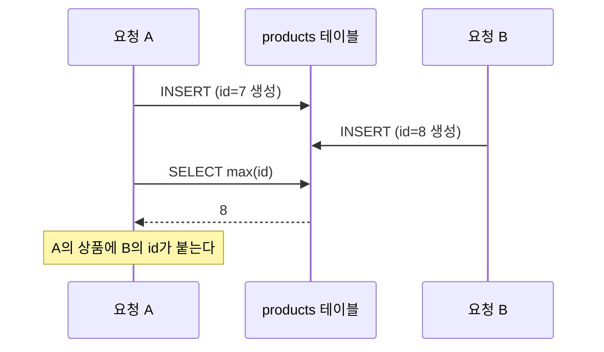

> Java에서 volatile, synchronized, AtomicLong 는 어떤 기능들일까요?
> 현재 코드로 ID를 발번하면 어떤 문제가 있을지 생각한번 해보면 좋을것 같아요

고치라는 말이 아니라 물음이었어요. 그런데 이 물음 하나 때문에 일주일 사이에 같은 코드를 세 번 고치게 됩니다.

안녕하세요, 고준서입니다. 카카오테크캠퍼스 3기 백엔드 과정의 첫 미션 이야기예요. spring-gift-product라는 개인 과제였고, 2025년 6월 24일부터 7월 1일까지 상품 API를 만들고, 관리자 화면을 붙이고, DB를 연결하는 세 단계로 진행됐습니다. 단계마다 멘토가 PR을 리뷰해 주셨는데, 그 일주일 동안 상품 ID를 만드는 코드가 세 번 바뀌었어요. 세 번 다 제가 먼저 문제를 본 게 아니라 멘토의 질문이 먼저였습니다.

**1단계: 컨트롤러 필드에 long 하나 두고 ++ 하면 되지 않나요?**

2단계 PR([#166](https://github.com/next-step/spring-gift-product/pull/166), 6월 26일)에서 관리자 화면의 상품 저장소는 컨트롤러 안의 `LinkedHashMap`이었고, ID는 필드 하나를 올려 가며 붙였습니다.

```java
// src/main/java/gift/Controller/AdminProductController.java:14-15, 31 (10371a6)
    private final Map<Long, Product> productMap = new LinkedHashMap<>();
    private long nextId = 1;

        product.setId(nextId++);
```

요구사항은 만족했어요. 화면에서 상품을 만들면 1, 2, 3이 붙었거든요. 그리고 다음 날, 15번째 줄에 위의 코멘트가 달렸습니다.

여러분이라면 어떻게 답하셨을까요?

저는 답을 쓰려면 세 키워드를 찾아봐야 했고, 찾아보니 문제가 보였습니다. 컨트롤러는 싱글턴이고 요청은 여러 스레드에서 들어오는데, `nextId++`는 읽고 더하고 쓰는 세 동작이라 두 요청이 겹치면 같은 ID를 두 번 줄 수 있죠. 그날 밤 이렇게 답글을 달았습니다.

> long과 ++ 사용으로인해 결국 멀티쓰레드 환경에서 중복된 ID 생성이 되고, 그게 아무런 제한장치없이 사용될 수 있네요
> volatile은 메모리에 저장을 해 중복발생을 줄이지만, 여전히 같은 이유로 중복발생가능
> synchronized는 락으로 중복발생을 막는다. 하지만 데드락이 발생할 수 도 있음
> AtomicLong은 CAS(compare and swap)알고리즘을 통해 중복발생방지를 보장함
> 이런 사항들을 고려해보니 일단 AtomicLong을 사용하는게 적합해보여서 수정했습니다.

**2단계: AtomicLong으로 바꾸고, 저장소도 떼어냈습니다**

같은 리뷰에서 "Admin과 Product의 HashMap이 서로 다르네요, 이제는 저장소 코드를 분리해야할때가 된것 같아요"라는 코멘트도 받았어요. 두 지적을 한 커밋([f5f9998](https://github.com/next-step/spring-gift-product/commit/f5f9998), 6월 27일 21시 21분)으로 처리했습니다. 컨트롤러에 흩어져 있던 맵을 `ProductRepository`로 모으고, 발번은 `AtomicLong`에 맡겼습니다.

```java
// src/main/java/gift/Repository/ProductRepository.java:12-13, 17 (f5f9998)
    private final Map<Long, Product> storage = new LinkedHashMap<>();
    private final AtomicLong nextId = new AtomicLong(1);

            product.setId(nextId.getAndIncrement());
```

멘토는 "네네 여러가지 부분에 대해서 잘고민해주셨네요!"라고 남기고 다음 날 머지해 주셨습니다.

여기서 끝났다고 생각했어요.

**3단계: DB로 옮겼더니 같은 질문이 또 왔습니다**

3단계는 H2에 JDBC로 붙이는 과제였습니다. 6월 30일 아침 커밋([178d709](https://github.com/next-step/spring-gift-product/commit/178d709))에서 `AtomicLong`은 주석이 됐고, 저장은 INSERT 뒤에 가장 큰 id를 읽어 오는 방식이 됐습니다.

```java
// src/main/java/gift/Repository/ProductRepository.java:39-43 (178d709)
    public Product save(Product product) {
        if(product.getId() == null){
            jdbcTemplate.update("Insert into products (name, price, imgUrl) values (?, ?, ?)", product.getName(), product.getPrice(), product.getImgUrl());
            Long id = jdbcTemplate.queryForObject("select max(id) from products", Long.class);
            product.setId(id);
```

발번 자체는 DB의 auto increment가 하니까 중복은 없습니다. 그런데 방금 넣은 행의 ID를 알아내는 방법이 `max(id)`였어요. 이게 왜 문제인지 바로 보이시나요?

PR([#239](https://github.com/next-step/spring-gift-product/pull/239))을 올린 지 두 시간 만에 멘토가 39번째 줄에 물었습니다.

> save가 동시에 여러개의 스레드에서 호출되었을때 동시성 이슈는 없을까요?
> select max(id)가 자신이 방금 삽입한 로우의 ID라는걸 보장할 수 있을까요?

2단계에서 배운 것과 정확히 같은 계열의 문제였습니다. 제 INSERT와 제 SELECT 사이에 다른 요청의 INSERT가 끼어들면, 저는 남의 ID를 제 상품에 붙이게 되거든요.



*그림 1. 요청 A의 INSERT와 SELECT max(id) 사이에 요청 B의 INSERT가 끼어드는 순간*

발번을 DB로 넘겼다고 동시성 문제가 사라진 게 아니라, 자리를 옮겼을 뿐이었어요. 그날 저녁 커밋([3641f99](https://github.com/next-step/spring-gift-product/commit/3641f99), 18시 9분)에서 `save`를 `create`와 `update`로 나누고, `create`는 JDBC가 돌려주는 생성 키를 받게 했습니다.

```java
// src/main/java/gift/Repository/ProductRepository.java:52-66 (3641f99)
    public Product create(Product product) {
        KeyHolder keyHolder = new GeneratedKeyHolder();
        jdbcTemplate.update(con -> {
            PreparedStatement ps = con.prepareStatement(
                    "INSERT INTO products (name, price, imgUrl) VALUES (?, ?, ?)",
                    Statement.RETURN_GENERATED_KEYS
            );
            ps.setString(1, product.getName());
            ps.setInt(2, product.getPrice());
            ps.setString(3, product.getImgUrl());
            return ps;
        }, keyHolder);

        Long id = keyHolder.getKey().longValue();
        product.setId(id);
```

PR에 남긴 설명은 한 줄이었습니다.

> 해당 스레드에서 생성한 ID임을 보장하기위해 keyholder를 사용하였습니다.

다음 날 멘토가 53번째 줄에 "넵 이방식이면 삽입한 ID를 알수있겠네요 👍 👍"를 남기고 머지해 주셨어요.

**남은 것: 주석 처리된 max(id)**

여기까지만 쓰면 깔끔한데, 최종 코드에는 `select max(id)`가 아직 있습니다. 실행되는 경로는 아니에요. 옛 `save` 메서드를 지우지 않고 `/* */`로 감싸 둔 채 머지했고, 그 블록 안의 39번째 줄에 `max(id)`가 그대로 남아 있습니다.

고친 뒤에도 옛 코드를 못 지우는 습관이 이때부터였던 것 같아요.

같은 PR에서 "필드와 생성자 사이 개행", "매퍼는 `private static final`로", "가격은 int 말고 다른 타입"(decimal로 바꿨습니다) 같은 지적도 같이 받았는데, 죽은 코드를 지우라는 말은 없었고 저도 지우지 않았습니다.

**그때는 못 봤던 것 하나**

2단계 코드는 `AtomicLong`으로 ID 중복만 막았지 `LinkedHashMap` 자체는 동기화되지 않았습니다. 두 스레드가 동시에 `put`을 하면 맵이 깨질 수 있는데, 그때는 ID에만 눈이 가 있어서 저장소 전체가 같은 조건에 놓여 있다는 걸 못 봤고, 멘토도 거기까지는 묻지 않으셨어요. 혹시 제 코드를 보면서 "그럼 맵은요?"라고 생각하셨다면, 맞습니다. 저는 이틀 뒤에야 그 생각을 했습니다.

3단계의 `KeyHolder`는 맞는 답이지만, JPA로 넘어가면 `@GeneratedValue`가 같은 일을 대신하고, 그다음 미션부터는 이 코드를 다시 쓸 일이 없었습니다.

**이 대화에서 배운 것**

세 코드는 전부 요구사항을 통과했습니다. 화면에서 상품을 만들면 ID가 붙었고 테스트도 돌았어요. 차이는 조건이 바뀌었을 때 드러났습니다. 요청이 하나일 때 맞는 코드와 요청이 겹칠 때도 맞는 코드는 다르고, 발번을 메모리에서 DB로 옮기면 문제의 위치도 같이 옮겨 가더라고요.

멘토는 두 번 다 답을 주지 않고 "이러면 어떤 문제가 있을까요"만 물으셨습니다. 두 번째 질문을 받았을 때, 첫 번째 답을 제가 스스로 적용하지 못했다는 걸 알았어요. 배운 걸 안다는 것과 새 상황에서 알아본다는 것 사이의 거리가 그 이틀이었습니다.

지금은 코드를 쓰기 전에 "이 코드는 요청이 겹칠 때도 맞는가"를 한 번 물어보게 됐습니다. 그 질문을 처음 제게 던져 주신 멘토께 감사드립니다. 첫 미션을 시작하는 분들께 이 기록이 조금이나마 참고가 되면 좋겠어요.
