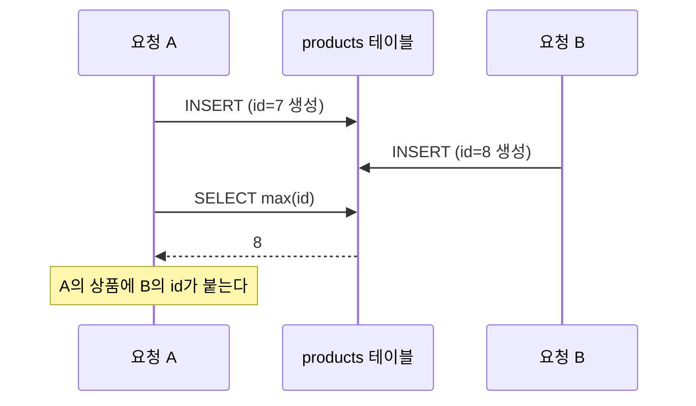

> Java에서 volatile, synchronized, AtomicLong 는 어떤 기능들일까요?
> 현재 코드로 ID를 발번하면 어떤 문제가 있을지 생각한번 해보면 좋을것 같아요

안녕하세요, 고준서입니다. 카카오테크캠퍼스 3기 백엔드 과정의 첫 미션(spring-gift-product) 이야기예요. 2025년 6월 24일부터 7월 1일까지 상품 API를 만들고, 관리자 화면을 붙이고, DB를 연결하는 세 단계짜리 개인 과제였고, 단계마다 멘토가 PR을 리뷰해 주셨습니다. 위 코멘트는 2단계 PR에 달린 것이고, 이 질문을 받은 뒤로 상품 ID를 만드는 코드가 일주일 사이에 세 번 바뀌었어요. 그 기록을 코멘트와 커밋 그대로 옮겨 둡니다.

## 2단계: 필드 하나를 ++ 하는 코드

2단계 PR([#166](https://github.com/next-step/spring-gift-product/pull/166), 6월 26일)에서 관리자 화면의 상품 저장소는 컨트롤러 안의 `LinkedHashMap`이었고, ID는 필드 하나를 올려 가며 붙였습니다.

```java
// src/main/java/gift/Controller/AdminProductController.java:14-15, 31 (10371a6)
    private final Map<Long, Product> productMap = new LinkedHashMap<>();
    private long nextId = 1;

        product.setId(nextId++);
```

화면에서 상품을 만들면 1, 2, 3이 붙었으니 요구사항은 만족한 상태였습니다. 다음 날 낮에 15번째 줄에 맨 위의 코멘트가 달렸어요. 고치라는 말이 아니라 물음이었습니다.

세 키워드를 찾아보니 문제가 보였습니다. 컨트롤러는 하나만 만들어져 여러 요청이 같이 쓰는데, `nextId++`는 읽고, 더하고, 쓰는 세 동작이라 두 요청이 겹치면 같은 ID를 두 번 줄 수 있어요. 그날 밤 이렇게 답글을 달았습니다.

> long과 ++ 사용으로인해 결국 멀티쓰레드 환경에서 중복된 ID 생성이 되고, 그게 아무런 제한장치없이 사용될 수 있네요
> volatile은 메모리에 저장을 해 중복발생을 줄이지만, 여전히 같은 이유로 중복발생가능
> synchronized는 락으로 중복발생을 막는다. 하지만 데드락이 발생할 수 도 있음
> AtomicLong은 CAS(compare and swap)알고리즘을 통해 중복발생방지를 보장함
> 이런 사항들을 고려해보니 일단 AtomicLong을 사용하는게 적합해보여서 수정했습니다.

`AtomicLong`은 여러 요청이 동시에 와도 숫자를 하나씩 안전하게 올려 주는 자바 클래스이고, CAS는 "지금 값이 내가 읽은 값과 같을 때만 바꾼다"는 방식입니다. 같은 리뷰에서 "Admin과 Product의 HashMap이 서로 다르네요~ 이제는 저장소 코드를 분리해야할때가 된것 같아요"라는 코멘트도 받아서, 두 지적을 커밋 하나([f5f9998](https://github.com/next-step/spring-gift-product/commit/f5f9998), 6월 27일 21시 21분)로 처리했습니다. 컨트롤러에 흩어져 있던 맵을 `ProductRepository`로 모으고, 발번은 `AtomicLong`에 맡겼어요.

```java
// src/main/java/gift/Repository/ProductRepository.java:12-13, 17 (f5f9998)
    private final Map<Long, Product> storage = new LinkedHashMap<>();
    private final AtomicLong nextId = new AtomicLong(1);

            product.setId(nextId.getAndIncrement());
```

멘토는 "네네 여러가지 부분에 대해서 잘고민해주셨네요! 👍"를 남기고 다음 날 머지해 주셨습니다.

## 3단계: DB로 옮기자 같은 질문이 또 왔습니다

3단계는 H2 데이터베이스에 JDBC로 붙이는 과제였습니다. 6월 30일 아침 커밋([178d709](https://github.com/next-step/spring-gift-product/commit/178d709))에서 `AtomicLong`은 주석이 됐고, 저장은 INSERT 뒤에 가장 큰 id를 읽어 오는 방식이 됐어요.

```java
// src/main/java/gift/Repository/ProductRepository.java:39-43 (178d709)
    public Product save(Product product) {
        if(product.getId() == null){
            jdbcTemplate.update("Insert into products (name, price, imgUrl) values (?, ?, ?)", product.getName(), product.getPrice(), product.getImgUrl());
            Long id = jdbcTemplate.queryForObject("select max(id) from products", Long.class);
            product.setId(id);
```

번호를 매기는 일 자체는 DB의 자동 증가 기능이 하니까 중복은 없습니다. 문제는 방금 넣은 행의 ID를 알아내는 방법이 `max(id)`였다는 거예요. PR([#239](https://github.com/next-step/spring-gift-product/pull/239))을 올린 지 두 시간쯤 뒤에 멘토가 39번째 줄에 물었습니다.

> save가 동시에 여러개의 스레드에서 호출되었을때 동시성 이슈는 없을까요?
> select max(id)가 자신이 방금 삽입한 로우의 ID라는걸 보장할 수 있을까요?

2단계에서 답했던 것과 같은 계열의 문제였습니다. 제 INSERT와 제 SELECT 사이에 다른 요청의 INSERT가 끼어들면 남의 ID를 제 상품에 붙이게 됩니다.



*그림 1. 요청 A의 INSERT와 SELECT max(id) 사이에 요청 B의 INSERT가 끼어드는 순간*

번호 매기기를 DB로 넘겼다고 동시성 문제가 없어진 게 아니라 자리만 옮겨 간 것이었어요. 그날 저녁 커밋([3641f99](https://github.com/next-step/spring-gift-product/commit/3641f99), 18시 9분)에서 `save`를 `create`와 `update`로 나누고, `create`는 JDBC의 `KeyHolder`, 그러니까 DB가 방금 만들어 준 ID를 그 요청에게 돌려주는 도구를 쓰게 했습니다.

```java
// src/main/java/gift/Repository/ProductRepository.java:52-66 (3641f99)
    public Product create(Product product) {
        KeyHolder keyHolder = new GeneratedKeyHolder();
        jdbcTemplate.update(con -> {
            PreparedStatement ps = con.prepareStatement(
                    "INSERT INTO products (name, price, imgUrl) VALUES (?, ?, ?)",
                    Statement.RETURN_GENERATED_KEYS
            );
            ps.setString(1, product.getName());
            ps.setInt(2, product.getPrice());
            ps.setString(3, product.getImgUrl());
            return ps;
        }, keyHolder);

        Long id = keyHolder.getKey().longValue();
        product.setId(id);
```

PR에는 이렇게 적었습니다.

> save를 create와 update로 분리(하나로 쓸 수 있지만, controller에서 다른 기능을 수행하는 두 곳에서 사용하기 때문에 분리했습니다. )
> 가격을 int에서 decimal(10,2)로 변경
> 해당 스레드에서 생성한 ID임을 보장하기위해 keyholder를 사용하였습니다.

가격 타입은 같은 리뷰에서 "int, long, bigint를 제외한 **금액과** 관련된 더 좋은 타입이 있을까요?"라는 질문을 받고 바꾼 것이고, 그 밖에 "필드와 생성자 사이에도 개행", "매퍼같은 필드는 private static final로", "동일 ID (PK)를 가진 컬럼이 여러개 존재할수도 있을까요?" 같은 지적도 같이 있었습니다. 다음 날 멘토가 53번째 줄에 "넵 이방식이면 삽입한 ID를 알수있겠네요 👍 👍"를 남기고 머지해 주셨어요. PR을 올릴 때 "rebase 하면서 계속 오류가 나서 step2 파일 복사해서 했더니 기록이 좀 사라진 것 같습니다..."라고 써 둔 것도 그대로 남아 있습니다.

## 남은 것

최종 코드에는 `select max(id)`가 아직 있습니다. 실행되는 경로는 아니에요. 옛 `save` 메서드를 지우지 않고 `/* */`로 감싸 둔 채 머지했고, 그 블록 안의 39번째 줄에 `max(id)`가 그대로 남아 있습니다. 죽은 코드를 지우라는 지적은 없었고 저도 지우지 않았습니다.

지금 다시 보면 하나 더 있습니다. 2단계 코드는 `AtomicLong`으로 ID 중복만 막았지 `LinkedHashMap` 자체는 동기화되지 않아서, 두 요청이 동시에 `put`을 하면 맵이 깨질 수 있었어요. 그때는 ID에만 눈이 가 있었고 멘토도 거기까지는 묻지 않으셨습니다. 3단계의 `KeyHolder`는 맞는 답이지만, 다음 미션부터 JPA로 넘어가면서 `@GeneratedValue`가 같은 일을 대신했고, 이 코드를 다시 쓸 일은 없었습니다.

세 코드는 전부 요구사항을 통과했습니다. 차이는 요청이 겹칠 때 드러났고, 두 번 다 제가 먼저 본 게 아니라 멘토의 질문이 먼저였습니다. 그 뒤로는 저장 코드를 쓸 때 "요청이 겹치면 어떻게 되나"를 먼저 보게 됐어요. 질문으로 알려 주신 멘토께 감사드립니다.
