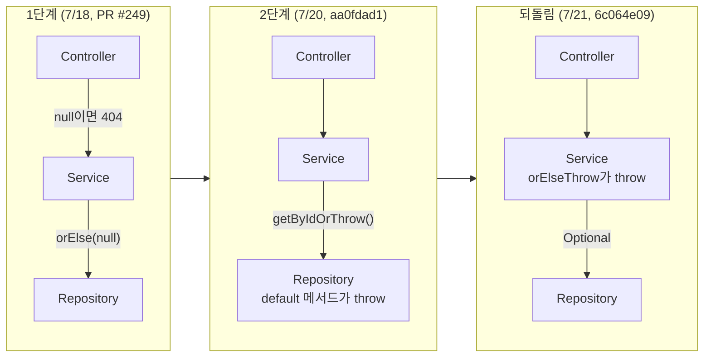

> 이렇게 null 을 던지는 방식보다는, exception 을 던지는 방식이 권장됩니다.
> (도메인 객체가 없을 경우, flow를 중단하는 것이 자연스럽습니다)
> 이렇게 null 을 던지게 되면, 사용하는 쪽에서 항상 null 처리를 해주어야 하고, NullPointerException 가능성이 높아지게 됩니다.

이 코멘트를 받고 예외 던지는 자리를 옮겼는데, 사흘 뒤 같은 분이 되돌리라고 하셨어요.

안녕하세요, 고준서입니다. 카카오테크캠퍼스 세 번째 미션 이야기예요. spring-gift-enhancement라는 개인 미션이었고, 2025년 7월 17일부터 22일까지 JPA 엔티티 매핑과 페이지네이션을 붙이는 과제였습니다. 그런데 이 미션에서 제일 오래 남은 건 JPA가 아니었어요. "없는 엔티티를 찾았을 때 누가 예외를 던지는가"를 놓고 코드가 사흘 동안 세 자리를 옮겨 다닌 기록이었습니다. [첫 미션의 ID 발번 이야기]({{ "/2025/07/01/id-generation-three-times/" | relative_url }})와 비슷한 패턴인데, 이번에는 리뷰가 시킨 대로 옮겼더니 같은 리뷰어가 다시 되돌리라고 한 경우예요.

여러분은 없는 엔티티를 만나면 어디서 예외를 던지시나요?

**1단계: null을 돌려주고 컨트롤러가 검사한다**

7월 18일에 올린 1단계 PR([#249](https://github.com/next-step/spring-gift-enhancement/pull/249))의 `ProductService`는 없는 상품을 null로 표현하고 있었습니다.

```java
// src/main/java/gift/product/service/ProductService.java:24-26 (455b26d)
    public Product findById(Long id) {
        return repository.findById(id).orElse(null);
    }
```

컨트롤러는 그 null을 받아 `notFound()`를 만들었어요. `get`, `update`, `delete` 세 메서드가 각자 `if (product == null) return ResponseEntity.notFound().build();`를 들고 있었죠. 머지 직전에 멘토님이 26번째 줄에 남긴 코멘트가 맨 위의 그 문장입니다.

같은 리뷰에서 "위의 findById() 메서드를 리팩토링 하시며, 공통으로 사용하셔도 좋을 것 같네요"라는 코멘트도 같이 받았습니다. 저는 이걸 "예외로 바꾸되 한 군데로 모으라"는 뜻으로 읽었어요.

**2단계: Repository의 default 메서드로 모았다**

7월 20일 저녁 커밋([aa0fdad1](https://github.com/gary5876/spring-gift-enhancement/commit/aa0fdad1))의 메시지는 "예외던지기를 repository로 옮김"입니다. "공통으로"를 가장 아래 계층에 두는 것으로 해석했거든요. 리포지토리 인터페이스에 `default` 메서드를 추가하고, 서비스는 그걸 부르기만 하게 했습니다.

```java
// src/main/java/gift/product/repository/ProductRepository.java:11-13 (aa0fdad1)
    default Product getByIdOrThrow(Long id) {
        return findById(id).orElseThrow(() -> new ProductNotFoundException(id));
    }
```

`MemberRepository`에도 `getByIdOrThrow`와 `getByEmailOrThrow`를 같은 모양으로 넣었어요. 효과는 분명했습니다. `ProductService`의 `findById`, `update`, `delete`와 `WishService`의 `addWish`, `deleteWish`가 전부 한 줄이 됐고, `WishService`에 따로 있던 `IllegalArgumentException("존재하지 않는 상품입니다.")`도 사라졌습니다. 예외는 `GlobalExceptionHandler`가 받아서 `ProductNotFoundException`이면 404로 바꿔 주고요. 컨트롤러의 null 검사 세 개는 없어졌습니다.

이 커밋에는 `repository.getByIdOrThrow(id);;`처럼 세미콜론이 두 개 찍힌 줄도 들어 있었어요. 다음 날 되돌리는 커밋에서 같이 사라졌습니다.

여기서 끝났다고 생각했습니다.



*그림 1. 예외를 던지는 자리가 사흘 동안 세 번 옮겨 다닌 경로*

**PR 본문에 남긴 찜찜함**

2단계 PR([#266](https://github.com/next-step/spring-gift-enhancement/pull/266))을 올리면서 본문에 이렇게 적었습니다.

> MemberService에 throw가 하나 남아있기는 한데, 이걸 repository로 넘길까? 에서
> 같은 조건문으로도 있을 때 Exeception, 없을 때에도 Exception을 만들어야하는 경우가 동시에 발생하면 어떻게 해야하지? 하는 고민에 남겨뒀습니다.

회원가입에서는 이메일이 이미 있으면 `MemberAlreadyExistsException`을 던지고, 로그인에서는 이메일이 없으면 `MemberNotFoundException`을 던집니다. 둘 다 `findByEmail` 한 번으로 판단하는데, 어느 쪽이 예외인지는 호출한 쪽 사정이잖아요. 리포지토리에 `getByEmailOrThrow`를 두면 "없으면 예외"는 담을 수 있지만 "있으면 예외"는 담을 수가 없었습니다.

그럼 "있으면 예외"는 어디에 둬야 할까요?

그때는 답을 못 찾았어요. `validateDuplicateEmail`은 서비스에 남겼고, 그게 이상하다는 느낌만 적어 둔 채 PR을 올렸습니다.

**되돌림: 같은 멘토님이 되돌리라고 했다**

머지 직전, 1단계에서 예외를 던지라고 했던 그 멘토님이 `MemberRepository`의 22번째 줄에 코멘트를 달았습니다.

> default 메서드로 선언한 getByIdOrThrow() 형태는 코드 간결성과 중복 제거 측면에서는 괜찮은 접근이지만,,
> 예외를 던지는 책임이 비즈니스 로직(Service)에 있어야 한다고 생각해요. (이렇게 이메일로 접근했을 때, 존재하는지 여부에 따라 예외를 던지는 것 또한 비즈니스 로직으로 판단. 단순히 repository 는 존재하는지?아닌지? 여부만 제공 (Optional을 통해)
> 책임의 경계를 명확히 가져가고 싶다면 Service에서 처리하는 것도 고려해보셔도 좋을 것 같아요 :)

제가 PR 본문에 적은 찜찜함의 답이 여기 있었어요. 리포지토리는 "있다, 없다"를 `Optional`로만 말하고, 그 부재가 오류인지 정상인지는 그걸 부른 서비스가 정하는 거였습니다. 로그인의 "없음"은 오류고 회원가입의 "없음"은 정상이니, 같은 조회를 놓고 예외의 방향이 갈리는 건 당연했고요. 그 갈림을 리포지토리가 알 이유가 없었던 거죠.

7월 21일 오후 커밋([6c064e09](https://github.com/gary5876/spring-gift-enhancement/commit/6c064e09), "getBy**OrThrow 책임을 Repository → Service로 이동")으로 `default` 메서드 세 개를 지우고, 예외를 던지던 자리 아홉 곳을 전부 서비스로 돌려놓았습니다.

5개 파일, 14줄 추가, 22줄 삭제.

```java
// src/main/java/gift/product/service/ProductService.java:38-41 (6c064e09)
    public ProductResponse findById(Long id) {
        Product product = repository.findById(id).orElseThrow(() -> new ProductNotFoundException(id));
        return ProductResponse.from(product);
    }
```

2단계보다 줄 수는 늘었습니다. 하지만 `MemberService` 안에서 `findByEmail(...).orElseThrow(...)`와 `findByEmail(...).ifPresent(throw)`가 나란히 있는 게 이제는 이상하지 않았어요. 둘 다 같은 조회 결과를 각자의 규칙으로 해석하는 서비스 코드였으니까요.

**같은 PR의 다른 피드백: H2에서 깨진 findByNameContaining**

2단계 본문에는 또 하나를 적어 뒀습니다. 이름 검색을 `findByNameContaining`으로 만들었더니 JPA가 `LIKE` 조건에 `escape '\\'`를 붙이는데, H2가 그걸 잘못된 이스케이프로 처리해서 에러가 났고, 그래서 `@Query("SELECT p FROM Product p WHERE p.name LIKE %:name%")`로 우회했다는 내용이었어요. 멘토님은 처음에 메서드 이름만으로 충분하지 않냐고 물으셨다가, H2 에러라는 설명을 보고 이렇게 답하셨습니다.

> 아하, findByNameContaining 처럼 구현해도 H2 에서는 에러가 난다는 말씀이실까요? 그렇다면 `@Query` 사용은 불가피하겠네요.
> 다만,,`@Query`도 결국 DB마다 문법/동작 차이에 영향을 받을 수 있다는 점은 인지하셔야 합니다. (DB 종속성 유발)

최종 코드에는 `findByNameContaining`과 `searchByName`이 둘 다 남아 있고, 서비스는 `searchByName`만 씁니다. 깨진 메서드를 지우지 않고 우회 메서드를 옆에 붙인 채로 미션이 끝났어요. 에러 메시지 원문은 어디에도 적어 두지 않아서, 지금은 재현 조건을 정확히 말씀드릴 수가 없습니다.

**팀 프로젝트로 이어진 것**

이 PR의 코멘트 하나가 습관이 됐습니다. 멘토님이 `ProductResponse`에 `public static ProductResponse from(Product product)`를 두면 `.map(ProductResponse::from)`으로 쓸 수 있다고 하셨고, 2단계 커밋에서 그렇게 바꿨거든요. 이후 팀 프로젝트 Team18_BE에서 제가 처음 만든 응답 DTO 네 개(`ClubListResponseDto`, `UserFormQuestionResponseDto`, `MyProfileResponseDto`, 그리고 문자열을 enum으로 바꾸는 `StatisticsDimension`)가 전부 같은 `from` 정적 팩터리 모양입니다. 2025년 9월부터 2026년 8월까지 이어졌어요.

**돌아보면**

되돌린 결정은 지금도 맞다고 봅니다. 다만 그때 서비스 메서드마다 `findById(...).orElseThrow(() -> new ...NotFoundException(...))`를 아홉 번 복사한 건, 중복을 없애라는 첫 코멘트와 책임을 옮기라는 두 번째 코멘트 사이에서 두 번째만 택한 결과였어요.

두 코멘트는 정말 충돌했을까요?

서비스 안에 `private Product getProduct(Long id)` 하나를 두면 책임은 서비스에 남기면서 중복도 없앨 수 있었습니다. 둘 다 만족하는 자리가 있었는데, 그걸 못 본 채 미션이 끝났어요. 리뷰 두 개가 서로 다른 말을 하는 것처럼 보일 때, 사실은 같은 코드를 다른 각도에서 보고 있는 경우가 많다는 걸 이때 배웠습니다.

제 사례가 계층 사이에서 예외 자리를 고민하는 분들께 조금이라도 도움이 되면 좋겠어요. 긴 글 읽어주셔서 감사합니다.
