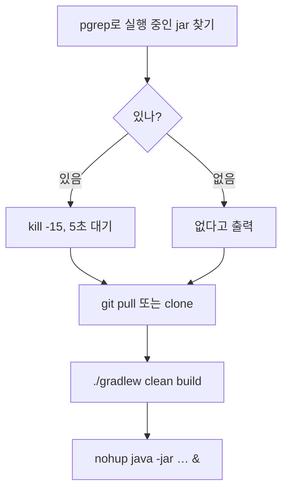

안녕하세요, 고준서입니다. 카카오테크캠퍼스 마지막 미션(spring-gift-order) 3단계는 지금까지 만든 서비스를 AWS EC2 서버에 직접 올리는 것이었어요. 2025년 8월 1일 오후에 PR([#293](https://github.com/next-step/spring-gift-order/pull/293))을 올렸고, 멘토는 코드를 고치라는 말보다 질문을 더 많이 남겼습니다. 리뷰 첫 코멘트가 이랬어요.

> 배포쪽은 코드가 생소할 수 있어서 질문 위주로 드렸는데요, 이번 기회에 잘 이해하고 넘어가시길 바라요!

## 8월 2일, 질문들

PR을 올릴 때 README에 배포 명령을 적어 두었는데, 빌드는 손으로 미리 해 두고 실행만 스크립트로 하는 모양이었습니다.

```bash
# README.md에 적었던 배포 스크립트 (f56006c)
JAR_NAME="spring-gift-0.0.1-SNAPSHOT.jar"

# 실행 중인 프로세스 종료
PID=$(pgrep -f $JAR_NAME)

if [ -n "$PID" ]; then
  echo ">> 기존 실행 중: $PID → 종료"
  kill -15 $PID
  sleep 5
else
  echo ">> 실행 중인 프로세스 없음"
fi

# 백그라운드 실행
echo ">> 새 애플리케이션 실행"
nohup java -jar $JAR_NAME > /dev/null 2>&1 &
```

8월 2일 오후에 멘토가 이 README와 CORS 설정 파일에 코멘트를 달았습니다. README에는 "배포 스크립트도 파일로 따로 만들어서 깃헙에 푸시해주세요~😊", "빌드를 수동으로 돌려놓은 상태에서 실행하는걸까요? 이 스크립트에서 빌드를 한 후에 배포를 진행하는건 어떨까요?😊", "33~ 41라인은 어떤 역할을 할까요?", "nohup 명령어가 어떤 역할을 할까요?" 그리고 "연결이 안되는 것 같아요!😭". 빌드 질문에는 이유도 덧붙여 주셨어요.

> 빌드시 테스트가 함께 돌아가기 때문에 검증에도 도움이 됩니다😊
> 참고로 현업에서는 빌드/배포를 따로 하기는 합니다. 빌드해둔 파일을 특정 저장소에 버전별로 저장하고, 배포 시 필요한 버전의 파일을 가져와서 배포하는 방식이에요. 이번 과제에서는 빌드/배포를 전부 경험해보면 좋겠다는 생각에 리뷰 드립니다😊

CORS 설정 파일에는 세 개가 달렸습니다. 허용 주소가 `localhost`로 돼 있으니 EC2 주소로 바꾸라는 것, `api/`로 시작하는 경로에만 열어도 되지 않겠냐는 것, 그리고 이 질문.

> 우리 어플리케이션에서 CORS 설정이 필요한 이유는 뭘까요? 답변 부탁드려요!

그날 밤과 다음 날 새벽에 걸쳐 스크립트를 다시 썼습니다. 저녁 5시 반에 파일로 분리하고([f104968](https://github.com/gary5876/spring-gift-order/commit/f104968)), 자정 넘어 빌드까지 넣었어요([c6e9dcd](https://github.com/gary5876/spring-gift-order/commit/c6e9dcd), [18a91ed](https://github.com/gary5876/spring-gift-order/commit/18a91ed)). 최종 `deploy.sh`는 실행 중인 프로세스를 찾아 종료하고, 저장소를 받아 오고, 빌드하고, 새로 띄우는 네 단계예요.



*그림 1. 최종 deploy.sh의 흐름. 빌드가 스크립트 안으로 들어왔습니다.*

질문에는 이렇게 답했습니다. 33~41행이 뭘 하느냐에는

> 기존 실행중인 프로세스를 종료합니다.
> pqrep로 조회 후 kill -15로 기본적인 종료요청을 보내고, 종료되기를 기다립니다. 만약 조회했는데 없으면 없다고 알립니다.

nohup에는

> sighup을 무시하고 계속 실행하게 해주는 명령어입니다. 백그라운드 실행을 위해 사용됩니다.

`kill -15`는 프로세스에게 "정리하고 종료해 달라"고 부탁하는 신호이고(`-9`는 부탁 없이 죽이는 쪽), `nohup`은 터미널을 닫아서 생기는 신호를 무시하게 해서 접속을 끊어도 서버가 계속 돌게 하는 명령입니다. 답글에 `pqrep`라고 오타를 낸 것도 그대로 남아 있어요.

## CORS에는 반만 답했습니다

CORS는 브라우저가 한 주소에서 열린 페이지가 다른 주소의 서버에 요청을 보낼 때 그 서버의 허락을 확인하는 규칙입니다. "왜 필요하냐"는 질문에 저는 이렇게 답했어요.

> 이 설정이 필요한 이유는 백엔드와 프론트엔드가 서로 다른 origin에서 동작 할 경우 api 요청 전에 cors오류로 차단되기 때문에 필요합니다. 그래서 어떤걸 허용할지 설정해줘야합니다.

교과서 답이었고, 멘토는 8월 3일 오후에 한 번 더 물었습니다.

> 우리 어플리케이션은 하나의 서버에서 백엔드와 프론트엔드가 동작하는데 어느 부분에서 CORS가 필요할까요?😊
> 이번 프로젝트에서 헷갈릴 수 있었던 부분이어서 질문드렸어요.
> 큰 프로젝트에서는 프론트엔드와 백엔드가 각각 다른 인스턴스에서 동작하여 통신해요. 각기 자기만의 도메인을 가지기 때문에 서로 통신할 때 CORS 설정은 필수입니다. 이 때에는 백엔드에 프론트엔드의 도메인을 CORS 등록합니다.
> 우리 어플리케이션은 하나의 도메인, 인스턴스에서 동작하기 때문에 나 자신의 도메인을 등록해둔다고 봐주시면 되겠습니다.😊 (아마 등록하지 않아도 이론적으로는 동작할텐데,, 직접 해보지 않아서 확신이 없네요😅 한번 확인해보시겠어요?😊)

같은 시각에 설정값 세 줄의 의미도 다시 물으셨고, 그건 길게 답했습니다.

> setAllowedHeaders(List.of("*")는 모든 헤더를 허용하겠다는 의미입니다.
> 브라우저는 보안상의 이유로 기본적으로 허용되는 몇 개의 헤더들이 있는데, 이 설정을 추가하면 모든 헤더를 허용하게 되기 때문에
> 이 프로젝트에서 사용된 'Authorization' , 'Content-Type : application/json' 같은 헤더들을 사용할 수 있게 됩니다.
>
> setAllowedCredentials(true)는 클라이언트가 서버에 인증정보를 포함해서 요청할 수 있게 허용하는 설정입니다.
> 인증정보의 예시로는 쿠키, 'Authorization' 헤더들이 있습니다.
> 이걸 포함하지 않으면 이런 정보들을 전송하지도 않고, 받더라도 저장하지 않기 때문에 로그인유지 같은게 안됩니다.
>
> setExposedHeaders(List.of("*"))는 응답에서 모든 헤더를 접근할 수 있게 해주겠다는 의미입니다.
> 기본적으로 몇 개의 헤더를 제외한 헤더들은
> headers.get('Authorization') 이렇게 접근하면 null을 반환하는데, 이걸 값을 읽을 수 있게 해줍니다.

그런데 "어느 부분에서 필요하냐"는 질문에는 1분 뒤에 "이해했습니다 감사합니다!"라고만 달고 넘어갔어요. 확인해 보라는 말도 확인하지 않았습니다. 멘토는 그날 밤 "답변 달아주신 내용 보니 깊게 잘 공부해보신게 보이네요💯"라고 승인해 주셨지만, 저는 그 질문 하나에는 답을 안 한 채로 미션을 끝냈습니다.

## 그때 못 한 답

지금 답하면 이렇습니다. 이 서비스의 화면은 같은 스프링 서버가 만들어서 내려주는 페이지였어요. 주소창의 `http://52.78.57.212:8080/admin/products`에서 열린 화면이 같은 `52.78.57.212:8080`으로 보내는 요청은 같은 주소 안의 요청이고, 거기에는 브라우저가 CORS를 적용하지 않습니다. 그러니 멘토 말대로 자기 주소를 허용 목록에 넣는 건 아무 일도 하지 않고, 등록하지 않아도 동작합니다. 허용 목록에서 실제로 의미가 있는 건 `http://localhost:8000` 하나였어요. 개발할 때 다른 포트에서 띄운 화면이 이 서버를 부르는 경우가 그것이니까요.

저장소를 다시 열어 보니 그날 새벽 커밋에 작은 흔적이 하나 더 있었습니다. PR을 올릴 때 설정은 `localhost:3000` 하나를 모든 경로(`/**`)에 열어 둔 것이었고, 코멘트를 받고 자정 넘어 주소 세 개로 바꾸면서 경로도 `api/**`로 좁혔는데([c6e9dcd](https://github.com/gary5876/spring-gift-order/commit/c6e9dcd)), 앞 슬래시를 빠뜨렸어요. 한 시간 반 뒤 마지막 커밋([2812be6](https://github.com/gary5876/spring-gift-order/commit/2812be6))이 그 한 글자를 고친 것입니다.

```java
// src/main/java/gift/global/config/CorsConfig.java (2812be6)
-        source.registerCorsConfiguration("api/**", configuration);
+        source.registerCorsConfiguration("/api/**", configuration);
```

요청 경로는 `/api/...`처럼 슬래시로 시작하니 `api/**`는 아무 요청에도 붙지 않는 패턴이었습니다. 그 한 시간 반 동안 CORS 설정은 사실상 꺼져 있었던 셈인데, 같은 주소에서 부르는 화면에는 원래 아무 영향이 없으니 화면만 봐서는 알 수 없는 상태였어요. 멘토의 질문은 정확히 이 지점을 가리키고 있었던 겁니다.

접속 문제는 CORS와 상관없는 곳에 있었습니다. 멘토가 두 번 "접속이 안 된다"고 했는데, 한 번은 README 주소에 포트를 두 번 적은 오타였고, 마지막은 EC2 쪽 보안 설정이었어요. 밤 11시 39분에 화면 캡처를 붙이고 "보안설정 고쳐서 해결했습니다"라고 달았습니다. 6주짜리 미션의 마지막 코멘트였습니다.
