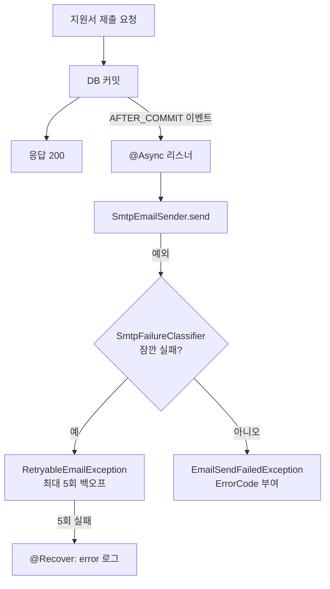

안녕하세요, 고준서입니다. 동아리움이라는 대학 동아리 지원 서비스의 백엔드를 팀에서 맡고 있고(백엔드 3인, 프론트엔드 3인), 지원서 제출과 합불 결과를 알리는 이메일은 제가 담당했습니다. 이메일 관련 커밋 38개 중 35개가 제 것이에요. 이 글은 2025년 10월 8일에 머지된 [PR #97](https://github.com/kakao-tech-campus-3rd-step3/Team18_BE/pull/97)의 설계를 다룹니다. 지원서를 제출하면 Gmail 서버의 응답을 기다리던 구조를, 커밋이 끝난 뒤 이벤트를 받은 별도 스레드가 메일을 보내는 구조로 바꿨고, 발송 실패는 메일 서버의 응답 코드로 "다시 보낼 것"과 "포기할 것"으로 나눴어요.

먼저 밝혀 둘 게 있습니다. 제출 응답이 얼마나 빨라졌는지는 재지 않았고, 메시지 큐 같은 다른 후보를 비교한 기록도 없습니다. 이슈 #80에는 "@async 비동기처리 고려해보기"라는 한 줄이 전부예요. 재시도를 5회, 2초에서 시작해 두 배씩, 최대 60초로 둔 이유도 PR과 커밋 어디에도 적혀 있지 않습니다. 그래서 이 글은 무엇을 어떻게 바꿨고 그 설계가 어디까지 버텼는지를 적어요. 그 결정이 8일 뒤에 어떤 장애로 이어졌는지는 [다음 글]({{ "/blog/2025/10/16/async-listener-lazy-init/" | relative_url }})에 따로 있고, 결과 메일을 팀원이 DB 기반으로 다시 짜 둔 것(아직 머지 전)은 이 글 끝에 있습니다.

## 팀 코드에 넣기 3주 전

팀 레포에 이메일 기능이 들어간 건 9월 22일인데, 그 전에 개인 레포에서 먼저 돌려봤습니다. 8월 30일에 emailTest라는 레포를 만들어 Spring Mail로 Gmail 발송을 시험했고, 수신자용 폼과 사용법 문서를 붙였어요. 9월 8일에는 복사본 레포에 테스트 코드와 Docker 설정까지 넣었습니다. 팀 코드에 처음 넣은 버전은 그 결과물이었고, 그때부터 리스너에는 `@TransactionalEventListener(AFTER_COMMIT)`가 달려 있었습니다. 지원서가 DB에 커밋되기 전에 "제출됐습니다" 메일이 먼저 나가면 안 되니까요.

## 제출 응답을 메일 서버에서 떼어내기

9월 26일에 올린 [이슈 #80](https://github.com/kakao-tech-campus-3rd-step3/Team18_BE/issues/80)의 개선 목록에 "@async 비동기처리 고려해보기"라는 항목이 있었습니다. 지원서 제출 API가 응답을 돌려주기 전에 Gmail 서버와의 왕복을 기다리고 있었거든요. 메일 서버가 느려지면 사용자의 제출 버튼도 같이 느려지는 구조였습니다.

10월 2일 커밋 [258c811b](https://github.com/kakao-tech-campus-3rd-step3/Team18_BE/commit/258c811b)에서 리스너에 `@Async`를 붙였습니다. 지원서는 커밋되고, 응답은 바로 나가고, 메일은 별도 스레드에서 보냅니다.

```java
// domain/email/eventListener/ApplicationNotificationListener.java:26-28
@Async
@TransactionalEventListener(phase = TransactionPhase.AFTER_COMMIT)
public void onSubmitted(ApplicationSubmittedEvent event) {
```

지원서 제출, 면접 합격, 면접 불합격, 최종 합격, 최종 불합격 다섯 이벤트가 전부 같은 모양이고, `AsyncConfig`는 `@EnableAsync` 한 줄이 전부입니다.

떼어내고 나니 실패가 문제가 됐습니다. 요청 스레드에서 보낼 때는 예외가 곧 500 응답이었는데, 별도 스레드에서는 예외를 받아줄 호출자가 없어요. 그래서 10월 6일 커밋 [5e68154e](https://github.com/kakao-tech-campus-3rd-step3/Team18_BE/commit/5e68154e)에서 발송기에 재시도를 넣고, 어떤 실패를 다시 시도할지 정하는 분류기를 따로 뒀습니다. PR 본문에는 이렇게 적었습니다.

> 비동기 처리시 발생하는 에러에 대해, 재시도를 통해 해결가능한 에러는 다시 시도할 수 있게 retry를 넣었습니다.

```java
// domain/email/sender/SmtpEmailSender.java:26-30
@Retryable(
        include = { RetryableEmailException.class },
        maxAttempts = 5,
        backoff = @Backoff(delay = 2_000, multiplier = 2.0, maxDelay = 60_000)
)
```

재시도 대상은 `RetryableEmailException` 하나입니다. 발송기는 메일 서버가 던진 예외를 `SmtpFailureClassifier.isTemporary`에 넘겨서, 잠깐 실패한 것이면 이 예외로 감싸 던지고 아니면 `EmailSendFailedException`으로 끝냅니다. 최대 5회, 2초에서 시작해 두 배씩 늘리고 60초를 넘지 않게 기다립니다. 다섯 번 다 실패하면 `@Recover`가 error 로그를 남기고 `EmailSendFailedException`을 던져요.

분류는 메일 서버의 응답 코드로 합니다. 연결 실패와 소켓 타임아웃은 잠깐 실패, 인증 실패는 영구 실패. 응답에 확장 코드(RFC 3463)가 있으면 `4.x.x`는 잠깐, `5.x.x`는 영구로 보되 `5.2.2`(수신함 가득 참)만 잠깐으로 예외를 뒀습니다. 확장 코드가 없으면 기본 코드 4xx는 잠깐, 552(용량 초과)는 잠깐, 나머지 5xx는 영구입니다. 그것도 없으면 메시지 문자열에서 "try again later", "temporarily", "timeout", "over quota"를 찾습니다.

```java
// domain/email/sender/SmtpFailureClassifier.java:50-60
if (enhanced != null) {
    if (enhanced.startsWith("4.")) return true;      // 4.x.x = 임시
    if ("5.2.2".equals(enhanced)) return true;       // mailbox full
    return false;                                     // 그 외 5.x.x
}

if (basic != null) {
    if (basic >= 400 && basic < 500) return true;    // 4xx
    if (basic == 552) return true;                   // 용량/스토리지
    return false;                                    // 나머지 5xx
}
```

`RetryableEmailException`에는 에러 코드가 없습니다. 소스 주석에 "이 에러는 @Retry 에서 사용하는거라 에러코드가 없습니다. 프론트에 넘겨주지 않아요"라고 적어 뒀어요. 재시도는 서버 안에서 끝나는 일이고 사용자에게 보여줄 상태가 아니니까요. `EmailSendFailedException`은 반대로 같은 분류기의 `toErrorCode`로 수신자 오류, 정책 거부, 인증 실패, 타임아웃 같은 코드를 받습니다.



*그림 1. 제출 요청과 메일 발송이 분리된 뒤의 흐름. 커밋이 끝나야 이벤트가 나가고, 발송 실패는 분류기를 거쳐 재시도 여부가 갈립니다.*

## 리뷰에서 나온 것

10월 4일에 팀원이 예외 클래스를 보고 물었습니다.

> 그럼 지금 gmail만 이메일로 등록 가능한 상황인건가요??

분류기의 마지막 단계가 Gmail이 돌려주던 문장을 기준으로 만들어진 게 코드에 보였던 겁니다. 그날은 이렇게 답했어요.

> 다른걸 사용하면 에러가 500으로 오는게 늘어나겠네요
> 생각해보니 사용자가 입력한 이메일이 gmail뿐이 아닐 수 있으니 이 런점 고려해서 개선할 수 있을 것 같아요

다음 날 규격 문서를 찾아보고 다시 답했습니다.

> https://www.ietf.org/rfc/rfc5321.txt https://www.ietf.org/rfc/rfc1893.txt
> 기본적인 약속이 있어서 550 5.7.1 Messages missing a valid From: 이렇게 앞에 550 5.7.1 까지는 똑같은데 뒤에 메세지가 조금씩 달라요
> gmail만 사용가능한건 아니고, 에러처리에서 좀 더 고려할게 있네요

응답 코드까지는 서버가 달라도 같고 뒤에 붙는 문장만 다르다는 것을 그때 확인했고, 그래서 문자열보다 코드를 먼저 보게 짜여 있는 게 맞았습니다. 다만 마지막 폴백의 문자열들이 Gmail에서 본 것들이라는 점은 그대로예요.

리뷰 봇(CodeRabbit)은 10월 5일에 두 가지를 짚었습니다. 하나는 `catch (Throwable e)`가 `OutOfMemoryError` 같은 치명적 오류까지 이메일 실패로 감싼다는 것이었고, 지금 코드는 `Exception`을 잡습니다. 다른 하나는 이것이었습니다.

> `@Async` 메서드에서 발생하는 예외는 기본적으로 호출자에게 전파되지 않고 `AsyncUncaughtExceptionHandler`로 전달되거나 조용히 무시됩니다.

이건 반영하지 않았고, 8일 뒤에 정확히 그 경로로 장애를 겪었습니다.

## 테스트는 실제로 보냅니다

PR 본문의 "고민했던 내용"에 이렇게 적었습니다.

> 적절한 테스트 방법에 대해 고민하다가, 실제로 이메일을 보내는 것이 작동을 확신할 수 있는 방법이라 생각해서 그렇게 만들어봤습니다.

메일 발송 객체를 가짜로 바꿔서 통과하는 테스트는 인증이 틀렸는지, 발신 주소가 거부되는지, HTML이 깨지는지 알려주지 않습니다. 그래서 `EmailSendTest`는 실제 메일 서버로 제목에 UUID를 박은 메일을 보내고, `EmailServiceIntegrationTest`는 서비스부터 발송까지 한 번에 돌립니다. 실행하는 사람이 `MAIL_TO`에 자기 주소를 넣고 메일함을 직접 확인하는 방식이에요. 리뷰 봇이 "assertDoesNotThrow만 사용하여 예외 발생 여부만 확인하고 있습니다"라고 했을 때는 이렇게 답했습니다.

> 테스트 실행자가 본인 이메일을 넣어서 직접 메일함을 확인하기를 원해서 이렇게 만든거야

대신 두 테스트 모두 `@Disabled`가 붙어 있어서 CI에서는 돌지 않습니다. 문구는 "실제 외부 SMTP 메일을 보냅니다. 로컬에서 주석처리 후 수동 실행하세요."예요. 팀원이 "혹시 로컬에서 주석처리하고 수동으로 실행하라는게 `@Disabled` 어노테이션을 주석처리하고 밑에 부분에 자기 이메일 작성해서 테스트 돌리면 된다는걸까용?"이라고 물었을 만큼, 확신을 주는 테스트와 매번 도는 테스트는 다른 것이었습니다.

이 설계에 남은 빈틈도 적어 둡니다. 분류기는 메일 서버가 던진 예외만 보기 때문에, 발송기에 도달하기 전에 서비스 안에서 나는 예외는 잠깐인지 영구인지 판단조차 받지 않습니다. 다음 글의 장애가 그 자리에서 났어요. 소켓 타임아웃을 잠깐 실패로 분류했는데, 서버가 메일을 이미 받아들인 뒤 응답만 늦은 경우라면 재시도는 같은 메일을 두 번 보냅니다. 재시도는 메모리 안에서 도는 대기라서 60초 기다리는 중에 프로세스가 내려가면 그 메일은 사라지고, 다섯 번 실패한 뒤의 예외는 별도 스레드 안이라 로그 한 줄로 끝납니다. 이슈 #80에는 "@Transactional 추가"가 체크돼 있지만 이 PR의 리스너에는 `@Transactional`이 없고, 그 어노테이션을 넣었다 뺐다 한 이야기는 다음 글에 있습니다.

## 팀원이 결과 메일을 DB 기반으로 다시 짜 두었습니다

이 빈틈들을 다른 쪽에서 풀어 둔 코드가 있어서 덧붙입니다. 팀원 ji-mim이 8월 12일자 커밋 [17209b61](https://github.com/kakao-tech-campus-3rd-step3/Team18_BE/commit/17209b61)과 [2e31e0e7](https://github.com/kakao-tech-campus-3rd-step3/Team18_BE/commit/2e31e0e7)에서 합불 결과 메일의 발송을 DB 작업 기반으로 바꿨습니다. 이 커밋들이 든 [PR #357](https://github.com/kakao-tech-campus-3rd-step3/Team18_BE/pull/357)은 8월 23일에 열렸고, 제가 확인한 시점에는 아직 머지되지 않았어요. 팀 코드의 현재 모습이 아니라 열려 있는 제안입니다.

커밋 메시지에 따르면 발송 작업은 PENDING, SENDING, SENT, PERMANENTLY_FAILED, UNKNOWN 상태를 갖고, 스케줄러가 "nextAttemptAt이 지난 PENDING 발송 작업"을 30초마다 조회해 50건씩 처리합니다. 재시도를 메모리에서 기다리는 대신 DB에 남기니, 이 글이 적은 "60초 기다리는 중에 프로세스가 내려가면 그 메일은 사라진다"는 자리가 달라집니다. 타임아웃은 "중복 발송 방지를 위해 UNKNOWN 상태로 분류"하고, 10분 넘게 SENDING인 작업도 "서버 중단 후 불명확한 작업의 자동 재발송 방지"를 위해 UNKNOWN으로 격리합니다. 제가 타임아웃을 잠깐 실패로 분류해 같은 메일을 두 번 보낼 수 있게 둔 자리를, 여기서는 "모름"으로 따로 둔 셈이에요. 재시도 값도 달라서 1분에서 시작하는 지수 백오프, 최대 지연 1시간, 최대 5회입니다. 횟수만 제 값과 같고 나머지는 다릅니다. 왜 그렇게 정했는지는 그 커밋 메시지에도 없어요.

이 글의 대상인 지원서 접수 메일은 그대로입니다. 17209b61 본문에 "지원서 접수 메일은 기존 SMTP 재시도 방식 유지"라고 적혀 있고, 최신 develop의 `SmtpEmailSender`에도 위의 `@Retryable`이 같은 값으로 남아 있어요.

이 설계에서 지금 말할 수 있는 건 이렇습니다.

1. 메모리 안에서 도는 재시도는 프로세스와 함께 사라집니다. 그래서 결과 메일 쪽 제안은 재시도를 DB 작업으로 남깁니다.
2. 이 PR의 분류기는 소켓 타임아웃을 잠깐 실패로 보고 재시도해서, 서버가 이미 받은 메일을 한 번 더 보낼 수 있었습니다. 결과 메일 쪽 제안은 그 경우를 UNKNOWN으로 따로 둡니다.
3. 제출 응답 시간, 다른 후보와의 비교, 재시도 값의 근거는 기록이 없어서 이 글은 그 부분을 주장하지 않습니다.
