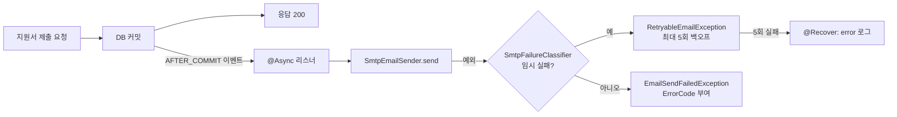

> 지금 gmail만 이메일로 등록 가능한 상황인가요?

리뷰에서 이 한 줄을 받고 나서야, 제가 뭘 전제로 코드를 짰는지가 보였어요.

안녕하세요, 고준서입니다. 동아리움이라는 대학 동아리 지원 서비스의 백엔드를 팀에서 맡고 있고(백엔드 3인, 프론트엔드 3인), 지원서 제출과 합불 알림 이메일은 제가 담당했습니다. 이메일 도메인 커밋 38개 중 35개가 제 손을 거쳤으니 이 부분에서 나온 문제는 대부분 제 책임이기도 하고요. 이번 글에서는 2025년 10월 8일에 머지된 [PR #97](https://github.com/kakao-tech-campus-3rd-step3/Team18_BE/pull/97)에서 발송을 요청 흐름에서 떼어내고, 실패를 "다시 보낼 것"과 "포기할 것"으로 나눈 과정을 풀어보려 합니다. 그 결정이 8일 뒤에 어떤 장애로 이어졌는지는 [다음 글]({{ "/2025/10/16/async-listener-lazy-init/" | relative_url }})에 따로 적었어요.

## Part 1. 팀 코드에 넣기 3주 전

팀 레포에 이메일 기능이 들어간 건 9월 22일입니다. 그런데 그 전에 한 번 따로 연습을 했어요.

8월 30일부터 개인 레포 emailTest에서 Spring Mail로 Gmail SMTP 발송을 먼저 돌려봤습니다. 수신자용 폼을 만들고, 사용법을 문서로 적고, 9월 8일에는 복사본 레포에 테스트 코드와 Docker 설정까지 붙였죠. 팀 코드에 처음 넣은 버전은 그 3주짜리 실험의 결과물이었습니다.

그때부터 이미 리스너에는 `@TransactionalEventListener(AFTER_COMMIT)`가 달려 있었어요. 지원서가 DB에 커밋되기도 전에 "제출됐습니다" 메일이 먼저 나가면 곤란하니까요. 이 부분만큼은 처음부터 맞게 잡았다고 생각합니다.

## Part 2. 발송을 요청에서 떼어내기

### 2.1 제출 버튼이 SMTP를 기다리고 있었습니다

9월 26일에 올린 [이슈 #80](https://github.com/kakao-tech-campus-3rd-step3/Team18_BE/issues/80)의 개선 목록에 "@async 비동기처리 고려해보기"라는 항목이 있었습니다.

지원서 제출 API가 응답을 돌려주기 전에 Gmail SMTP 왕복을 기다리면 어떻게 될까요? SMTP가 느려지는 순간 사용자의 제출 버튼도 같이 느려집니다. 메일은 부가 기능인데, 제출이라는 본 기능이 거기 묶여 있었던 거죠.

### 2.2 @Async 한 줄

10월 2일 커밋 [258c811b](https://github.com/kakao-tech-campus-3rd-step3/Team18_BE/commit/258c811b)에서 리스너에 `@Async`를 붙였습니다. 지원서는 커밋되고, 응답은 바로 나가고, 메일은 다른 스레드에서 보냅니다.

```java
// domain/email/eventListener/ApplicationNotificationListener.java:26-28
@Async
@TransactionalEventListener(phase = TransactionPhase.AFTER_COMMIT)
public void onSubmitted(ApplicationSubmittedEvent event) {
```

지원서 제출, 면접 합격, 면접 불합격, 최종 합격, 최종 불합격. 다섯 이벤트가 전부 같은 모양으로 붙어 있습니다. `AsyncConfig`는 `@EnableAsync` 한 줄이 전부예요.



*그림 1. 제출 요청과 메일 발송이 분리된 뒤의 흐름. 커밋이 끝나야 이벤트가 나가고, 발송 실패는 분류기를 거쳐 재시도 여부가 갈립니다.*

## Part 3. 실패를 둘로 나누기

분리하고 나니 이번엔 실패가 문제였습니다.

요청 스레드에서 보낼 때는 예외가 곧 500 응답이었어요. 그런데 비동기 스레드에서는 예외를 받아줄 호출자가 없습니다. 그냥 사라지는 거죠. 그래서 10월 6일 커밋 [5e68154e](https://github.com/kakao-tech-campus-3rd-step3/Team18_BE/commit/5e68154e)에서 발송기에 재시도를 넣고, 어떤 실패를 재시도할지 정하는 분류기를 따로 뒀습니다.

```java
// domain/email/sender/SmtpEmailSender.java:26-30
@Retryable(
        include = { RetryableEmailException.class },
        maxAttempts = 5,
        backoff = @Backoff(delay = 2_000, multiplier = 2.0, maxDelay = 60_000)
)
```

재시도 대상은 `RetryableEmailException` 하나뿐입니다. 발송기는 `mailSender.send`가 던진 예외를 `SmtpFailureClassifier.isTemporary`에 넘겨서, 임시 실패면 `RetryableEmailException`으로 감싸 던지고 아니면 `EmailSendFailedException`으로 끝냅니다. 최대 5회, 2초에서 시작해 두 배씩 늘리고 60초를 넘지 않아요. 다섯 번 다 실패하면 `@Recover`가 error 로그를 남기고 `EmailSendFailedException`을 던집니다.

그럼 무엇이 임시이고 무엇이 영구일까요?

분류기는 SMTP 응답 코드로 판단합니다. 연결 실패와 소켓 타임아웃은 임시, 인증 실패는 영구입니다. 응답에 RFC 3463 확장 코드가 있으면 `4.x.x`는 임시, `5.x.x`는 영구로 보되 `5.2.2`(수신함 가득 참)만 임시로 예외를 뒀어요. 확장 코드가 없으면 기본 코드 4xx는 임시, 552(용량 초과)는 임시, 나머지 5xx는 영구입니다. 그것도 없으면 메시지 문자열에서 "try again later", "temporarily", "timeout", "over quota"를 찾습니다.

```java
// domain/email/sender/SmtpFailureClassifier.java:50-60
if (enhanced != null) {
    if (enhanced.startsWith("4.")) return true;      // 4.x.x = 임시
    if ("5.2.2".equals(enhanced)) return true;       // mailbox full
    return false;                                     // 그 외 5.x.x
}

if (basic != null) {
    if (basic >= 400 && basic < 500) return true;    // 4xx
    if (basic == 552) return true;                   // 용량/스토리지
    return false;                                    // 나머지 5xx
}
```

`RetryableEmailException`에는 에러 코드가 없습니다. 소스 주석에 "이 에러는 @Retry 에서 사용하는거라 에러코드가 없습니다. 프론트에 넘겨주지 않아요"라고 적어뒀거든요. 재시도는 서버 안에서 끝나는 일이지 사용자에게 보여줄 상태가 아니니까요. 반대로 `EmailSendFailedException`은 같은 분류기의 `toErrorCode`로 수신자 오류, 정책 거부, 인증 실패, 타임아웃 같은 `ErrorCode`를 받습니다.

### 그리고 맨 앞의 그 질문

여기서 팀원이 예외 클래스를 보고 물었습니다. 지금 gmail만 이메일로 등록 가능한 상황인가요?

분류기가 Gmail 응답 메시지를 기준으로 만들어진 게 코드에 그대로 보였던 거예요. RFC 5321과 RFC 1893 링크를 달고, `550 5.7.1`까지는 서버가 달라도 같고 뒤에 붙는 문장만 다르다고 답했습니다. 그래서 문자열보다 코드를 먼저 보게 짜긴 했지만, 마지막 폴백의 문자열 매칭은 제가 Gmail에서 본 문장들이라는 걸 그 자리에서 인정했어요.

CodeRabbit도 두 가지를 짚었습니다. 하나는 `catch (Throwable e)`가 `OutOfMemoryError`까지 이메일 실패로 감싼다는 것이었고, 지금 코드는 `Exception`을 잡습니다. 다른 하나는 `@Async` 메서드에서 던진 예외가 호출자에게 전파되지 않으니 리스너 안에서 잡아야 한다는 것이었어요.

두 번째는 반영하지 않았습니다.

8일 뒤에 정확히 그 경로로 장애를 겪었고요.

## Part 4. 테스트는 실제로 보냅니다

PR 본문의 "고민했던 내용"에 이렇게 적었습니다.

> 적절한 테스트 방법에 대해 고민하다가, 실제로 이메일을 보내는 것이 작동을 확신할 수 있는 방법이라 생각해서 그렇게 만들어봤습니다.

`JavaMailSender`를 mock으로 바꾸면 통과하는 테스트가 무엇을 말해줄까요? SMTP 인증이 틀렸는지, 발신 주소가 거부되는지, HTML이 깨지는지, 아무것도요. 그래서 `EmailSendTest`는 실제 SMTP로 UUID가 박힌 제목의 메일을 보내고, `EmailServiceIntegrationTest`는 서비스부터 발송까지 한 번에 돌립니다. 실행하는 사람이 `MAIL_TO`에 자기 주소를 넣고 메일함을 직접 확인하는 방식이에요.

CodeRabbit이 "assertDoesNotThrow만으로는 검증이 약하다"고 했을 때는 "테스트 실행자가 본인 이메일을 넣어서 직접 메일함을 확인하기를 원해서 이렇게 만든 거"라고 답했습니다.

대가는 있었습니다. 두 테스트 모두 `@Disabled("실제 외부 SMTP 메일을 보냅니다. 로컬에서 주석처리 후 수동 실행하세요.")`가 붙어서 CI에서는 돌지 않아요. 확신을 주는 테스트와 매번 도는 테스트가 같은 테스트가 아니었던 거죠.

## Part 5. 마치며

이 설계에는 구멍이 몇 개 남아 있습니다.

분류기는 `mailSender.send`가 던진 예외만 봅니다. 발송기에 도달하기 전에 서비스 안에서 나는 예외는 임시인지 영구인지 판단조차 받지 않아요. 다음 글의 장애가 정확히 그 자리에서 났습니다.

재시도 자체에도 빈틈이 있어요. 소켓 타임아웃을 임시로 분류했는데, 서버가 메일을 이미 받아들인 뒤 응답만 늦은 경우라면 재시도는 같은 메일을 두 번 보냅니다. 재시도는 메모리 안에서 도는 백오프라서 60초 대기 중에 프로세스가 내려가면 그 메일은 그냥 사라지고요. 아웃박스 테이블도 큐도 없고, 다섯 번 실패한 뒤 `@Recover`가 던지는 예외는 비동기 스레드 안이라 로그 한 줄로 끝납니다.

그리고 이슈 #80에는 "@Transactional 추가"가 체크돼 있지만, 정작 PR에서 리스너의 `@Transactional` import는 지워졌습니다. 그 어노테이션을 넣었다 뺐다 한 이야기도 다음 글에 있어요.

비동기로 떼어내는 건 한 줄이었는데, 떼어낸 뒤에 실패를 어디서 누가 받아줄지 정하는 게 진짜 일이었습니다. 이메일 알림을 비동기로 돌리려는 분들께 이 사례가 조금이나마 참고가 되면 좋겠습니다. 감사합니다.
