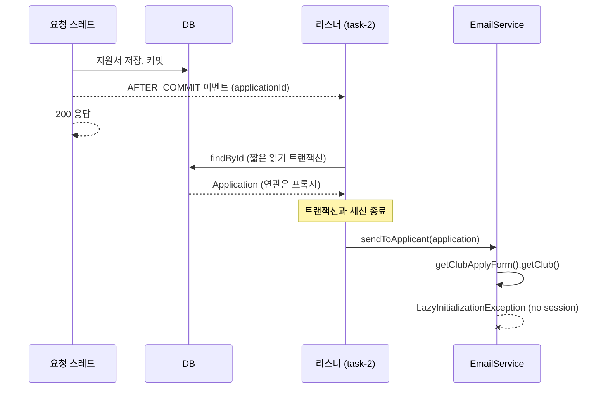

```
org.hibernate.LazyInitializationException: Could not initialize proxy [...ClubApplyForm#1] - no session
    at ...ClubApplyForm$HibernateProxy.getClub(Unknown Source)
    at ...EmailService.sendToApplicant(EmailService.java:43)
    at ...ApplicationNotificationListener.onSubmitted(ApplicationNotificationListener.java:34)
```

이 로그, 보신 적 있으시죠?

안녕하세요, 고준서입니다. 동아리움이라는 대학 동아리 지원 서비스의 백엔드를 팀에서 맡고 있고(백엔드 3인, 프론트엔드 3인), 이메일 알림은 제가 담당했습니다. 2025년 10월 16일 저녁, 지원서를 내면 화면에는 "처리됨"이 뜨는데 메일은 오지 않는 상태를 운영 로그에서 발견했어요. 위의 예외가 그 로그였고요. 이번 글에서는 이 예외가 어디서 왔는지, 왜 아무도 모르게 실패했는지, 그리고 사고 이틀 전에 제 손으로 그 조건을 만들어 놓았다는 것까지 풀어보려 합니다.

## 응답은 200, 메일은 없음

[이슈 #144](https://github.com/kakao-tech-campus-3rd-step3/Team18_BE/issues/144)에 붙여 둔 로그의 앞부분은 이렇습니다.

```
2025-10-16T18:29:45.128+09:00 ERROR 1 --- [Team18_BE] [ task-2] .a.i.SimpleAsyncUncaughtExceptionHandler :
Unexpected exception occurred invoking async method:
public void ...ApplicationNotificationListener.onSubmitted(...ApplicationSubmittedEvent)
org.hibernate.LazyInitializationException: Could not initialize proxy [...ClubApplyForm#1] - no session
    at ...ClubApplyForm$HibernateProxy.getClub(Unknown Source)
    at ...EmailService.sendToApplicant(EmailService.java:43)
    at ...ApplicationNotificationListener.onSubmitted(ApplicationNotificationListener.java:34)
```

스레드 이름이 `task-2`인 게 보이시나요? 요청 스레드가 아니라 `@Async` 풀에서 도는 스레드예요. 거기서 `ClubApplyForm` 프록시의 `getClub()`을 호출하는 순간 세션이 없다고 터졌습니다. 위치는 `EmailService.java:43`, 당시 코드로는 이 줄이었습니다.

```java
// EmailService.sendToApplicant 첫 줄 (수정 전, cf304daf 직전 상태)
public void sendToApplicant(Application application, List<AnswerEmailLine> emailLines) {

    Long clubId = application.getClubApplyForm().getClub().getId();
```

사용자 화면에는 아무 에러도 없었습니다. 지원서는 정상 저장, 응답은 200. 메일만 조용히 빠졌어요.

## 리스너는 분명히 다시 조회했는데요?

수정 전 리스너는 이벤트에 담긴 `applicationId`로 `applicationRepository.findById`를 다시 호출하고 있었습니다. 비동기 스레드에서 새로 꺼내 왔으니 괜찮겠지, 하고 짠 구조였죠.

그런데 리스너 메서드 자체에는 트랜잭션이 없었습니다.

`findById`는 리포지토리 프록시가 여는 짧은 읽기 트랜잭션 안에서 실행되고, 값을 돌려주는 순간 그 트랜잭션과 세션은 닫힙니다. 손에 든 `Application`은 살아 있지만 `clubApplyForm` 같은 지연로딩 연관은 프록시 껍데기만 남아 있어요. 이걸 `EmailService`에 넘겨 `getClub()`을 부르면 프록시가 초기화를 시도하고, 붙을 세션이 없으니 예외가 납니다.



*그림 1. 요청 스레드는 커밋 후 바로 응답을 돌려주고, 비동기 리스너는 세션이 닫힌 뒤에 지연로딩 필드를 건드립니다.*

[PR #142](https://github.com/kakao-tech-campus-3rd-step3/Team18_BE/pull/142) 본문에 원인을 이렇게 적었습니다.

> 문제가 발생한 이유는 @async로 분리된 thread가 transaction이 종료된 이후에 엔티티의 지연로딩필드에 접근하고 있었기 때문이었습니다.

## 이틀 전으로 되감기

그런데 이 리스너, 원래부터 이런 모양이었을까요?

아니었습니다. 사고 이틀 전에 제가 두 번 손댔거든요.

10월 14일 12시 42분에 올린 [PR #136](https://github.com/kakao-tech-campus-3rd-step3/Team18_BE/pull/136)의 제목은 "Listener오류 수정", 본문은 "이메일 발송이 안되는 문제 해결" 한 줄이에요. 이 PR에서 `@TransactionalEventListener(AFTER_COMMIT)`를 주석 처리하고 `@Transactional(readOnly = true)`를 붙였습니다. 리스너 안에 읽기 트랜잭션을 두면 `findById` 뒤에도 세션이 살아 있으니 지연로딩이 되죠. 같은 PR에는 `EmailService.sendToApplicant`에 `REQUIRES_NEW`를 붙였다가 주석으로 남긴 흔적도 있습니다.

여기까지만 보면 문제는 이미 풀린 상태였습니다.

## 42분 뒤

13시 24분, [PR #137](https://github.com/kakao-tech-campus-3rd-step3/Team18_BE/pull/137)로 그걸 다시 뒤집었습니다. `@Transactional`을 주석 처리하고 `AFTER_COMMIT`을 되살렸어요. 제목은 GitHub 웹 편집기가 붙여 준 "Update ApplicationNotificationListener.java", 본문은 빈 템플릿, 1분 만에 제가 직접 머지했습니다.

왜 되돌렸을까요?

솔직히 지금은 추측밖에 안 됩니다. 커밋되기도 전에, 트랜잭션 도중에 리스너가 돌면 안 된다는 판단이었을 거예요. 그런데 PR에도 커밋 메시지에도 그 이유가 한 줄도 없습니다. 확실한 건 이 두 번째 변경으로 리스너에서 트랜잭션이 사라졌고, 그 상태로 이틀 뒤 운영에 첫 지원서가 들어왔다는 것뿐이에요.

## 왜 조용히 실패했나: 세 겹

메일이 안 나갔는데 왜 아무도 몰랐을까요? 세 겹이 겹쳐 있었습니다.

첫째, `@Async` 메서드에서 던진 예외는 호출자에게 돌아오지 않습니다. `AsyncConfig`는 `@EnableAsync` 한 줄이라 기본 핸들러인 `SimpleAsyncUncaughtExceptionHandler`가 받아서 ERROR 로그 한 줄 남기는 것으로 끝나요.

둘째, `AFTER_COMMIT` 리스너는 이름 그대로 커밋이 끝난 뒤에 돕니다. 지원서는 이미 저장됐고 응답도 나갔으니 사용자는 성공 화면을 봅니다.

셋째, 재시도가 이 예외를 보지 않습니다. [PR #97](https://github.com/kakao-tech-campus-3rd-step3/Team18_BE/pull/97)에서 붙인 `SmtpEmailSender`의 `@Retryable`은 `RetryableEmailException`만 잡는 구조거든요. SMTP 4xx 같은 일시 장애용이고, 이 예외는 발송기에 도달하기도 전에 `EmailService` 안에서 터졌으니 재시도 대상조차 아니었습니다.

예외는 났는데, 그걸 받아줄 사람도 코드도 없었던 거죠.

## 수정: 엔티티 대신 값을 넘긴다

같은 날 23시 9분 커밋 [cf304daf](https://github.com/kakao-tech-campus-3rd-step3/Team18_BE/commit/cf304daf)에서 방향을 바꿨습니다. 비동기 스레드에서는 엔티티를 아예 만지지 않기로요. 이벤트를 발행하는 시점, 그러니까 요청 트랜잭션 안에서 메일에 필요한 값을 전부 꺼내 불변 레코드에 담고, 그것만 넘깁니다.

```java
// domain/email/dto/ApplicationInfoDto.java:5-15
public record ApplicationInfoDto(
        String clubName,
        String userName,
        Long clubId,
        String presidentEmail,
        String studentId,
        String userDepartment,
        String userPhoneNumber,
        String userEmail,
        LocalDateTime lastModifiedAt
        ) {
}
```

값을 채우는 `buildApplicationInfo`는 `ApplicationServiceImpl`에 두었고, 회장 이메일 조회(`ClubMemberRepository`)도 `EmailService`에서 이쪽으로 옮겼습니다. 리스너는 `event.info()`를 꺼내 넘기기만 해요.

```java
// domain/email/eventListener/ApplicationNotificationListener.java:26-33
@Async
@TransactionalEventListener(phase = TransactionPhase.AFTER_COMMIT)
public void onSubmitted(ApplicationSubmittedEvent event) {
    ApplicationInfoDto info = event.info();

    emailService.sendToApplicant(info, event.emailLines());
    log.info("Email sent successfully: clubName={} userName={}", info.clubName(), info.userName());
}
```

## 다섯 이벤트, 그리고 리뷰가 잡아준 버그 하나

지원서 제출, 면접 합격, 면접 불합격, 최종 합격, 최종 불합격. 다섯 이벤트가 모두 같은 DTO를 싣도록 바꿨고, `Application`, `Club`, `User`를 받던 `EmailService` 시그니처도 전부 DTO 기반으로 정리했습니다. 테스트 세 파일도 엔티티 픽스처 대신 DTO로 옮겼고요.

리뷰에서 CodeRabbit이 진짜 버그를 하나 잡아줬습니다. 면접 합격 처리에서 `updateStage(FINAL)`을 먼저 부르고 이벤트에 `a.getStage()`를 넣고 있어서, INTERVIEW가 아닌 FINAL이 담기고 있었어요. 원래 stage를 지역 변수에 잡아 두는 것으로 고쳤습니다.

## 고려하지 못한 대안들

리스너에 `@Transactional`을 다는 방법은 이틀 전에 시도했다가 42분 만에 되돌린 바로 그것이고, 이유가 기록에 없다는 건 위에 적은 대로예요. open-in-view나 fetch join으로 연관을 미리 채우는 방법은 당시에 검토했는지조차 기록이 없습니다.

지금 보면 fetch join은 이벤트마다 필요한 연관이 달라 리스너별로 쿼리를 따로 두게 되고, 결국 "비동기 스레드가 영속 객체를 쥐고 있어야 한다"는 전제를 그대로 유지하는 셈이라 DTO 쪽이 맞았다고 생각해요.

## 고치는 데 다섯 시간, 적는 데 여드레

로그는 16일 18시 29분, 수정 커밋은 같은 날 23시 9분입니다. 발견에서 수정까지 다섯 시간이었어요.

그런데 PR은 24일에 열었고, 이슈는 그 다음 날인 25일에 썼습니다. 이슈 번호 #144가 PR 번호 #142보다 뒤인 이유죠. 고치는 건 빨랐고, 팀이 볼 수 있게 남기는 건 여드레 늦었습니다. 이슈에 스택트레이스를 붙이고 재현 절차를 적은 건 사후 문서화였어요.

## 돌아보면

비동기 실패를 세는 지표가 지금도 없습니다. `SimpleAsyncUncaughtExceptionHandler`의 ERROR 로그 한 줄이 전부이고, 그 로그는 사람이 열어 봐야 알 수 있어요. 이 사고를 겪고도 `AsyncConfigurer`로 핸들러를 바꾸거나 실패 카운터를 붙이지 않았습니다.

재시도 분류도 마찬가지예요. `SmtpFailureClassifier`는 SMTP 응답 코드로 일시 장애와 영구 장애를 나누지만, 발송기 앞단에서 나는 예외는 분류 밖입니다. "재시도 안 함"이 아니라 "재시도 여부를 판단조차 안 함"인 거죠. 그리고 `ApplicationRepository`는 리스너에서 더 이상 쓰지 않는데 필드 주입이 지금도 남아 있습니다. 리뷰에서 지적받고도 정리하지 않은 거예요. 이메일 통합 테스트는 실제 SMTP로 보내는 방식이라 `@Disabled`로 꺼져 있고, 비동기 스레드에서 지연로딩이 터지는 경로를 재현하는 테스트는 없습니다.

같은 조건이 다시 오면 같은 방식으로, 로그에서만 알게 될 거예요. 그 로그를 여드레 뒤가 아니라 그날 팀에 올리는 것부터 고쳐야겠다는 게 이 사고에서 남은 숙제입니다. 이 리스너를 이벤트로 떼어내고 재시도를 붙였던 결정 자체는 [이전 글]({{ "/2025/10/08/email-event-retry-classification/" | relative_url }})에 있습니다. 긴 글 읽어주셔서 감사합니다.
