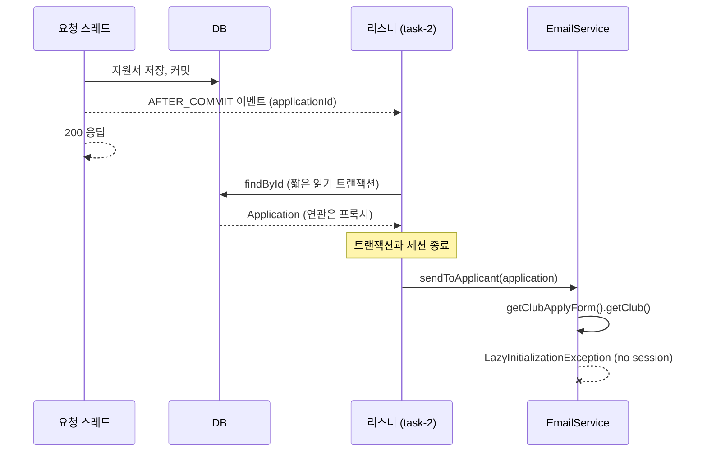

안녕하세요, 고준서입니다. 동아리움이라는 대학 동아리 지원 서비스의 백엔드를 팀에서 맡고 있고(백엔드 3인, 프론트엔드 3인), 지원서를 내면 나가는 알림 이메일은 제가 담당했습니다. 2025년 10월 16일 저녁, 운영 로그에서 이런 줄을 봤습니다.

```
2025-10-16T18:29:45.128+09:00 ERROR 1 --- [Team18_BE] [ task-2] .a.i.SimpleAsyncUncaughtExceptionHandler :
Unexpected exception occurred invoking async method:
public void ...ApplicationNotificationListener.onSubmitted(...ApplicationSubmittedEvent)
org.hibernate.LazyInitializationException: Could not initialize proxy [...ClubApplyForm#1] - no session
    at ...ClubApplyForm$HibernateProxy.getClub(Unknown Source)
    at ...EmailService.sendToApplicant(EmailService.java:43)
    at ...ApplicationNotificationListener.onSubmitted(ApplicationNotificationListener.java:34)
```

지원서는 저장됐고 화면에는 "처리됨"이 떴는데 메일만 안 나간 상황이었어요. 나중에 [이슈 #144](https://github.com/kakao-tech-campus-3rd-step3/Team18_BE/issues/144)에 재현 방법을 이렇게 적었습니다.

> 1. 지원서 제출하기 버튼을 누른다
> 2. 처리됨을 받지만, 실제로 이메일이 전송이 되지 않는다
> 3. 로그를 확인해보면 lazyInitializationException이 발생했음을 알 수 있다.

## 세션이 닫힌 뒤에 엔티티를 만졌습니다

로그에 찍힌 스레드 이름이 `task-2`입니다. 사용자의 요청을 처리하는 스레드가 아니라, 메일 발송용으로 따로 도는 비동기 스레드예요. 이 프로젝트는 지원서가 DB에 저장(커밋)된 뒤에 이벤트를 하나 발행하고, 그 이벤트를 받은 리스너가 다른 스레드에서 메일을 보내는 구조였습니다. 제출 응답이 메일 서버를 기다리지 않게 하려고 그렇게 떼어 놓은 거였고, 그 결정은 [앞 글]({{ "/2025/10/08/email-event-retry-classification/" | relative_url }})에 있습니다.

문제는 그 리스너가 엔티티를 다루는 방식이었어요. 리스너는 이벤트에 담긴 `applicationId`로 지원서를 DB에서 다시 조회했습니다. 새 스레드에서 새로 꺼내 왔으니 괜찮을 거라고 봤던 거죠. 그런데 JPA에서 `findById`는 짧은 읽기 트랜잭션 안에서 실행되고, 값을 돌려주는 순간 그 트랜잭션과 세션은 닫힙니다. 손에 든 `Application` 객체는 살아 있지만, 그 안의 `clubApplyForm` 같은 연관 필드는 "필요할 때 DB에서 가져오겠다"는 껍데기(프록시)만 들어 있어요. 이 껍데기를 `EmailService`에 넘겨서 `getClub()`을 부르면, 프록시가 DB에 붙으려다 세션이 없다며 예외를 냅니다.

```java
// EmailService.sendToApplicant 첫 줄 (수정 전, cf304daf 직전 상태)
public void sendToApplicant(Application application, List<AnswerEmailLine> emailLines) {

    Long clubId = application.getClubApplyForm().getClub().getId();
```



*그림 1. 요청 스레드는 커밋 후 바로 응답을 돌려주고, 비동기 리스너는 세션이 닫힌 뒤에 연관 필드를 건드립니다.*

[PR #142](https://github.com/kakao-tech-campus-3rd-step3/Team18_BE/pull/142) 본문에는 원인을 이렇게 적었습니다.

> 문제가 발생한 이유는 @async로 분리된 thread가 transaction이 종료된 이후에 엔티티의 지연로딩필드에 접근하고 있었기 때문이었습니다.

그런데 이 조건은 사고 이틀 전에 제가 직접 만든 것이었습니다.

10월 14일 12시 42분에 올린 [PR #136](https://github.com/kakao-tech-campus-3rd-step3/Team18_BE/pull/136)의 제목은 "Listener오류 수정", 본문은 "이메일 발송이 안되는 문제 해결" 한 줄입니다. 이 PR에서 리스너의 `@TransactionalEventListener(AFTER_COMMIT)`를 주석 처리하고 `@Transactional(readOnly = true)`를 붙였어요. 리스너 안에 읽기 트랜잭션이 있으면 조회 뒤에도 세션이 살아 있으니 위 예외는 안 납니다. 같은 PR에는 `EmailService.sendToApplicant`에 `REQUIRES_NEW`를 붙였다가 주석으로 남긴 흔적도 있고요. 이 PR은 30분 뒤에 머지됐습니다.

그리고 13시 24분, [PR #137](https://github.com/kakao-tech-campus-3rd-step3/Team18_BE/pull/137)로 그걸 다시 뒤집었습니다. `@Transactional`을 주석 처리하고 `AFTER_COMMIT`을 되살렸어요. 제목은 GitHub 웹 편집기가 붙여 준 "Update ApplicationNotificationListener.java", 본문은 빈 템플릿, 1분 뒤에 제가 머지했습니다. 왜 되돌렸는지는 PR에도 커밋에도 한 줄이 없습니다. 커밋되기 전에 리스너가 도는 걸 피하려던 게 아니었나 싶지만, 기록이 없으니 추측이에요. 확실한 건 이 변경으로 리스너에서 트랜잭션이 사라졌고, 그 상태로 이틀 뒤 운영에 지원서가 들어왔다는 것입니다.

## 왜 아무도 몰랐나

메일이 안 나갔는데 사용자도 팀도 몰랐던 데는 이유가 겹쳐 있었습니다. 비동기 스레드에서 난 예외는 요청을 보낸 쪽으로 돌아오지 않습니다. 이 프로젝트의 `AsyncConfig`는 `@EnableAsync` 한 줄이라, 스프링 기본 핸들러가 받아서 ERROR 로그 한 줄 남기는 게 전부였어요. 리스너는 커밋이 끝난 뒤에 도니까 지원서는 이미 저장됐고 사용자는 성공 화면을 봅니다. 앞 글에서 붙인 재시도는 메일 서버가 돌려준 실패만 다시 보내는 구조라, 발송기까지 가기도 전에 `EmailService` 안에서 터진 이 예외는 재시도 대상조차 아니었습니다.

이슈 #144에 이렇게 적어 뒀습니다.

> 비동기처리 thread에서 발생하는 예상치 못한 exception이라서 로그를 통해 확인할 수 있었습니다.

## 엔티티 대신 값을 넘기기로

같은 날 23시 9분 커밋 [cf304daf](https://github.com/kakao-tech-campus-3rd-step3/Team18_BE/commit/cf304daf)에서 방향을 바꿨습니다. 비동기 스레드에서는 엔티티를 아예 만지지 않기로요. 이벤트를 발행하는 시점, 그러니까 아직 요청 트랜잭션 안에 있을 때 메일에 필요한 값을 전부 꺼내 불변 레코드에 담고, 리스너에는 그 값만 넘깁니다.

```java
// domain/email/dto/ApplicationInfoDto.java:5-15
public record ApplicationInfoDto(
        String clubName,
        String userName,
        Long clubId,
        String presidentEmail,
        String studentId,
        String userDepartment,
        String userPhoneNumber,
        String userEmail,
        LocalDateTime lastModifiedAt
        ) {
}
```

```java
// domain/email/eventListener/ApplicationNotificationListener.java:26-33
@Async
@TransactionalEventListener(phase = TransactionPhase.AFTER_COMMIT)
public void onSubmitted(ApplicationSubmittedEvent event) {
    ApplicationInfoDto info = event.info();

    emailService.sendToApplicant(info, event.emailLines());
    log.info("Email sent successfully: clubName={} userName={}", info.clubName(), info.userName());
}
```

값을 채우는 `buildApplicationInfo`는 `ApplicationServiceImpl`에 두었고, 회장 이메일을 찾는 조회도 `EmailService`에서 이쪽으로 옮겼습니다. 지원서 제출, 면접 합격, 면접 불합격, 최종 합격, 최종 불합격 다섯 이벤트가 모두 같은 레코드를 싣게 바꿨고, 테스트 세 파일도 엔티티 대신 이 레코드를 쓰도록 고쳤어요. PR 본문에는 "해결을 위해 만든 dto가 너무 지저분하지는 않은지 궁금합니다. 좀 더 깔끔한 구성 있으면 제안 감사드립니다."라고 적었는데, 팀원은 이렇게 확인하고 승인해 줬습니다.

> 수고하셨어요! 이메일 보내는데 필요한 정보를 AppliatotionInfoDto에 담아두고 이걸 사용함으로서 LazyInitializationException을 해결하신거죠?

리뷰 봇(CodeRabbit)이 이 PR에서 진짜 버그를 하나 잡아 주기도 했습니다. 면접 합격 처리에서 단계를 FINAL로 바꾼 뒤에 이벤트에 `a.getStage()`를 넣고 있어서, 이벤트에 INTERVIEW가 아니라 FINAL이 담기고 있었어요. 원래 단계를 지역 변수에 잡아 두는 것으로 고쳤습니다.

리스너에 트랜잭션을 두는 방법은 이틀 전에 42분 만에 되돌린 바로 그 방법이고, 연관을 미리 채워서 넘기는 방법(fetch join 등)은 당시에 검토했는지 기록이 없습니다. 지금 보면 그 방법은 이벤트마다 필요한 연관이 달라 리스너별로 쿼리를 따로 두게 되고, 비동기 스레드가 영속 객체를 쥐고 있어야 한다는 전제도 그대로라 값만 넘기는 쪽이 맞았다고 생각합니다.

## 다섯 시간과 여드레

로그는 16일 18시 29분, 수정 커밋은 같은 날 23시 9분입니다. 고치는 데는 다섯 시간이 걸렸어요. 그런데 PR은 24일에 열었고 이슈는 25일에 썼습니다. 이슈 번호(#144)가 PR 번호(#142)보다 뒤인 이유예요. 팀이 볼 수 있게 남기는 데 여드레가 걸린 셈이고, 이슈에 로그와 재현 절차를 붙인 건 다 고친 뒤의 문서화였습니다.

남은 것도 있습니다. 비동기 스레드의 실패를 세는 지표는 지금도 없고, 기본 핸들러가 남기는 ERROR 로그 한 줄이 전부예요. 재시도 분류기는 메일 서버의 응답 코드만 보기 때문에, 발송기 앞에서 나는 예외는 여전히 분류 밖입니다. 리스너에는 이제 쓰지 않는 `ApplicationRepository` 주입이 남아 있고, 이메일 통합 테스트는 실제 메일 서버로 보내는 방식이라 꺼져 있어서, 비동기 스레드에서 연관 필드가 터지는 이 경로를 자동으로 재현하는 테스트는 없습니다. 같은 조건이 다시 오면 그때처럼 로그에서 알게 될 거예요. 그 로그를 여드레 뒤가 아니라 그날 팀에 올리는 것이 이 사고에서 제가 가져가는 숙제입니다. 읽어주셔서 감사합니다.
