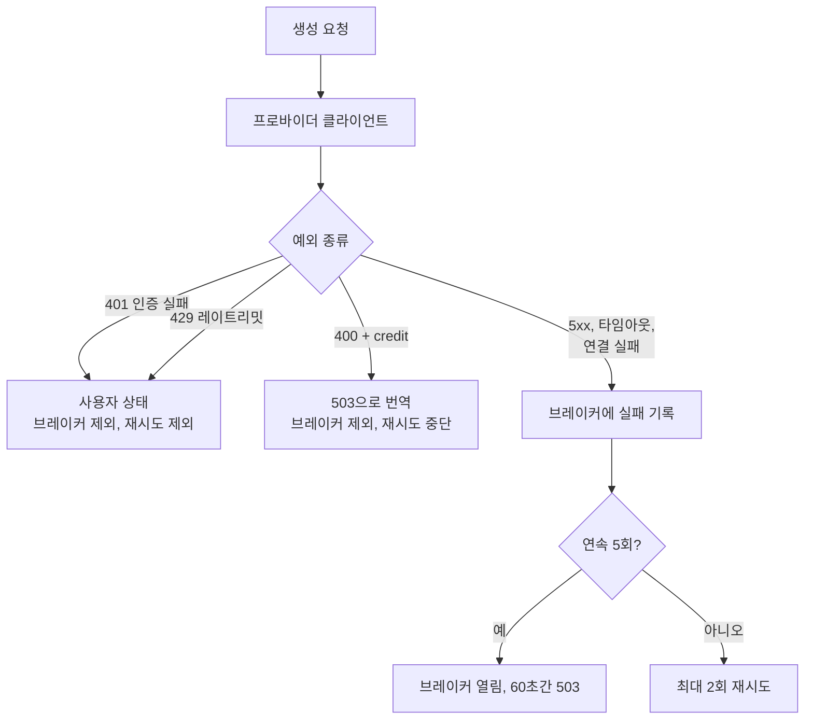

안녕하세요, 고준서입니다. study-helper는 PDF를 올리면 LLM으로 학습 노트와 퀴즈를 만들어 주는 서비스이고, 혼자 만들었습니다. 사용자는 Claude, GPT, TimelyGPT 중 하나를 고르고 자기 API 키를 넣어요. 2026년 3월 31일에 프로바이더를 하나에서 셋으로 늘리면서 클라이언트마다 서킷 브레이커를 하나씩 뒀는데, 그 브레이커가 무엇을 실패로 세고 무엇을 세지 않는지를 코드 기준으로 정리해 둡니다. 결론부터 말하면 프로바이더마다 연속 실패 5회에 열리고 60초 뒤 하나를 통과시켜 시험하는 구조이고, 사용자 키 때문에 나는 인증 실패(401)와 한도 초과(429)는 세지 않습니다. 세 클라이언트와 브레이커 구현은 Claude와 같이 작업했고, 그날 커밋에는 공동 작성자로 Claude가 찍혀 있습니다. 이 규칙을 테스트로 못 박은 건 한 달 뒤인 4월 30일이었고, 운영에서 브레이커가 실제로 열린 횟수나 401과 5xx의 건수는 기록에 없어요.

## 브레이커 하나에 프로바이더 하나

서킷 브레이커는 외부 서비스가 계속 실패하면 잠시 호출을 끊어 두는 장치입니다. 여기서는 프로바이더별로 프로세스 안에 하나씩 있습니다. 연속 실패가 5회에 닿으면 열리고, 60초 뒤에 요청 하나를 통과시켜 다시 닫아도 되는지 시험합니다. 세 클라이언트가 같은 클래스를 복사해서 갖고 있어요.

```python
# app/services/anthropic_client.py:24-31
class _CircuitBreaker:
    """Simple half-open circuit breaker for the Anthropic API."""

    FAILURE_THRESHOLD = 5     # consecutive failures before opening
    RECOVERY_TIMEOUT = 60     # seconds before attempting half-open
```

열려 있는 동안 그 프로바이더 호출은 API를 건드리지 않고 503으로 바로 끝납니다. 다른 두 프로바이더의 브레이커는 별개라 영향이 없습니다. 재시도는 브레이커 바깥에서 `MAX_RETRIES=2`로 돕니다. 1초, 2초 간격이고, 두 번 더 해 보고도 안 되면 500으로 끝납니다.

문제는 "실패"가 뭐냐는 것이었습니다.



*그림 1. 예외 종류에 따라 브레이커에 기록되기도, 안 되기도 합니다.*

## 누구의 실패인가

이 서비스의 키는 서버 것이 아니라 사용자 것입니다. 그러면 인증 실패(401)는 프로바이더의 상태가 아니라 그 사용자의 상태입니다. 401을 실패로 세면, 한 사용자가 오타 난 키로 다섯 번 시도한 순간 브레이커가 열리고, 그때부터 60초 동안 멀쩡한 키를 가진 다른 사용자들까지 503을 받게 됩니다. 프로바이더는 아무 문제가 없는데 서비스가 스스로 문을 닫는 구조가 되죠. 그래서 인증 예외는 브레이커에 기록하지 않습니다.

```python
# app/services/anthropic_client.py:93-98
    except anthropic.AuthenticationError as exc:
        # Auth failures do not count toward the circuit breaker
        raise GenerationError(
            "Invalid Anthropic API key. Please check your key and try again.",
            status_code=401,
        ) from exc
```

같은 논리로 429(요청 한도 초과)도 세지 않습니다. 한도는 대개 키 단위로 걸리니 역시 사용자의 상태입니다. 브레이커에 기록되는 것은 프로바이더 쪽 문제로 볼 수 있는 셋뿐입니다. 5xx 계열 상태 오류, 타임아웃, 연결 실패.

재시도도 같은 선을 긋습니다. 401, 429, 503을 받으면 다시 시도하지 않고 그대로 올립니다. 키가 틀렸는데 2초 기다렸다가 또 보내 봐야 결과는 같고, 한도에 걸렸는데 바로 또 보내면 한도만 더 깊어지고, 503은 브레이커가 이미 열렸다는 뜻이라 재시도해도 같은 503입니다.

Anthropic은 크레딧이 떨어지면 400을 돌려줍니다. 코드로만 보면 잘못된 요청이라 그대로 두면 재시도 대상이 되고 브레이커에도 실패로 쌓입니다. 크레딧이 없는 건 요청 형식 문제도 프로바이더 장애도 아니어서, 메시지에 "credit"이 있으면 503으로 바꾸고 브레이커는 건드리지 않게 했습니다.

```python
# app/services/anthropic_client.py:104-109
    except anthropic.APIStatusError as exc:
        if exc.status_code == 400 and "credit" in str(exc.message).lower():
            raise GenerationError(
                "서비스에 일시적인 문제가 발생했습니다. 잠시 후 다시 시도해주세요.",
                status_code=503,
            ) from exc
```

503으로 올리면 재시도 루프가 바로 멈추고 사용자에게는 "잠시 후 다시" 메시지가 갑니다. 이 메시지는 정확하지 않습니다. 잠시 후에도 안 되는 문제니까요. OpenAI와 TimelyGPT 쪽은 402와 403을 같은 자리로 보내고 "quota exceeded or billing issue"라고 적어 줍니다. 이 분기는 `test_call_claude_credit_error_returns_503` 같은 테스트로 고정돼 있고, 세 클라이언트의 브레이커와 401 처리에도 각각 테스트가 있습니다.

TimelyGPT는 한 단계가 더 있습니다. API 키로 access token을 먼저 받고, 그 토큰으로 생성 요청을 보내는 구조라서요. 이 흐름은 공식 SDK 소스를 보고 그대로 옮겼고, 토큰은 키별로 55분 캐시합니다. 그러면 401이 두 층에서 날 수 있습니다. 토큰 교환에서 나면 키가 틀린 것이고, 생성 요청에서 나면 토큰이 만료됐을 가능성이 있어서, 두 번째 경우는 캐시를 비워 다음 시도가 재인증하게 했습니다.

```python
# app/services/timely_client.py:170-175
    if resp.status_code == 401:
        # Token may have expired; evict cache so next retry re-authenticates
        _token_cache.pop(api_key, None)
        raise GenerationError(
            "TimelyGPT authentication failed. Please verify your API key.",
            status_code=401,
        )
```

여기서도 401은 브레이커 밖입니다. 다만 "다음 시도"가 자동으로 오지는 않습니다. 401은 재시도 제외 목록에 있으니 사용자가 다시 눌러야 재인증이 됩니다. 토큰 캐시는 모듈 변수라 워커마다 따로 있고, 그날 작업 기록에는 "멀티워커 배포 시 워커 간 공유 안됨 (단, 각 워커가 독립적으로 캐싱하므로 기능상 문제 없음)"이라고 적혀 있습니다.

## 네 번째 프로바이더가 있었습니다

3월 24일에는 사용자 키 없이 쓰는 Gemini 무료 플랜이 있었습니다. 서버가 Gemini 키 여러 개를 풀로 들고 돌아가며 쓰고, 429를 맞은 키는 쿨다운에 넣는 구조였어요. 이틀 뒤 쿨다운을 고정 60초에서 15초, 30초, 60초로 늘어나는 방식으로 바꾸고 응답의 Retry-After를 우선하게 했고, 3월 31일에는 한도 초과 재시도를 최대 4회로 늘렸습니다. 그날 GPT와 TimelyGPT를 붙였으니 플랜은 넷이었습니다.

4월 8일에 키 풀이 소진돼 화면에서 무료 플랜을 숨겼습니다. 같은 날 법적 위험을 검토한 문서에는 서버가 키 풀을 돌려 무료로 제공하는 방식이 구글 API 약관 위반 소지가 있다는 판단이 적혀 있고, 결론은 모든 플랜을 사용자 본인 키 방식으로 통일하는 것이었습니다. 4월 9일 커밋에서 `llm_provider.py` 361줄이 사라졌고 `plan` 값에서 `"free"`가 빠졌습니다. 지금 코드에 남은 Gemini의 흔적은 `json_utils.py` 첫 줄 주석 하나입니다.

브레이커가 401을 세지 않는 이유는 "키가 사용자 것"이라는 전제였는데, 무료 플랜은 그 전제를 깨는 유일한 플랜이었고 다른 이유로 사라졌습니다.

## 남은 것

브레이커는 가용성 장치입니다. 프로바이더가 응답을 못 할 때 요청을 빨리 실패시키는 것이지, 돌아온 응답이 맞는지는 전혀 보지 않습니다. 응답 검증은 별도 검증기가 합니다.

가용성 장치로서도 완결되지 않았습니다. 브레이커가 열려 있어도 요청을 다른 프로바이더로 자동으로 보내지 않아서, 503을 받은 사용자가 플랜을 바꿔 다시 눌러야 합니다. 상태는 프로세스 메모리에만 있어 워커가 재시작되면 실패 횟수가 0이 되고, 워커가 둘이면 브레이커도 둘이라 한쪽만 열릴 수 있습니다. 코드 주석에 "multi-worker deployments use Redis-backed state instead"라고 적어 두고 하지 않았습니다. 열림과 닫힘을 세는 지표도, 상태를 보는 엔드포인트도 없어서 브레이커가 실제로 열린 적이 있는지는 로그를 뒤져야 알 수 있습니다.

이 규칙을 지켜 줄 테스트는 브레이커를 넣고 한 달 뒤에야 생겼습니다. 4월 30일 커밋 [57c2c35](https://github.com/gary5876/study-helper-backend/commit/57c2c35)와 [78437ab](https://github.com/gary5876/study-helper-backend/commit/78437ab)에서 클라이언트별 테스트를 늘리면서, 브레이커를 다루는 테스트가 처음 저장소에 들어왔어요. Claude 쪽에는 브레이커 자체의 동작(시작은 닫힘, 임계 미만이면 닫힘, 5회에 열림, 성공하면 초기화, 시간이 지나면 복구) 단위 테스트 다섯 개가 있고, Claude와 GPT 쪽에는 인증 오류가 나도 실패 횟수가 0이라는 것을 `assert _circuit_breaker._failures == 0`으로 확인하는 테스트가 있습니다. TimelyGPT 쪽 401 테스트는 토큰 캐시를 비우는 것만 확인하고 이 규칙은 단언하지 않아요. 그러니 3월 31일부터 4월 30일까지 한 달은 "401은 세지 않는다"를 지켜 주는 것이 코드 주석과 제 눈뿐이었습니다.

그래도 실패를 세기 전에 "이게 누구의 실패인가"를 먼저 나눈 것은 지금도 맞았다고 봅니다. 사용자 키를 받는 서비스에서 그 구분이 없으면 브레이커는 보호 장치가 아니라 장애를 퍼뜨리는 장치가 됩니다.

이 브레이커에서 기록으로 남은 사실은 이렇습니다.

1. 인증 실패를 세지 않는다는 규칙은 Claude와 GPT 클라이언트의 테스트가 확인하고, TimelyGPT 클라이언트는 확인하지 않습니다.
2. 그 테스트는 브레이커를 넣은 지 한 달 뒤에 생겼습니다.
3. 브레이커가 운영에서 몇 번 열렸는지는 세는 지표가 없어서 기록이 없습니다.
