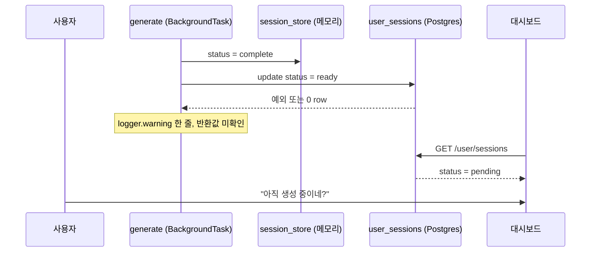

대시보드에 "생성 중"이 하루 종일 떠 있었습니다.

안녕하세요, 고준서입니다. study-helper는 PDF를 올리면 LLM으로 학습 노트와 퀴즈를 만들어 주는 서비스인데, 혼자 만들고 혼자 운영하고 있어요. 2026년 4월 15일 아침에 잡은 버그 하나를 사건 파일처럼 정리해 보려고 합니다. 문제는 다 생성됐는데 대시보드는 끝까지 "생성 중"이라고 우기는 사건이었고, 범인은 제가 전날 직접 만든 코드였습니다.

### 사건 발생

로그인한 사용자가 PDF를 올리고 문제 생성을 끝냅니다. 그리고 대시보드로 돌아가면, 방금 만든 세션이 "생성 중"으로 표시되고 "학습하기" 링크가 뜨지 않아요. 대시보드는 3초마다 폴링하는데 `pending`이 남아 있으면 계속 기다리기만 합니다.

처음엔 만료를 의심했습니다. 메모리 세션 저장소의 TTL이 2시간이거든요. 그런데 방금 만든 세션에서도 똑같이 재현됐습니다.

2시간은 아직 한참 남았는데 말이죠.

### 실종된 상태의 특징

판단을 흐린 관찰이 하나 있었습니다. 사용자 입장에서는 "문제를 끝까지 풀어야만 완료로 바뀐다"고 느낄 만큼 타이밍이 일관적이었어요. 이런 경험 있으신가요? 증상이 너무 규칙적이라 오히려 엉뚱한 곳을 파게 되는 경우요.

그런데 코드에는 풀이 완료가 세션 상태를 갱신하는 경로가 없습니다. 나중에 확인하니 대시보드를 다시 열 때 실행되는 자가 복구 로직이 어쩌다 맞아떨어진 것이었고, "풀어야 완료된다"는 체감은 우연의 상관관계였습니다.

### 현장의 구조: 저장소가 둘이고, 읽는 쪽이 다릅니다

이 서비스는 세션 상태를 두 곳에 들고 있습니다.

| 저장소 | 상태값 | 누가 읽나 |
|---|---|---|
| `session_store` (Redis 또는 메모리) | uploaded, processing, complete, failed | `/status`, `/result` |
| `user_sessions` (Supabase Postgres) | pending, ready, failed | 대시보드 `/user/sessions` |

대시보드는 DB만 읽고, 생성 상태와 결과는 메모리만 읽습니다. 생성이 끝나면 `_sync_user_session_status`가 메모리 쪽 완료를 DB 쪽 `ready`로 한 방향 동기화하죠.



*그림 1. 완료 처리 흐름. 메모리는 complete가 됐는데 DB 갱신이 조용히 실패하면 대시보드는 영원히 pending을 봅니다.*

이 동기화 함수는 전날([d488f43](https://github.com/gary5876/study-helper-backend/commit/d488f43)) 두 저장소의 id를 하나로 맞추면서 처음 넣은 것이었어요. 그 전에는 두 저장소가 아예 다른 id를 써서 대시보드 링크가 404였고, 같은 날 `(user_id, pdf_hash)` UNIQUE 충돌로 재업로드 저장이 실패하던 것도 upsert로 고쳤습니다([821ab87](https://github.com/gary5876/study-helper-backend/commit/821ab87)). 즉 이번 사건은 전날의 수정이 만든 동기화 경로가 조용히 실패하는 문제였습니다.

### 용의자 여덟

여러분이라면 어디부터 의심하시겠어요? 저는 증상만 보고 바로 고치는 대신, 가능한 원인을 전부 적고 하나씩 코드로 확인했습니다. 가설은 Claude Code와 같이 뽑았는데, 여덟 개 중 다섯은 코드를 열어보니 바로 탈락이었어요. 판정 근거를 라인 단위로 남겨 둔 표입니다.

| | 가설 | 판정 | 근거 |
|---|---|---|---|
| H1 | `_sync_user_session_status`가 예외를 삼킨다 | 주원인 | `generate.py:43-50` 모든 예외를 `logger.warning`만 찍고 무시. `update_session_status`가 0건 매치면 False를 돌려주는데 호출측이 반환값을 안 본다 |
| H2 | 재업로드 시 `upsert_session`이 ready를 pending으로 되돌린다 | 보조원인 | `user_store.py:176,193` `status = EXCLUDED.status`, `upload.py:98`은 항상 pending을 넘긴다 |
| H3 | RLS 정책이 UPDATE를 0건으로 만든다 | 아님 | `SUPABASE_DB_URL`이 postgres 역할이라 RLS를 우회한다. INSERT가 되는데 UPDATE만 막힐 수 없다 |
| H4 | session_id, user_id 타입 불일치 | 아님 | uuid4 문자열, RETURNING `id::text`, `$2::uuid` 캐스팅으로 양쪽이 같은 값 |
| H5 | BackgroundTasks 안에서 예외가 나 sync를 건너뛴다 | H1의 특수 케이스 | sync 호출 자체가 예외면 안에서 잡혀 warning만 남는다 |
| H6 | 메모리 레코드의 user_id가 유실된다 | 아님 | dataclass와 `asdict` 직렬화가 user_id를 보존한다 |
| H7 | DB 커넥션 풀 경합 | 거의 아님 | `max_size=5`, 실제 동시 요청은 폴링 1과 sync 1 |
| H8 | 두 테이블이 서로 다른 DB 풀에 있다 | 구조 문제 | `main.py:53-55` `DATABASE_URL`과 `SUPABASE_DB_URL`이 다른 DB일 수 있다. 기존 자가 복구가 한 SQL로 두 테이블을 조인해서 분리 환경에서는 예외가 삼켜지며 무력화된다 |

*표 1. 가설 여덟 개와 판정.*

### 범인은 warning 로그였습니다

H1이 증상과 정확히 맞았습니다. 메모리는 `complete`, DB는 `pending`인 채로 굳고, 실패했다는 사실은 warning 로그 한 줄에만 남아 있었어요. 아무도 안 보는 로그 한 줄에요.

허탈했습니다.

H2는 같은 PDF를 다시 올릴 때만 생기는 별개 경로였고, H8은 직접 원인은 아니지만 이미 넣어둔 자가 복구를 무력화하고 있었습니다. 나머지 다섯은 코드를 읽는 것만으로 배제됐고요.

### 조치 하나: 동기화 함수가 결과를 말하게

수정은 커밋 하나([d2ee07b](https://github.com/gary5876/study-helper-backend/commit/d2ee07b), `generate.py` +105, `user_store.py` +61)로 묶었습니다. 첫 번째는 동기화 함수가 성공 여부를 돌려주게 한 것입니다. 예외도 0건 매치도 error 레벨로 session_id, user_id, status를 같이 남기고 False를 반환합니다.

```python
# app/routers/generate.py:43-65 (수정 후)
async def _sync_user_session_status(user_id: str | None, session_id: str, status: str) -> bool:
    if not user_id:
        return True
    try:
        updated = await get_user_store().update_session_status(user_id, session_id, status)
    except Exception as exc:
        logger.error("user_sessions status sync 실패 (session=%s user=%s status=%s): %s",
                     session_id, user_id, status, exc)
        return False
    if not updated:
        logger.error("user_sessions status sync 0 row matched (session=%s user=%s status=%s)",
                     session_id, user_id, status)
        return False
    return True
```

### 조치 둘: 완료 처리를 한 곳으로

완료 처리를 `_finalize_ready` 하나로 모았습니다. 메모리를 `complete`로 올린 뒤 sync 결과를 보고, 실패하면 메모리를 `failed`로 되돌리고 "세션을 다시 생성해 달라"는 메시지를 남깁니다. 사용자는 영원한 "생성 중" 대신 실패를 보고 다시 시도할 수 있게 되죠. 캐시 히트 경로와 정상 생성 경로가 각자 따로 완료 처리를 하고 있었는데, 둘 다 이 헬퍼를 거치게 했습니다.

```python
# app/routers/generate.py:82-92 (수정 후)
async def _finalize_ready(result_json: str) -> None:
    await store.update_status(session_id, "complete", progress_pct=100, result_json=result_json)
    ok = await _sync_user_session_status(record.user_id, session_id, "ready")
    if not ok:
        await store.update_status(session_id, "failed",
                                  error_message="DB 상태 동기화 실패 — 세션을 다시 생성해주세요.",
                                  result_json=result_json)
```

### 조치 셋: upsert가 상태를 내려깎지 못하게

`ON CONFLICT` 두 분기 모두에서 기존 상태가 ready나 failed면 그대로 두고, 아니면 새 값을 씁니다.

```sql
-- app/services/user_store.py:217-222 (수정 후)
status = CASE
  WHEN user_sessions.status IN ('ready','failed') THEN user_sessions.status
  ELSE EXCLUDED.status
END
```

### 조치 넷과 다섯: 재진입 경로와 자가 복구

`/result`에 DB 폴백을 넣었습니다. 메모리에 없으면 로그인 사용자 한정으로 `user_sessions`에서 `pdf_hash`를 찾고, 그 해시로 `question_bank`의 결과를 가져옵니다. 두 테이블이 다른 DB 풀이어도 각자 조회하니 상관없고, 메모리 TTL이 지나거나 서버가 재시작돼도 재진입이 됩니다.

대시보드의 자가 복구도 다시 짰어요. 이전 버전은 `user_store` 풀 안에서 `question_bank`를 서브쿼리로 참조해서, DB가 분리돼 있으면 조용히 죽었습니다. 새 버전은 `user_store`에서 pending 행의 `(id, pdf_hash)`를 모으고, `question_bank` 풀에서 `pdf_hash = ANY($1)`로 히트를 찾고, 매치된 id만 `user_store`에서 `ready`로 올립니다. 같은 응답의 rows에도 즉시 반영해서 한 번 조회로 "완료"가 보이게 했습니다.

### 검증은 어디까지 했나

`py_compile`로 문법을 확인하고, 사용자 환경에서 업로드부터 대시보드까지 수동으로 돌려 "완료"가 즉시 뜨는 걸 봤습니다.

그게 전부였습니다.

자동 회귀 테스트는 이 커밋에 없어요. 조사 문서의 체크리스트에서 그 항목만 미체크로 남아 있고, 그건 지금도 그렇습니다.

### 사건 회고

수정은 증상을 막았지만 구조는 그대로입니다. 같은 세션의 상태가 두 저장소에 따로 있고, 그 둘이 서로 다른 DB 풀에 있을 수 있다는 H8은 이날 "별개 결정"으로 미뤄뒀거든요. 그 결정을 미룬 대가는 빨리 왔습니다. 같은 날 저녁, 전날 만든 세션을 다른 기기에서 열면 `/result`가 404로 영구 실패하는 두 번째 사고가 터졌어요. 원인을 따라가니 다시 H8이었습니다. 메모리가 primary고 DB가 폴백인 방향 자체가 거꾸로였던 거죠. 그날 DB를 primary로 올리는 리팩터를 구현했다가 같은 날 되돌렸는데([06d00bd](https://github.com/gary5876/study-helper-backend/commit/06d00bd), [7464ef1](https://github.com/gary5876/study-helper-backend/commit/7464ef1)), 그 이야기는 따로 쓰겠습니다.

여러분의 코드에는 결과를 아무도 확인하지 않는 동기화가 없나요? 저는 하루 걸려 알았습니다. 실패를 warning으로 적는 코드는 실패를 숨기는 코드더라고요.

읽어주셔서 감사합니다.
