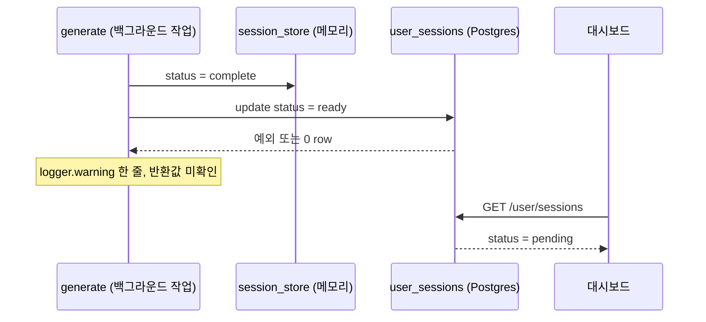

안녕하세요, 고준서입니다. study-helper는 PDF를 올리면 LLM이 학습 노트와 퀴즈를 만들어 주는 서비스이고, 혼자 만들어 운영했습니다. 2026년 4월 15일에 고친 버그 이야기예요. 로그인한 사용자가 PDF를 올리고 문제 생성이 끝나도, 대시보드에는 그 세션이 계속 "생성 중"으로 남고 학습 페이지에 다시 들어갈 수 없었습니다. 처음엔 세션 만료를 의심했는데, 원인은 전날 제가 넣은 동기화 함수였습니다. DB 갱신이 실패해도 warning 로그 한 줄만 남기고 넘어가고 있었거든요.

이 글에서는 가설 여덟 개를 세워 코드 줄 번호로 하나씩 지워 간 순서와, 왜 증상만 고치고 구조는 미뤘는지를 적습니다. 영향받은 세션이 몇 개였는지는 세어 두지 않아 모릅니다.

그날 남긴 조사 문서와 수정 커밋을 바탕으로 씁니다. 조사 문서는 Claude Code 세션에서 작성된 것이고, 수정 커밋([d2ee07b](https://github.com/gary5876/study-helper-backend/commit/d2ee07b))에도 공동 작성자로 Claude가 찍혀 있어요.

## 증상과 구조

대시보드는 3초마다 상태를 물어보는데 `pending`이 남아 있으면 계속 기다립니다. 메모리 세션 저장소의 보관 시간이 2시간이라 처음엔 만료를 의심했지만, 방금 만든 세션에서도 재현됐습니다.

조사 문서에는 관찰 하나가 적혀 있습니다. "문제를 끝까지 푸는 경우에는 정상으로 보임(관찰 기반)", 그리고 사용자 체감으로는 "문제를 다 풀어야만 완료로 바뀐다"고 느껴진다는 것. 그런데 코드에는 풀이 완료가 세션 상태를 바꾸는 경로가 없습니다. 문서는 이 관찰을 타이밍이 우연히 맞아떨어진 것으로 해석했어요. 나중에 보니 대시보드를 다시 열 때 실행되는 자가 복구 로직이 그 사이에 돌았던 것이었습니다.

구조를 보면 이유가 보입니다. 세션 상태를 두 곳에 들고 있었거든요.

| 저장소 | 상태값 | 누가 읽나 |
|---|---|---|
| `session_store` (Redis 또는 메모리) | uploaded, processing, complete, failed | `/status`, `/result` |
| `user_sessions` (Supabase Postgres) | pending, ready, failed | 대시보드 `/user/sessions` |

대시보드는 DB만 읽고, 생성 진행 상태와 결과는 메모리만 읽습니다. 생성이 끝나면 `_sync_user_session_status`라는 함수가 메모리 쪽 완료를 DB 쪽 `ready`로 한 방향 동기화합니다.



*그림 1. 완료 처리 흐름. 메모리는 complete가 됐는데 DB 갱신이 조용히 실패하면 대시보드는 계속 pending을 봅니다.*

이 동기화 함수는 전날([d488f43](https://github.com/gary5876/study-helper-backend/commit/d488f43)) 두 저장소의 id를 하나로 맞추면서 처음 넣은 것이었습니다. 그 전에는 두 저장소가 다른 id를 써서 대시보드 링크가 404였고, 같은 날 `(user_id, pdf_hash)` 고유 제약 충돌로 재업로드 저장이 실패하던 것도 upsert(있으면 갱신, 없으면 삽입)로 고쳤습니다([821ab87](https://github.com/gary5876/study-helper-backend/commit/821ab87)). 즉 15일의 버그는 14일의 수정이 만든 동기화 경로가 조용히 실패하는 문제였습니다.

## 가설 여덟 개

증상만 보고 바로 고치는 대신, 가능한 원인을 전부 적고 코드 라인으로 하나씩 확인했습니다. 가설 목록과 판정은 Claude Code와 함께 만든 조사 문서에 그대로 있고, 아래 표는 그 문서를 옮긴 것입니다.

| | 가설 | 판정 | 근거 |
|---|---|---|---|
| H1 | `_sync_user_session_status`가 예외를 삼킨다 | 주원인 | `generate.py:43-50` 모든 예외를 `logger.warning`만 찍고 무시. `update_session_status`가 0건 매치면 False를 돌려주는데 호출측이 반환값을 안 본다 |
| H2 | 재업로드 시 `upsert_session`이 ready를 pending으로 되돌린다 | 보조원인 | `user_store.py:176,193` `status = EXCLUDED.status`, `upload.py:98`은 항상 pending을 넘긴다 |
| H3 | RLS 정책이 UPDATE를 0건으로 만든다 | 아님 | `SUPABASE_DB_URL`이 postgres 역할이라 RLS를 우회한다. INSERT가 되는데 UPDATE만 막힐 수 없다 |
| H4 | session_id, user_id 타입 불일치 | 아님 | uuid4 문자열, RETURNING `id::text`, `$2::uuid` 캐스팅으로 양쪽이 같은 값 |
| H5 | BackgroundTasks 안에서 예외가 나 sync를 건너뛴다 | H1의 특수 케이스 | sync 호출 자체가 예외면 안에서 잡혀 warning만 남는다 |
| H6 | 메모리 레코드의 user_id가 유실된다 | 아님 | dataclass와 `asdict` 직렬화가 user_id를 보존한다 |
| H7 | DB 커넥션 풀 경합 | 거의 아님 | `max_size=5`, 실제 동시 요청은 폴링 1과 sync 1 |
| H8 | 두 테이블이 서로 다른 DB 풀에 있다 | 구조 문제 | `main.py:53-55` `DATABASE_URL`과 `SUPABASE_DB_URL`이 다른 DB일 수 있다. 기존 자가 복구가 한 SQL로 두 테이블을 조인해서 분리 환경에서는 예외가 삼켜지며 무력화된다 |

*표 1. 가설 여덟 개와 판정. RLS는 Supabase의 행 단위 접근 제어입니다.*

H1이 증상과 맞았습니다. 메모리는 `complete`, DB는 `pending`인 채로 굳고, 실패했다는 사실은 warning 로그 한 줄에만 남습니다. H2는 같은 PDF를 다시 올릴 때만 생기는 별개 경로였고, H8은 직접 원인은 아니지만 이미 넣어 둔 자가 복구를 무력화하고 있었습니다. 나머지 다섯은 코드를 읽는 것만으로 배제됐습니다.

## 수정 다섯 가지

커밋 하나(`generate.py` +105, `user_store.py` +61)로 묶었습니다.

첫째, 동기화 함수가 성공 여부를 돌려주게 했습니다. 예외도 0건 매치도 error 레벨로 session_id, user_id, status를 같이 남기고 False를 반환합니다.

```python
# app/routers/generate.py:43-65 (수정 후)
async def _sync_user_session_status(user_id: str | None, session_id: str, status: str) -> bool:
    if not user_id:
        return True
    try:
        updated = await get_user_store().update_session_status(user_id, session_id, status)
    except Exception as exc:
        logger.error("user_sessions status sync 실패 (session=%s user=%s status=%s): %s",
                     session_id, user_id, status, exc)
        return False
    if not updated:
        logger.error("user_sessions status sync 0 row matched (session=%s user=%s status=%s)",
                     session_id, user_id, status)
        return False
    return True
```

둘째, 완료 처리를 `_finalize_ready` 하나로 모았습니다. 메모리를 `complete`로 올린 뒤 동기화 결과를 보고, 실패하면 메모리를 `failed`로 되돌리고 "세션을 다시 생성해 달라"는 메시지를 남깁니다. 사용자는 영원한 "생성 중" 대신 실패를 보고 다시 시도할 수 있습니다. 캐시 히트 경로와 정상 생성 경로가 각자 따로 완료 처리를 하고 있었는데, 둘 다 이 헬퍼를 거치게 했습니다.

```python
# app/routers/generate.py:82-92 (수정 후)
async def _finalize_ready(result_json: str) -> None:
    await store.update_status(session_id, "complete", progress_pct=100, result_json=result_json)
    ok = await _sync_user_session_status(record.user_id, session_id, "ready")
    if not ok:
        await store.update_status(session_id, "failed",
                                  error_message="DB 상태 동기화 실패 — 세션을 다시 생성해주세요.",
                                  result_json=result_json)
```

셋째, upsert가 상태를 내려깎지 못하게 했습니다. 기존 상태가 ready나 failed면 그대로 두고, 아니면 새 값을 씁니다.

```sql
-- app/services/user_store.py:217-222 (수정 후)
status = CASE
  WHEN user_sessions.status IN ('ready','failed') THEN user_sessions.status
  ELSE EXCLUDED.status
END
```

넷째, `/result`에 DB 폴백을 넣었습니다. 메모리에 없으면 로그인 사용자 한정으로 `user_sessions`에서 `pdf_hash`를 찾고, 그 해시로 `question_bank`의 결과를 가져옵니다. 두 테이블이 다른 DB 풀이어도 각자 조회하니 상관없고, 메모리 보관 시간이 지나거나 서버가 재시작돼도 다시 들어갈 수 있습니다.

다섯째, 대시보드의 자가 복구를 다시 짰습니다. 이전 버전은 `user_store` 풀 안에서 `question_bank`를 서브쿼리로 참조해서 DB가 분리돼 있으면 조용히 죽었습니다. 새 버전은 `user_store`에서 pending 행의 `(id, pdf_hash)`를 모으고, `question_bank` 풀에서 `pdf_hash = ANY($1)`로 히트를 찾고, 매치된 id만 `user_store`에서 `ready`로 올립니다.

검증은 `py_compile`로 문법을 확인하고, 사용자 환경에서 업로드부터 대시보드까지 수동으로 돌려 "완료"가 즉시 뜨는 걸 본 것이 전부입니다. 자동 회귀 테스트는 이 커밋에 없고, 조사 문서의 체크리스트에서 그 항목만 미체크로 남아 있습니다. 지금도 그렇습니다.

## 그 뒤

수정은 증상을 막았지만 구조는 그대로입니다. 같은 세션의 상태가 두 저장소에 따로 있고 그 둘이 서로 다른 DB 풀에 있을 수 있다는 H8은, 이날 "별개 결정"으로 미뤄 뒀습니다. 같은 날 저녁에 전날 만든 세션을 다른 기기에서 열면 `/result`가 404로 실패하는 두 번째 문제가 나왔고, 원인을 따라가니 다시 H8이었습니다. 메모리가 주 저장소이고 DB가 보조라는 방향 자체가 거꾸로였던 거죠. 그날 DB를 주 저장소로 올리는 리팩터를 구현했다가 같은 날 되돌렸는데([06d00bd](https://github.com/gary5876/study-helper-backend/commit/06d00bd), [7464ef1](https://github.com/gary5876/study-helper-backend/commit/7464ef1)), 되돌린 이유는 커밋에도 문서에도 남아 있지 않습니다.

이 버그가 남긴 규칙은 이렇습니다.

1. 실패를 warning으로 적는 코드는 실패를 숨깁니다. 호출한 쪽이 결과를 보지 않는 동기화는 없는 것과 같았고, 그걸 알아채는 데 하루가 걸렸습니다.
2. 같은 상태를 두 저장소에 두면 어느 쪽이 주인인지부터 정해야 합니다. 그걸 "별개 결정"으로 미룬 채 증상만 고쳤더니, 같은 날 저녁 두 번째 문제가 바로 그 자리에서 났습니다.
