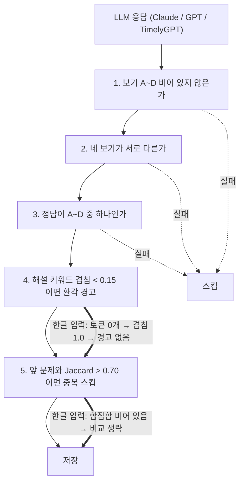

안녕하세요, 고준서입니다. study-helper는 PDF를 올리면 LLM으로 학습 노트와 객관식 문제를 만들어 주는 서비스이고, 혼자 만들어 운영했습니다. 처음부터 LLM 응답을 그대로 저장하지 않고 검증기를 통과한 문제만 남기게 만들었는데, 그 검증기의 절반이 한글에서는 아무것도 하지 않고 있었다는 걸 한 달 넘게 지나서 알았습니다. 토큰을 자르는 정규식이 영문만 보고 있어서, 한글 해설은 토큰이 0개가 되고 "판단할 수 없음"이 그대로 "통과"가 되고 있었거든요. 무엇을 검사하고 있었고 무엇이 검사되지 않았는지, 고친 코드가 왜 지금도 운영에 없는지를 파일 경로와 줄 번호로 적어 둡니다. 그 한 달 동안 한글로 생성된 문제가 몇 개였는지는 지금 와서 셀 방법이 없습니다.

## 검증기가 보는 다섯 가지

생성 파이프라인은 사용자가 고른 플랜에 따라 Claude, GPT, TimelyGPT 중 하나를 부르지만, 응답은 전부 같은 검증기로 들어갑니다. `app/routers/generate.py`는 플랜별로 클라이언트만 바꾸고 결과는 `validate_notes`, `validate_mcq`, `validate_fill`에 넘깁니다(149, 190, 191행). 검증기 자체는 3월 19일 첫 커밋부터 있었고, 토큰화 부분은 4월 25일까지 한 번도 바뀌지 않았습니다.

`validate_mcq`는 객관식 문제 하나를 버릴지 남길지를 순서대로 판단합니다. 네 보기가 전부 비어 있지 않은가, 서로 다른가, 정답이 A부터 D 중 하나인가. 여기까지 하나라도 걸리면 경고 로그를 남기고 그 문제를 건너뜁니다. 넷째는 해설 검사입니다. 해설이 20자 미만이면 기본 문장으로 대체하고, 30어절이 넘는 해설은 원문과 키워드가 얼마나 겹치는지 봅니다.

```python
# app/services/response_validator.py:198-204
        # Hallucination check on explanation
        overlap = _keyword_overlap(explanation, source_text)
        if len(explanation.split()) > 30 and overlap < 0.15:
            logger.warning(
                "MCQ %s: explanation keyword overlap=%.2f (possible hallucination).", q["id"], overlap
            )
            # Don't skip — just log. Partial result is better than empty.
```

겹침이 15% 미만이면 원문에 없는 내용을 지어냈을 가능성으로 보고 경고만 남깁니다. 다섯째는 근사 중복입니다. 앞서 통과한 문제들과 단어 집합이 얼마나 겹치는지(Jaccard 유사도)를 재서 0.70을 넘으면 같은 문제로 보고 버립니다. 넷째와 다섯째가 둘 다 `_tokenize`에 기대고 있었습니다.

```python
# app/services/response_validator.py:28-39
def _tokenize(text: str) -> set[str]:
    """Simple word tokenizer for keyword overlap checks."""
    return set(re.findall(r"\b[a-zA-Z]{4,}\b", text.lower()))


def _keyword_overlap(text_a: str, text_b: str) -> float:
    """Return fraction of text_a's keywords present in text_b."""
    a = _tokenize(text_a)
    b = _tokenize(text_b)
    if not a:
        return 1.0
    return len(a & b) / len(a)
```



*그림 1. 객관식 한 문제가 거치는 다섯 단계. 굵은 선이 한글 입력이 실제로 지나간 길입니다.*

## 한글에서는 토큰이 0개

정규식은 영문 알파벳 네 글자 이상만 단어로 봅니다. 한글로 된 해설이나 문제 문장을 넣으면 반환값은 빈 집합입니다. 그 다음 줄이 결과를 정합니다. 해설 토큰이 비어 있으면 `_keyword_overlap`은 1.0을 돌려주고, "15% 미만"이라는 조건은 성립할 수 없습니다. 환각 경고는 한글에서 한 번도 뜨지 않았습니다. 중복 검사도 같습니다. 두 문제의 토큰 합집합이 비어 있으면 `if union and ...` 조건이 거짓이 되어 유사도 계산 자체를 건너뜁니다.

두 검사 모두 "전부 실패"가 아니라 "전부 통과"로 무력화됐습니다. 전부 실패하는 쪽이었다면 문제가 하나도 저장되지 않았을 테니 첫날 알았을 겁니다. 요청 스키마의 `lang` 기본값이 `"ko"`라(`schemas.py:152`) 기본 언어가 한국어인 서비스에서, 검증기의 다섯 항목 중 둘은 실제로는 돌지 않고 있었습니다.

알게 된 계기는 버그 신고가 아니라 비교였습니다. 4월 25일에 다른 프로젝트에서 손으로 큐레이션한 문제 은행과 study-helper가 실행 시점에 만든 문제를 나란히 놓고 봤더니 품질과 다양성 차이가 컸고, 그 원인을 찾는 계획 문서를 Claude Code와 같이 쓰다가 이 함수에 닿았습니다. 문서에는 "영문만 추출. 한글 토큰은 전혀 잡히지 않음"이라고 적었고, 우선순위는 높음, 이유는 "기존 사용자에게도 이미 영향", 착수 순서 1번에 예상 시간은 20분이었습니다.

## 고친 코드와 고쳐지지 않은 운영

같은 날 브랜치 `feat/question-quality-phase-a`에 커밋 [a923b21](https://github.com/gary5876/study-helper-backend/commit/a923b21b69921e1118c81bfac93df1bd1847feaa)로 고쳤습니다. 정규식에 한글 두 글자 이상을 추가하고 영문 기준도 세 글자로 낮췄습니다. 중복 임계는 0.70에서 0.60으로 내렸는데, 그 이유는 상수 옆 주석에 있습니다.

```python
_TOKEN_RE = re.compile(r"[a-zA-Z]{3,}|[가-힣]{2,}")

# Korean inflectional endings make token sets diverge more than English even
# when two questions ask the same thing ("무엇입니까" vs "무엇인가요"). Empirically
# 0.70 is too strict — a near-duplicate Korean pair lands around 0.65–0.70.
_DUP_JACCARD_THRESHOLD = 0.60
```

어절 단위로 자르면 "무엇입니까"와 "무엇인가요"는 다른 토큰이라, 같은 질문인데도 유사도가 0.65에서 0.70 사이로 떨어집니다. 형태소 분석기를 붙이는 대신 임계값을 내린 것이라 거친 근사입니다. 왜 분석기를 안 붙였는지는 커밋 메시지에도 계획 문서에도 이유가 없어요. 이 항목을 20분짜리 작업으로 잡아 둔 걸 보면 범위 문제였을 것 같지만, 그건 추측입니다. 테스트는 한글 토큰화 네 개와 한글 중복 한 개를 새로 넣었고, 중복 테스트는 정확히 그 어미 쌍을 넣어 두 번째가 버려지는지 봅니다. 코드와 테스트 초안은 Claude가 썼고 커밋에 공동 작성자로 남아 있으며, 검증기 테스트 39개가 통과했습니다.

이 커밋은 지금도 그 브랜치에만 있습니다. `git log origin/develop..origin/feat/question-quality-phase-a`에 a923b21 하나가 남아 있고, develop의 `_tokenize`는 여전히 `[a-zA-Z]{4,}`, 임계는 0.70입니다. develop의 검증기 테스트 파일에는 한글이 한 줄도 없습니다. 4월 25일 이후 develop에 들어간 건 5월 5일 CI 워크플로 분리와 6월 23일 GCP Cloud Run 이전뿐입니다.

더 어긋난 곳이 있습니다. 4월 30일에 CodeRabbit을 붙이면서 쓴 `.coderabbit.yaml`은 서비스 코드를 리뷰할 때 한글 토큰화 정규식 `[a-zA-Z]{3,}|[가-힣]{2,}`와 중복 임계 0.60을 기준으로 보라고 적어 뒀고, 테스트 경로에는 "한글 케이스 누락"을 잡으라고 적어 뒀습니다. 리뷰 기준은 브랜치의 코드이고 리뷰 대상은 develop의 코드입니다. 그 기록의 후속 항목에는 "Phase A 잔여 작업 머지 시 CodeRabbit 리뷰가 1차 검증으로 작동하는지 확인"이라고 돼 있으니 머지는 계획에 있었습니다. 왜 하지 않았는지는 어느 문서에도 커밋에도 없습니다. 5월 이후 이 프로젝트의 확장을 멈춘 시점과 겹치지만 그건 정황이지 기록이 아닙니다.

검증기는 LLM을 의심하라고 만든 코드인데, 검증기 자체를 의심하는 코드는 없었습니다. 한 달 넘게 한글 트래픽을 받으면서 환각 경고가 한 번도 안 떴다면 검사가 안 도는 것일 텐데, 경고 횟수를 세는 지표가 없었으니 "0건"이 이상하다는 걸 알 방법이 없었습니다. `_keyword_overlap`이 토큰 없음을 1.0으로 돌려주는 설계도 같은 문제입니다. 판단할 수 없음을 통과로 해석하는 기본값은, 판단할 수 없는 경우가 대부분일 때 검사를 없애는 것과 같습니다. 그리고 그 고친 코드를 브랜치에 남겨 둔 채 서비스를 멈춘 건 저입니다.
