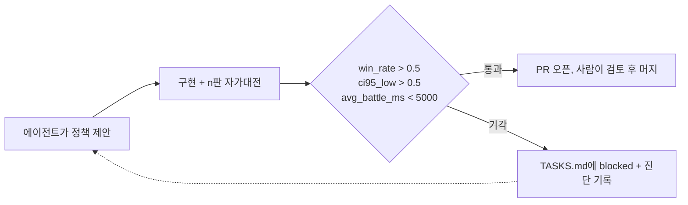

| 판 수 | 승률 | 95% 하한 | 판정 |
|---|---|---|---|
| 200 | 0.560 | 0.4907 | 기각 |
| 500 | 0.528 | 0.4842 | 기각 |
| 2000 | 0.5405 | 0.5186 | 통과 |

*표 1. 같은 정책(heuristic_det)을 판 수만 바꿔 돌린 결과*

같은 코드인데 200판에서는 0.560이던 승률이 500판에서 0.528로 내려갔습니다. 보이시나요? 표본을 키웠더니 성적이 떨어졌어요.

안녕하세요, 고준서입니다. vgc-ai는 제가 혼자 만든 포켓몬 VGC 게임 AI 프로젝트인데요, IEEE CoG 2026 대회를 목표로 시작했지만 제출까지는 가지 못했습니다. 이 프로젝트에서 새 배틀 정책을 만드는 건 코딩 에이전트(Claude)이고, 그 정책을 받을지 말지는 제가 아니라 통계 게이트가 정합니다. 이번 글에서는 2026년 5월 11일부터 14일 사이에 그 게이트가 내린 판정 16건을 그대로 옮겨 보려고 합니다.

15건이 기각됐습니다.

## 게이트 조건 세 줄

정책 과제마다 붙어 있던 acceptance는 전부 같은 문장이었어요. 기준선(`greedy`)과 n판을 붙여서 `win_rate_a > 0.5`, `ci95_low > 0.5`, `avg_battle_ms < 5000`을 모두 만족할 것. 승률이 0.5를 넘는 걸로는 부족하고, 승률의 95% 신뢰구간 하한이 0.5를 넘어야 합니다. 하한은 Wilson 구간으로 계산하고요(`bench/run_once.py:38-47`).

```python
def wilson_ci_95(wins: int, n: int) -> tuple[float, float]:
    if n == 0:
        return (0.0, 0.0)
    z = 1.96
    p = wins / n
    denom = 1.0 + z * z / n
    center = (p + z * z / (2.0 * n)) / denom
    spread = z * math.sqrt(p * (1.0 - p) / n + z * z / (4.0 * n * n)) / denom
    return (max(0.0, center - spread), min(1.0, center + spread))
```

흐름은 이렇습니다. 에이전트가 `TASKS.md`의 과제를 집어 정책을 구현하고 벤치를 돌립니다. 세 조건을 통과하면 PR을 열고, 못 넘으면 PR을 열지 않은 채 해당 항목을 `[blocked]`로 바꾸면서 수치와 진단을 적어요. 덕분에 기각 기록이 커밋 메시지와 TASKS.md에 전부 남아 있었고, 이 글도 그 기록을 그대로 옮긴 겁니다.



*그림 1. 정책 하나가 채택되기까지의 경로. 판정은 게이트가, 머지는 사람이 합니다.*

## 첫날의 희망

5월 11일에 나온 결과는 꽤 희망적이었어요. HP가 25% 아래로 떨어지면 유리한 타입의 벤치로 교체하는 `greedy_switch`가 200판에서 0.535, 상태 평가 함수에 1-ply 롤아웃을 붙인 `heuristic`이 0.545, 롤아웃의 난수를 고정한 `heuristic_det`가 0.560을 찍었습니다. 셋 다 기준선을 이겼죠.

그런데 셋 다 기각이었습니다.

하한이 각각 0.4659, 0.4758, 0.4907로 0.5를 못 넘었거든요([a811f55](https://github.com/gary5876/vgc-ai/commit/a811f55), [a86fc0f](https://github.com/gary5876/vgc-ai/commit/a86fc0f), [dd2cf1a](https://github.com/gary5876/vgc-ai/commit/dd2cf1a)). 승률은 이겼는데 게이트는 "아직 모르겠다"고 답한 셈이에요.

## 변형 네 개

에이전트는 `greedy_switch`의 변형을 네 개 더 만들었습니다. 벤치가 풀 HP일 때만 교체(a), 턴당 한 번만 교체(b), 상성과 자속을 곱한 점수로 교체 대상을 고르기(c), 지금 마주한 상대 슬롯 기준으로만 판단(d). 결과는 0.525, 0.540, 0.465, 0.535였어요. (c)는 오히려 기준선보다 졌고, 나머지는 원본과 같은 모양이었습니다.

네 번을 더 돌려서 확인한 건 하나였습니다. 200판으로는 "3~5% 우위"와 "동전 던지기"를 구분할 수 없다는 것.

## 표본을 키웠더니

그럼 표본을 키우면 하한이 올라오지 않을까요? 저도 그렇게 생각했고, 에이전트도 같은 가설로 `greedy_switch`와 `heuristic`을 500판으로 다시 돌렸습니다. 0.535는 0.534가 됐고 0.545는 0.540이 됐어요. 하한은 0.4902와 0.4962. 여전히 0.5 아래였고, 두 번째는 0.004 차이였습니다.

`heuristic_det`는 더 분명했어요. 200판에서 0.560이던 점추정이 500판에서 0.528로 내려갔고, 하한은 0.4907에서 0.4842로 오히려 멀어졌습니다. 커밋 메시지에 적힌 판정은 이렇습니다.

> Point estimate regressed from 0.560 (n=200) to 0.528 (n=500); ci95_low is further from 0.5 than the n=200 run (0.4842 < 0.4907). The "n=500 certifies the gate" hypothesis is falsified. ([2ec9e67](https://github.com/gary5876/vgc-ai/commit/2ec9e67))

200판의 0.560은 진짜 실력이 아니라 표본이 작아서 위로 튄 값이었던 거죠. 표본을 늘리자 진짜 값 근처로 내려온 겁니다. 게이트를 만들 때 "우연한 연승을 개선으로 착각하지 말자"고 적어 뒀는데, 그 문장이 숫자로 나타난 순간이었어요.

## 하한이 0.5를 넘으려면

왜 이렇게 안 넘어갈까요? Wilson 하한이 0.5를 넘으려면 표본 크기별로 필요한 승률이 정해져 있습니다. 위의 함수로 계산해 보면 n=200에서는 114승(0.570), n=500에서는 272승(0.544), n=2000에서는 1044승(0.522)이 필요해요.

그러니까 진짜 승률이 0.53인 정책은 200판으로는 절대 통과할 수 없고, 500판으로도 어렵습니다. 2000판이면 통과하죠. 반대로 진짜 승률이 0.50인 정책이 200판에서 0.56을 찍는 일은 드물지 않습니다. 게이트는 이 두 경우를 구분하라고 있는 건데, 200판은 그 구분에 필요한 정보량이 안 됐던 겁니다.

## 유일한 통과

500판 결과를 보고 `heuristic_det`를 2000판으로 다시 돌렸습니다. 1081승 919패, 승률 0.5405, 하한 0.5186, 상한 0.5622. 세 조건을 처음으로 모두 통과했어요([PR #9](https://github.com/gary5876/vgc-ai/pull/9), [da6d312](https://github.com/gary5876/vgc-ai/commit/da6d312)).

진짜 우위는 200판에서 보였던 6%가 아니라 4% 안팎이었고, 그 4%를 확인하는 데 2000판이 들었습니다.

통과 직후 이 정책은 벤치 기준선([PR #11](https://github.com/gary5876/vgc-ai/pull/11))과 제출 기본값([PR #13](https://github.com/gary5876/vgc-ai/pull/13))이 됐습니다. 그 뒤로 오는 후보는 `greedy`가 아니라 `heuristic_det`를 이겨야 했고요.

## 판정 16건

| 순서 | 정책 | n | 승률 | 하한 | 판정 |
|---|---|---|---|---|---|
| 1 | greedy_switch | 200 | 0.535 | 0.4659 | 기각 |
| 2 | heuristic | 200 | 0.545 | 0.4758 | 기각 |
| 3 | greedy_switch | 500 | 0.534 | 0.4902 | 기각 |
| 4 | heuristic | 500 | 0.540 | 0.4962 | 기각 |
| 5 | greedy_switch_a (풀 HP 조건) | 200 | 0.525 | 0.456 | 기각 |
| 6 | greedy_switch_b (턴당 1회) | 200 | 0.540 | 0.4708 | 기각 |
| 7 | greedy_switch_c (상성×자속 점수) | 200 | 0.465 | 0.3972 | 기각, 퇴행 |
| 8 | greedy_switch_d (슬롯 정렬) | 200 | 0.535 | 0.4659 | 기각 |
| 9 | heuristic_det | 200 | 0.560 | 0.4907 | 기각 |
| 10 | heuristic_det | 500 | 0.528 | 0.4842 | 기각 |
| 11 | heuristic_det | 2000 | 0.5405 | 0.5186 | 통과 |
| 12 | tabular_mc (승자만 학습) | 200 | 0.055 | 0.031 | 기각 |
| 13 | tabular_mc (+패자 −1 신호) | 200 | 0.035 | 0.0171 | 기각, 퇴행 |
| 14 | tabular_mc (+greedy 워밍업) | 200 | 0.075 | 0.046 | 기각 |
| 15 | tabular_mc (행동키 정규화) | 200 | 0.030 | 0.0138 | 기각, 퇴행 |
| 16 | heuristic_det_2ply (vs heuristic_det) | 200 | 0.495 | 0.4265 | 기각 |

*표 2. 5월 11일부터 14일까지의 판정 전부. 근거는 각 과제의 TASKS.md 항목과 커밋 메시지입니다.*

12번부터 15번은 tabular Monte Carlo 학습 시도예요. 네 번 다 기준선에 압도당했는데, 마지막 진단은 위치 기반 `action_idx`가 더블 배틀에서 서로 다른 행동을 같은 셀에 섞고 있었다는 것이었습니다(정규화 후에도 100개 행동이 36개 키로 뭉쳤어요). 16번은 1-ply를 2-ply로 깊게 판 시도인데, 같은 평가 함수를 쓰는 상대에게 99승 101패로 끝났습니다. 이 둘은 각각 따로 풀 만한 이야기라 여기서는 결과만 적어 둘게요.

## 예외를 하나 두었습니다

솔직하게 적어야 할 게 하나 있어요. 팀빌딩 정책에 종별 EV와 성격, 기술 선택을 붙인 [PR #17](https://github.com/gary5876/vgc-ai/pull/17)은 기존 빌드와 정면 대결한 2998판에서 승률 0.5067, 하한 0.4888로 게이트에 미달했습니다.

그런데 머지했습니다.

무작위 팀을 상대로는 10시드 전부 양수에 평균 +391 ELO였고, 실전에서는 미러 매치보다 다양한 상대를 만난다는 판단에서였어요. PR 본문에 그 근거가 적혀 있고 저도 동의해서 머지했지만, "게이트를 통과한 것만 받는다"는 원칙 기준으로는 분명히 예외입니다. 그래서 예외였다는 사실까지 여기에 남겨 둡니다. 다음에 저 자신을 속이지 않으려면 이렇게 적어 두는 수밖에 없더라고요.

## 정리

이 글의 게이트는 정책 하나를 승격시킬 때 쓰는 기준입니다. 그런데 며칠 뒤 돌기 시작한 자동 승격 루프는 최근 결과를 15~30판씩 풀링해서 같은 `ci95_low > 0.5` 조건을 적용했고, 그 결과 기본 전략이 12일 동안 일곱 번 바뀌는 일이 생깁니다. 게이트를 만드는 것과 게이트가 충분한 표본을 보게 하는 건 다른 문제였는데, 그 이야기는 다음 글에서 이어가겠습니다.

교내 리그전(2026-05-17, 25팀 라운드로빈)에서는 Championship 트랙 1위였습니다. 다만 그건 팀빌딩 쪽 기여가 컸고, 이 글의 배틀 정책은 Battle 트랙 12위에 그쳤어요.

돌아보면 이 나흘 동안 제가 한 일은 정책을 짠 게 아니라 임계값 세 개와 Wilson 하한을 정해 두고, 에이전트가 올린 결과를 승인하거나 큐로 돌려보낸 것뿐이었습니다(정책 구현과 벤치 실행, 기각 진단은 전부 에이전트 몫이었고 커밋에 그렇게 남아 있어요). 그래도 그 임계값 하나 덕분에 "200판에서 0.56"을 개선이라고 믿고 넘어가는 일은 없었습니다. 비슷한 게이트를 고민하시는 분께 조금이라도 참고가 되면 좋겠습니다. 읽어주셔서 감사합니다.
