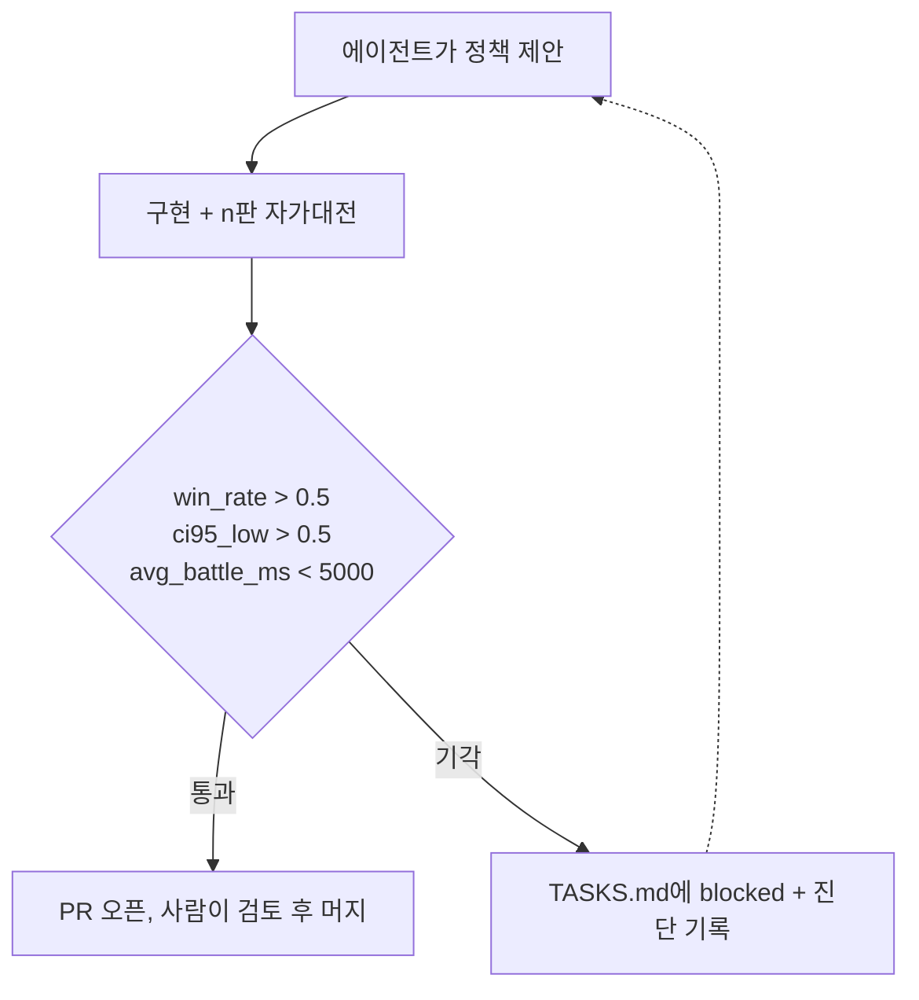

안녕하세요, 고준서입니다. vgc-ai는 포켓몬 VGC라는 게임의 대회용 AI를 혼자 만들어 본 개인 프로젝트예요. IEEE CoG 2026 대회를 목표로 시작했는데 제출까지는 가지 못했습니다. 이 프로젝트에서 새 배틀 정책(어떤 상황에서 어떤 기술을 쓸지 정하는 규칙)을 짜는 건 코딩 에이전트인 Claude이고, 그 정책을 받아들일지는 사람이 아니라 미리 정해 둔 통계 기준이 정합니다. 2026년 5월 11일부터 14일 사이에 그 기준이 판정 16건을 내렸고, 통과는 한 건이었습니다. 200판에서 이겼던 정책이 500판에서 떨어진 일도 그 안에 있는데, 원인은 표본 오차였어요. 실제 우위는 4% 안팎이었고 그걸 확인하는 데 2000판이 들었고요. 16건의 수치와 판정은 커밋 메시지와 작업 목록 파일에서 그대로 옮겼고, 판 수를 200에서 2000까지 늘린 이유는 하한 계산으로 보였습니다. 기준 자체를 왜 그렇게 정했는지는 기록이 부분만 남아 있어서, 그것도 그대로 적어요.

## 기준 세 줄

정책 과제마다 붙어 있던 채택 조건은 전부 같은 문장이었습니다. 기준선 정책(`greedy`)과 n판을 붙여서 `win_rate_a > 0.5`, `ci95_low > 0.5`, `avg_battle_ms < 5000`을 모두 만족할 것. 승률이 절반을 넘는 것만으로는 부족하고, 그 승률의 95% 신뢰구간 하한(이 승률이 우연이 아니라고 볼 수 있는 아래쪽 경계)이 절반을 넘어야 합니다. 하한은 Wilson 구간이라는 공식으로 계산했어요(`bench/run_once.py:38-47`).

```python
def wilson_ci_95(wins: int, n: int) -> tuple[float, float]:
    if n == 0:
        return (0.0, 0.0)
    z = 1.96
    p = wins / n
    denom = 1.0 + z * z / n
    center = (p + z * z / (2.0 * n)) / denom
    spread = z * math.sqrt(p * (1.0 - p) / n + z * z / (4.0 * n * n)) / denom
    return (max(0.0, center - spread), min(1.0, center + spread))
```

세 조건을 왜 이렇게 뒀는지는 `TASKS.md`에 부분만 있습니다. 5000ms는 배틀 한 판의 시간 예산이라, 넘으면 기각하되 그 예산을 맞추려고 휴리스틱을 약하게 만들지는 말라고 과제마다 적혀 있어요. 0.5는 기준선을 이겨야 한다는 뜻 그대로고요. 다만 신뢰구간을 정규 근사가 아니라 Wilson으로 계산하기로 한 이유는 어디에도 적혀 있지 않습니다. 첫 벤치 스크립트 커밋에 Wilson으로 구현됐다는 사실만 남아 있어요.

흐름은 이렇습니다. 에이전트가 `TASKS.md`의 과제를 집어 정책을 구현하고 벤치(자가 대전)를 돌립니다. 세 조건을 통과하면 PR을 열고, 못 넘으면 PR을 열지 않은 채 그 항목을 `[blocked]`로 바꾸면서 수치와 진단을 적습니다. 기각 기록이 남은 이유가 이거예요.



*그림 1. 정책 하나가 채택되기까지의 경로. 판정은 기준이, 머지는 사람이 합니다.*

## 200판, 500판, 2000판

5월 11일에 나온 첫 결과입니다. HP가 25% 아래로 떨어지면 유리한 타입의 벤치로 교체하는 `greedy_switch`가 200판에서 승률 0.535, 상태 평가 함수에 한 수 앞을 내다보는 롤아웃을 붙인 `heuristic`이 0.545, 그 롤아웃의 난수를 고정한 `heuristic_det`가 0.560이었습니다. 셋 다 기준선을 이겼고, 셋 다 기각이었어요. 하한이 각각 0.4659, 0.4758, 0.4907로 0.5를 못 넘었습니다([a811f55](https://github.com/gary5876/vgc-ai/commit/a811f55), [a86fc0f](https://github.com/gary5876/vgc-ai/commit/a86fc0f), [dd2cf1a](https://github.com/gary5876/vgc-ai/commit/dd2cf1a)).

에이전트는 `greedy_switch`의 변형을 네 개 더 만들었습니다. 벤치가 풀 HP일 때만 교체(a), 턴당 한 번만 교체(b), 상성과 자속을 곱한 점수로 교체 대상을 고르기(c), 지금 마주한 상대 슬롯 기준으로만 판단(d). 결과는 0.525, 0.540, 0.465, 0.535였고, (c)는 기준선보다 졌습니다. 200판으로는 3~5% 우위와 동전 던지기를 구분할 수 없다는 게 네 번 더 확인된 셈입니다.

다음은 표본을 키우는 시도였습니다. `greedy_switch`와 `heuristic`을 500판으로 다시 돌리자 0.535는 0.534가 됐고 0.545는 0.540이 됐습니다. 하한은 0.4902와 0.4962로 여전히 0.5 아래였어요. `heuristic_det`는 200판에서 0.560이던 승률이 500판에서 0.528로 내려갔고, 하한은 0.4907에서 0.4842로 오히려 멀어졌습니다. 커밋 메시지에 적힌 판정은 이렇습니다.

> Point estimate regressed from 0.560 (n=200) to 0.528 (n=500); ci95_low is further from 0.5 than the n=200 run (0.4842 < 0.4907). The "n=500 certifies the gate" hypothesis is falsified. ([2ec9e67](https://github.com/gary5876/vgc-ai/commit/2ec9e67))

200판의 0.560은 표본이 작아서 위로 튄 값이었고, 표본을 늘리자 진짜 값 근처로 내려온 겁니다. 위의 함수로 계산하면 하한이 0.5를 넘으려면 200판에서는 114승(승률 0.570), 500판에서는 272승(0.544), 2000판에서는 1044승(0.522)이 필요합니다. 진짜 승률이 0.53인 정책은 200판으로는 통과할 수 없고, 500판으로도 어렵고, 2000판이면 통과합니다.

그래서 `heuristic_det`를 2000판으로 다시 돌렸습니다. 1081승 919패, 승률 0.5405, 하한 0.5186, 상한 0.5622. 세 조건을 처음으로 모두 통과했어요([PR #9](https://github.com/gary5876/vgc-ai/pull/9), [da6d312](https://github.com/gary5876/vgc-ai/commit/da6d312)). 실제 우위는 200판에서 보였던 6%가 아니라 4% 안팎이었고, 그 4%를 확인하는 데 2000판이 들었습니다. 이 정책은 곧바로 벤치 기준선([PR #11](https://github.com/gary5876/vgc-ai/pull/11))과 제출 기본값([PR #13](https://github.com/gary5876/vgc-ai/pull/13))이 됐고, 그 뒤의 후보는 `greedy`가 아니라 `heuristic_det`를 이겨야 했습니다.

| 순서 | 정책 | n | 승률 | 하한 | 판정 |
|---|---|---|---|---|---|
| 1 | greedy_switch | 200 | 0.535 | 0.4659 | 기각 |
| 2 | heuristic | 200 | 0.545 | 0.4758 | 기각 |
| 3 | greedy_switch | 500 | 0.534 | 0.4902 | 기각 |
| 4 | heuristic | 500 | 0.540 | 0.4962 | 기각 |
| 5 | greedy_switch_a (풀 HP 조건) | 200 | 0.525 | 0.456 | 기각 |
| 6 | greedy_switch_b (턴당 1회) | 200 | 0.540 | 0.4708 | 기각 |
| 7 | greedy_switch_c (상성×자속 점수) | 200 | 0.465 | 0.3972 | 기각, 퇴행 |
| 8 | greedy_switch_d (슬롯 정렬) | 200 | 0.535 | 0.4659 | 기각 |
| 9 | heuristic_det | 200 | 0.560 | 0.4907 | 기각 |
| 10 | heuristic_det | 500 | 0.528 | 0.4842 | 기각 |
| 11 | heuristic_det | 2000 | 0.5405 | 0.5186 | 통과 |
| 12 | tabular_mc (승자만 학습) | 200 | 0.055 | 0.031 | 기각 |
| 13 | tabular_mc (+패자 −1 신호) | 200 | 0.035 | 0.0171 | 기각, 퇴행 |
| 14 | tabular_mc (+greedy 워밍업) | 200 | 0.075 | 0.046 | 기각 |
| 15 | tabular_mc (행동키 정규화) | 200 | 0.030 | 0.0138 | 기각, 퇴행 |
| 16 | heuristic_det_2ply (vs heuristic_det) | 200 | 0.495 | 0.4265 | 기각 |

*표 1. 5월 11일부터 14일까지의 판정 전부. 근거는 각 과제의 TASKS.md 항목과 커밋 메시지입니다.*

12번부터 15번은 tabular Monte Carlo라는 학습 방식을 시도한 것으로, 네 번 다 기준선에 크게 졌습니다. 마지막 진단은 행동을 구분하는 키가 더블 배틀에서 서로 다른 행동을 같은 칸에 섞고 있었다는 것이었습니다(정규화 후에도 100개 행동이 36개 키로 뭉쳤어요). 16번은 한 수 앞을 두 수 앞으로 늘린 시도인데, 같은 평가 함수를 쓰는 상대에게 99승 101패였습니다.

## 예외 하나

기준을 어긴 채 머지한 PR이 하나 있습니다. 팀빌딩 정책에 종별 노력치와 성격, 기술 선택을 붙인 [PR #17](https://github.com/gary5876/vgc-ai/pull/17)은 기존 빌드와 정면 대결한 2998판에서 승률 0.5067, 하한 0.4888로 기준에 미달했는데, 무작위 팀을 상대로는 10시드 전부 양수에 평균 +391 ELO였고 실전에서는 미러 매치보다 다양한 상대를 만난다는 판단으로 머지했습니다. 그 근거는 PR 본문에 적혀 있고, 머지한 사람은 저입니다. "통과한 것만 받는다"는 원칙 기준으로는 예외이고, 그래서 여기에도 적어 둡니다.

이 나흘 동안 정책 구현과 벤치 실행, 기각 진단은 에이전트가 했고 커밋에 Claude가 공동 작성자로 남아 있습니다. 제가 한 건 임계값 세 개와 Wilson 하한을 기준으로 정해 둔 것, 그리고 에이전트가 올린 PR을 승인하거나 큐로 돌려보낸 것입니다. 이 기준은 정책 하나를 승격시킬 때 쓰는 것이고, 며칠 뒤 돌기 시작한 자동 승격 루프는 최근 결과를 15~30판씩 풀링해서 같은 조건을 적용했습니다. 그 결과 기본 전략이 12일 동안 일곱 번 바뀌는 일이 생기는데, 그 이야기는 [루프 글]({{ "/blog/2026/05/23/three-loops-on-a-gcp-vm/" | relative_url }})에서 이어집니다. 교내 리그전(2026년 5월 17일, 25팀 라운드로빈)에서는 Championship 트랙 1위였지만 그건 팀빌딩 쪽 기여가 컸고, 이 글의 배틀 정책은 Battle 트랙 12위였습니다.

이 나흘에서 제가 다시 꺼내 쓰는 건 이렇습니다.

1. 200판으로는 3~5% 우위와 동전 던지기를 구분할 수 없습니다. 우위가 그 정도로 보이면 판 수를 늘리는 게 정책을 하나 더 만드는 것보다 먼저입니다.
2. 기준을 미리 적어 두면 기각도 기록이 됩니다. 16건 중 15건이 기각인데 그 수치가 남은 건, 통과 못 한 과제를 지우지 않고 `[blocked]`로 바꾸게 해 뒀기 때문이에요.
3. 기준을 어긴 머지는 어겼다고 적어야 합니다. PR #17이 그 예외이고, 예외의 근거가 PR 본문에 있어서 지금도 되짚을 수 있습니다.
