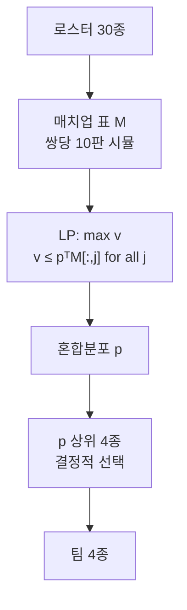

안녕하세요, 고준서입니다. vgc-ai는 포켓몬 VGC 대회용 AI를 혼자 만들어 본 개인 프로젝트예요. 그중 Championship 트랙에서는 배틀을 시작하기 전에 30종 로스터에서 4종을 골라야 하는데, 이 4종을 고르는 정책을 2026년 5월 14일 하루 동안 세 번 바꿨습니다. 마지막 버전은 선형계획법(LP, 여러 제약 아래에서 가장 좋은 값을 찾는 계산법)으로 최악의 상대를 가정한 혼합전략을 풀어서 그 확률 순으로 종을 고릅니다. 그리디에서 LP까지 간 순서와, +111 ELO라는 숫자가 실제로는 어떤 모양이었는지를 PR 기록대로 적습니다.

## 상대를 모르는 채로 4종을 고르는 문제

로스터는 매 챔피언십마다 무작위로 30종이 주어집니다. 참가자는 그중 `max_team_size`인 4종을 골라 팀을 만들고, 배틀마다 그 팀에서 2종을 선출해 싸웁니다. 팀빌딩 시점에 쓸 수 있는 정보는 로스터 자체와, 에포크가 진행되면서 쌓이는 상대들의 사용률(meta)뿐이고, 첫 에포크에는 그 meta도 비어 있습니다.



*그림 1. 최종 버전의 팀빌딩 흐름. 매치업 표를 보수 행렬로 보고 LP를 풀어 나온 확률 순으로 4종을 고릅니다.*

## 세 번의 시도

첫 팀빌더([PR #12](https://github.com/gary5876/vgc-ai/pull/12))는 meta의 종별 사용률 상위 4종을 고르고, meta가 비어 있으면 종족값 합으로 대신했습니다. 무작위 팀빌더를 상대로 5에포크 15전 전승, +177 ELO였고, 이 숫자가 이후 모든 후보가 통과해야 하는 "무작위는 이기는가" 검사의 기준이 됐습니다.

두 번째는 타입 차트였습니다. 후보 종을 팀에 넣었을 때 공격 커버리지에서 약점을 뺀 값이 얼마나 늘어나는지를 사용률 점수에 가중해 더하는 그리디였어요([PR #15](https://github.com/gary5876/vgc-ai/pull/15)). 5시드 결과가 −30, +72, +98, −47, −111, 평균 −4 ELO였고, 가중치를 0.4로 두면 −32, 0.15로 낮추면 −4였습니다. PR 본문에 "Honest negative result"라고 적고 닫았고, 코드는 남기되 기본값은 바꾸지 않았습니다. 이 PR 본문의 결론이 다음 방향이 됐습니다. 타입 차트 휴리스틱을 더 만들 게 아니라 실제 배틀 시뮬레이션으로 로스터 간 매치업 표를 만들고 그 위에서 LP나 유전 알고리즘을 돌리자는 것이었습니다.

세 번째([PR #16](https://github.com/gary5876/vgc-ai/pull/16))가 그 매치업 표입니다. 로스터의 모든 순서쌍 (i, j)에 대해 1대1 배틀을 열 판씩 돌려 승률 행렬 M을 만듭니다. 양쪽 다 `GreedyBattlePolicy`로 싸우고, `M[i][j]`는 i가 j를 이긴 비율, 대각선은 0.5입니다.

```python
# src/vgc_ai/eval/matchup_table.py:1-12
"""Roster x Roster 1v1 matchup table built from actual battle simulation.

For each ordered pair (i, j) of distinct species in the roster, run
``n_battles_per_pair`` singleton-vs-singleton battles (one-mon teams,
``n_active=1``) with both sides playing ``GreedyBattlePolicy``. Return an
``N x N`` matrix where ``M[i][j]`` is species i's win rate against j over
those battles. Diagonal is 0.5 by convention.

Singleton battles are an approximation of the doubles-actually-played
contest format — they ignore positioning and double-targeting — but they
isolate raw 1v1 typing + stat + move synergy, which is the only signal the
team-build pre-game has. The table is computed once per roster and cached.
"""
```

이 표 위에서 그리디로 골랐습니다. 첫 종은 행 평균이 가장 높은 종, 그다음은 팀이 각 상대에게 낼 수 있는 최고 승률 `max_t(M[t][j])`의 평균을 가장 많이 올리는 종입니다. 사용률 상위 빌더와 10시드 대결에서 평균 +127 ELO, 7시드에서 양수였고, 표 하나 만드는 데 30종 기준 약 5초라 챔피언십당 한 번만 계산하고 캐시했습니다.

## LP로 최악의 상대를 가정하기

같은 날 저녁 네 번째 버전([PR #20](https://github.com/gary5876/vgc-ai/pull/20))이 기본값이 됐습니다. 그리디 커버리지는 이길 수 있는 상대의 수를 늘리지만, 로스터에 가위바위보 구조가 있으면 한 갈래에 몰아 넣는 경향이 있습니다. 그래서 매치업 표를 두 사람이 서로 반대 목표를 가진 게임의 보수 행렬로 보고, 상대가 어떤 종을 내도 보장되는 최악의 승률을 가장 크게 만드는 확률 분포를 LP로 풀었습니다. 변수는 최악의 보수 v와 각 종을 고를 확률 p이고, 모든 상대 열 j에 대해 v가 p로 가중한 승률 이하가 되도록 두고 v를 최대화합니다.

```python
# src/vgc_ai/policies/teambuild.py:263-267
        variables x = [v, p_0, ..., p_{n-1}]
        minimize   -v             (i.e. maximize the worst-case payoff)
        subject to v - p^T M[:, j] <= 0   for each column j
                   sum(p) = 1
                   p_i >= 0,  v unbounded
```

풀이는 `scipy.optimize.linprog`에 맡겼습니다. 이 LP의 형태는 대회 주최자 Reis가 공개한 `vgc-agents`의 `get_policy`와 같고, 30종이면 10ms 안에 풀립니다. 나온 p는 어떤 종을 어떤 확률로 섞어야 최악의 상대에게도 v를 보장하는가인데, 여기서는 확률대로 뽑지 않고 p가 큰 순서로 4종을 정해진 대로 고릅니다.

```python
# src/vgc_ai/policies/teambuild.py:318-321
    p = _solve_minimax_policy(table)
    row_mean = table.mean(axis=1)
    order = sorted(range(n), key=lambda i: (-p[i], -row_mean[i], i))
    return order[:max_team_size]
```

도크스트링에 적힌 이유는 LP 가중치를 매번 굴리는 샘플링 분포가 아니라 데려갈 종의 순위로 취급한다는 것, 호출마다 무작위가 섞이면 캐시가 깨지고 4종 사전 선택 문제에서는 그럴 필요가 없다는 것입니다. 구현은 코딩 에이전트가 했고 커밋에 `Co-Authored-By: Claude Opus 4.7`이 남아 있습니다. PR을 읽고 머지한 것과 scipy를 의존성에 넣는 것을 승인한 건 저입니다.

이전 기본값(그리디 커버리지)과 10시드로 붙인 결과가 이렇습니다. 표는 그리디 시점에서 본 ELO 차이라 음수가 minimax의 승리입니다.

| 시드 | 1 | 2 | 3 | 4 | 5 | 6 | 7 | 8 | 9 | 10 | 평균 |
|---|---|---|---|---|---|---|---|---|---|---|---|
| ELO 차이 | +344 | +11 | −271 | −423 | −354 | +255 | −423 | −26 | +11 | −238 | −111 |

*표 1. PR #20의 10시드 결과. 그리디 시점 부호이므로 음수가 minimax 승리입니다.*

minimax가 이긴 시드는 6개이고 그중 2개는 전승(−423)입니다. 시드 1과 6에서는 그리디가 +344, +255로 크게 이겼고, 시드 2와 9는 +11로 사실상 동률입니다. 범위가 −423에서 +344까지 767 ELO 폭이고, PR 본문은 이를 "championship-level variance"라고 적었습니다. 평균 +111과 6/10을 근거로 승격했지만, 4개 시드에서 졌다는 사실은 표에 그대로 있습니다.

일주일 뒤 2시드 재벤치([PR #41](https://github.com/gary5876/vgc-ai/pull/41))에서는 순수 Nash 빌더가 중위권이었고, 관측된 meta에 최적 대응하는 빌더는 최하위였습니다. 그래서 [PR #48](https://github.com/gary5876/vgc-ai/pull/48)에서 목적함수를 (1 − blend) × v + blend × (meta 최적 대응 보수)로 섞은 `MinimaxMetaTeamBuildPolicy`를 추가했습니다. 기본 blend는 0.5이고 meta가 없으면 순수 Nash와 같은 결과를 냅니다. 이 0.5가 더 낫다는 증거는 없고, 도크스트링에도 "Worth A/B-ing if signal warrants"라고만 적혀 있습니다.

남은 문제도 적어 둡니다. 매치업 표는 한 쌍의 승률을 10판으로 추정하므로 각 칸이 크게 흔들리는데, LP는 그 표를 정확한 값처럼 풉니다. 판 수를 늘리면 5초짜리 사전 계산이 분 단위가 됩니다. 그리고 확률 순 상위 4종을 정해진 대로 고르는 것은 혼합전략의 핵심인 "섞어서 읽히지 않는다"를 버린 것이라, 상대가 로스터와 이 빌더를 알면 4종은 예측 가능합니다. 10시드 중 4시드에서 진 결과는 분산으로 두었고, 그 시드들의 로스터에 어떤 구조가 있었는지는 확인하지 않았습니다.

## 참고 문헌

- Reis, `vgc-agents` 저장소의 `teambuilders.py`, `get_policy`. 같은 형태의 max-min LP 정식화.
- SciPy, `scipy.optimize.linprog`. 본 글의 LP 풀이에 사용.
