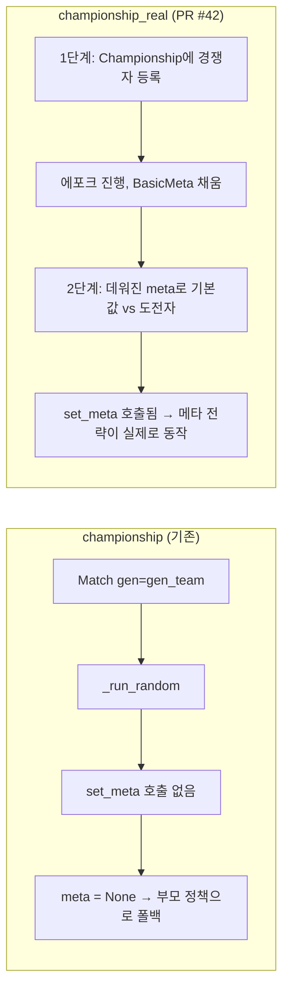

안녕하세요, 고준서입니다. vgc-ai는 포켓몬 VGC 대회용 게임 AI를 만드는 개인 프로젝트예요. GCP 가상 서버 위에서 코딩 에이전트가 전략을 제안하고 구현하면 벤치(자가 대전) 루프가 돌리고, 리뷰어 루프가 통계 기준으로 채택 여부를 정하는 구조입니다. 기준이 어떻게 생겼는지는 [이전 글]({{ "/blog/2026/05/12/wilson-gate-16-verdicts/" | relative_url }})에 있어요. 이번 글은 그 벤치가 이틀 동안 상대 메타(상대들이 어떤 포켓몬을 얼마나 쓰는지에 대한 통계)를 읽는 전략들을 전부 빈 메타로 재고 있었다는 게 드러난 5월 22일의 기록입니다.

## 이틀 동안 승격 PR이 0건

Championship 트랙은 상대 메타를 읽어 팀을 짜고 선출을 정하는 트랙입니다. 5월 20일과 21일에 에이전트가 메타를 읽는 조합 전략을 연달아 올렸습니다. 사용률로 공격 점수를 가중하는 `minimax+meta_weighted_selection`([PR #31](https://github.com/gary5876/vgc-ai/pull/31)), 거기에 최악의 위협 방어를 합친 `minimax+meta_threat_aware_selection`([PR #34](https://github.com/gary5876/vgc-ai/pull/34)), 그리고 페어 커버리지와 스피드 티어 변형이 뒤따랐습니다. 전부 "메타가 없으면 부모 정책으로 되돌아간다"는 설계라 최악이 동률이었고, 메타가 있으면 나아야 했습니다.

그런데 이틀 동안 기본값을 바꾸자는 PR이 하나도 열리지 않았습니다. 리뷰어 루프는 `championship.csv`에서 후보 대 기본값 행을 모아 하한이 0.5를 넘으면 승격 PR을 여는데, 그 조건을 넘는 후보가 없었어요. 그때 CSV에 찍혀 있던 승률과 하한을 여기 옮기고 싶은데, 그 파일은 가상 서버에서만 쌓였고 커밋하지 않아서 레포에 없습니다. "평평했다"를 숫자로 보여 드리지는 못하고, 남은 건 승격 PR이 0건이었다는 사실뿐이에요. 기본값은 메타를 읽지 않는 `minimax+matchup_aware` 그대로였습니다. 그 이틀 사이에도 에이전트는 다음 조합을 제안했고 저는 그걸 승인했습니다.

## 하네스를 열어보니

원인은 벤치 드라이버였습니다. `bench/run_strategy_tournament.py`의 `championship` 서브커맨드는 두 경쟁자를 `Match`로 붙이면서 팀 생성기를 넘깁니다.

```python
# bench/run_strategy_tournament.py:262-268
match = Match(
    cm,
    n_active=2,
    n_battles=max(1, n_battles // 2),
    gen=gen_team,
    params=BattleRuleParam(),
)
```

vgc2 프레임워크에서 `gen`을 넘기면 `Match._run_random`으로 갑니다. 이 경로는 매 판 새 팀을 뽑아 배틀만 돌려요. 반면 `Championship` 생태계가 쓰는 `_run_non_random`은 배틀 전에 메타를 주입합니다.

```python
# vgc2/competition/match.py:114-118
if self.meta is not None:
    selector[0].set_meta(self.meta)
    agent[0].set_meta(self.meta)
    selector[1].set_meta(self.meta)
    agent[1].set_meta(self.meta)
```

`_run_random`에는 이 다섯 줄이 없습니다. `set_meta`가 한 번도 불리지 않으니 모든 메타 조합 전략의 `meta`는 `None`이었고, 설계대로 부모 정책으로 되돌아갔습니다. 선출 정책의 가중치 함수가 그 동작을 그대로 보여 줍니다.

```python
# src/vgc_ai/policies/selection.py:166-175
if meta is None or not opp_team.members:
    return None
try:
    raw = [meta.usage_rate_pokemon(opp.species) for opp in opp_team.members]
except ZeroDivisionError:
    return None
```

`None`이 돌아오면 호출자는 균등 점수로 돌아갑니다. 그러니까 `meta_threat_aware`는 벤치 안에서 `matchup_aware`와 같은 정책이었고, 기본값과 같은 정책이 기본값을 이기지 못한 겁니다. 이 되돌아가기 설계는 첫 에포크에 `usage_rate_pokemon`이 0으로 나누기 오류를 내는 프레임워크 특성 때문에 넣은 방어였는데, 방어가 잘 동작한 덕에 예외도 로그도 없었습니다. 벤치는 매 사이클 정상 종료했고 CSV는 채워졌고, 숫자가 나오니 기준도 정상 판정을 내렸습니다.

발견은 정책 쪽 작업에서 나왔습니다. 배틀 정책 `HeuristicDet`에 `set_meta`를 붙이는 작업을 준비하면서 Championship 기반의 임시 드라이버로 재벤치를 돌렸는데 그 결과가 기존 벤치와 달랐고, 그 차이를 추적하다 `_run_random` 경로가 드러났습니다. [PR #41](https://github.com/gary5876/vgc-ai/pull/41) 본문의 "Why now" 절과 커밋 메시지의 Methodology note가 그 시점의 기록입니다. 이 PR 본문은 에이전트가 썼고 저는 검토해서 머지했으며, 커밋에는 Claude Opus 4.7이 공동 작성자로 남아 있습니다. 누가 먼저 이상하다고 봤는지는 기록으로 구분되지 않습니다.



*그림 1. 기존 championship 서브커맨드는 _run_random 경로라 set_meta를 건너뛴다. championship_real은 메타를 먼저 데운 뒤 붙인다.*

## 같은 날 PR 세 개

[PR #41](https://github.com/gary5876/vgc-ai/pull/41)은 `HeuristicDet`에 `set_meta`를 붙이고, 임시 드라이버의 2시드 결과로 기본값을 `meta_threat_aware`로 올렸습니다. 구조적인 수정은 [PR #42](https://github.com/gary5876/vgc-ai/pull/42)였어요. `championship_real` 서브커맨드를 새로 넣어서, 1단계에서 모든 경쟁자를 `Championship`에 등록해 `BasicMeta`를 채우며 에포크를 돌리고, 2단계에서 데워진 메타로 기본값 대 도전자 쌍을 붙입니다. 출력 형식은 그대로 둬서 리뷰어와 프로포저는 손대지 않고 읽습니다. 기존 `championship`은 지우지 않고 "메타 없는 기준선"으로 남겼습니다. [PR #43](https://github.com/gary5876/vgc-ai/pull/43)은 가상 서버에서 도는 루프 스크립트를 바꿨고, 스크립트 머리에 이유가 적혀 있습니다.

```sh
# ops/run_bench.sh:14-17
#                            championship_real (not championship) is used
#                            because the latter routes to Match._run_random
#                            and never calls set_meta — every meta-aware
#                            compound would be tested with empty meta.
```

루프는 매 사이클 `git pull`로 시작하니 다음 사이클부터 새 드라이버가 돌았습니다.

메타를 채우고 다시 재자 전략 사이에 차이가 생겼습니다. 50 에포크, 12 경쟁자, 시드 두 개로 돌린 결과에서 `minimax+meta_threat_aware_selection`은 이전 기본값보다 시드 2026에서 +101 ELO, 시드 2027에서 +246 ELO 앞섰습니다. 반면 `principled_coverage+matchup_aware`는 시드 2026에서 1위였다가 시드 2027에서 7위로 떨어졌고, 그 차이가 763 ELO였습니다. 두 시드에서 모두 상위였고 흔들림이 적은 후보만 올리기로 해서 `meta_threat_aware`를 기본값으로 정했습니다. 이 후보가 상위권 중 유일하게 `set_meta`를 통해 메타를 실제로 읽는 조합이었다는 점도 판단에 들어갔습니다.

이 재벤치는 시드 두 개짜리였습니다. 며칠 뒤 자동 승격 루프가 15판에서 30판짜리 표본으로 기본값을 일곱 번 바꾸는 일이 생기는데, 측정기를 고친 뒤에도 표본이 작으면 같은 일이 반복된다는 이야기라 [루프 글]({{ "/blog/2026/05/23/three-loops-on-a-gcp-vm/" | relative_url }})에서 따로 다룹니다. 이 건에서 남은 건, 후보 여러 개가 연속으로 기본값을 못 넘을 때 후보를 더 만들기 전에 측정이 차이를 낼 수 있는 구조인지부터 봐야 했다는 것, 그리고 메타가 비어 있는 채로 벤치가 끝났다는 사실을 경고 한 줄로라도 남겼다면 이틀이 더 짧았을 거라는 것입니다.
