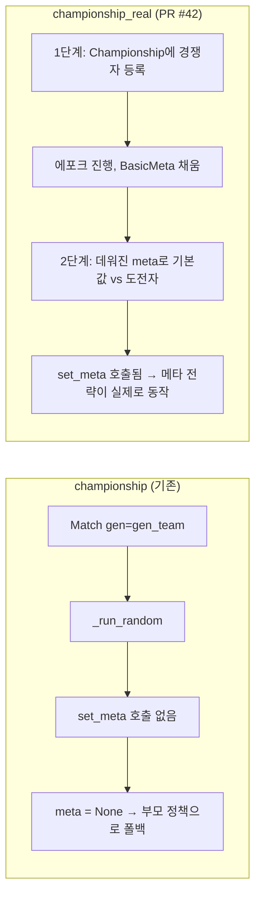

상상해 보세요. 시장에서 상인 열 명이 저마다 물건을 내놓고, 저울 하나로 값을 매깁니다. 그런데 그 저울은 무엇을 올려도 같은 눈금을 가리켜요. 상인들은 물건을 더 좋게 만들어 보지만 값은 요지부동입니다.

문제는 물건이 아니라 저울이었던 거죠.

안녕하세요, 고준서입니다. vgc-ai는 포켓몬 VGC 대회용 게임 AI를 만드는 개인 프로젝트예요. GCP VM 위에서 코딩 에이전트가 전략을 제안하고 구현하면 벤치 루프가 돌리고, 리뷰어 루프가 통계 게이트로 채택 여부를 정하는 구조입니다. 게이트가 어떻게 생겼는지는 [이전 글]({{ "/2026/05/12/wilson-gate-16-verdicts/" | relative_url }})에 있어요. 이번 글에서는 그 벤치 루프가 이틀 동안 meta를 읽는 전략들을 전부 빈 meta로 재고 있었다는 걸 알게 된 날을 풀어보려 합니다.

## 이틀 동안 승격 PR이 0건

Championship 트랙은 상대 메타의 사용률을 읽어 팀을 짜고 선출을 정하는 트랙입니다. 5월 20일과 21일에 에이전트가 메타를 읽는 컴파운드를 연달아 올렸어요. 사용률로 공격 점수를 가중하는 `minimax+meta_weighted_selection`([PR #31](https://github.com/gary5876/vgc-ai/pull/31)), 거기에 최악의 위협 방어를 합친 `minimax+meta_threat_aware_selection`([PR #34](https://github.com/gary5876/vgc-ai/pull/34)), 그리고 페어 커버리지와 스피드 티어 변형이 뒤따랐습니다. 전부 "메타가 없으면 부모 정책으로 폴백한다"는 설계라 최악이 동률이었고, 메타가 있으면 나아야 했죠.

그런데 이틀 동안 기본값을 바꾸자는 PR이 하나도 열리지 않았습니다.

리뷰어 루프는 `championship.csv`에서 후보 대 기본값 행을 풀링해 `ci95_low > 0.5`면 승격 PR을 여는데요, 그 조건을 넘는 후보가 없었어요. 기본값은 여전히 메타를 읽지 않는 `minimax+matchup_aware`였습니다.

## 이런 벤치 결과 보신 적 있으신가요?

후보를 넷이나 올렸는데 전부 기본값과 비슷비슷한 결과. 처음엔 "메타 가중이 생각보다 효과가 없나 보다"라고 넘겼습니다. 에이전트는 다음 컴파운드를 또 제안했고, 저는 그걸 또 승인했어요.

돌이켜보면 이 시점에 물어봤어야 할 질문은 "다음 전략은 뭘까"가 아니라 "이 벤치는 차이를 잴 수 있는 구조인가"였습니다.

## 하네스를 열어보니

원인은 벤치 드라이버였습니다. `bench/run_strategy_tournament.py`의 `championship` 서브커맨드는 두 경쟁자를 `Match`로 붙이면서 팀 생성기를 넘겨요.

```python
# bench/run_strategy_tournament.py:262-268
match = Match(
    cm,
    n_active=2,
    n_battles=max(1, n_battles // 2),
    gen=gen_team,
    params=BattleRuleParam(),
)
```

vgc2 프레임워크에서 `gen`을 넘기면 `Match._run_random`으로 갑니다. 이 경로는 매 판 새 팀을 뽑아 배틀만 돌려요. 반면 `Championship` 생태계가 쓰는 `_run_non_random`은 배틀 전에 메타를 주입합니다.

```python
# vgc2/competition/match.py:114-118
if self.meta is not None:
    selector[0].set_meta(self.meta)
    agent[0].set_meta(self.meta)
    selector[1].set_meta(self.meta)
    agent[1].set_meta(self.meta)
```

`_run_random`에는 이 다섯 줄이 없습니다. `set_meta`가 한 번도 불리지 않으니 모든 메타 컴파운드의 `meta`는 `None`이었고, 설계대로 부모 정책으로 폴백했어요. 선출 정책의 가중치 함수가 그 폴백을 정확히 문서화하고 있었습니다.

```python
# src/vgc_ai/policies/selection.py:166-175
if meta is None or not opp_team.members:
    return None
try:
    raw = [meta.usage_rate_pokemon(opp.species) for opp in opp_team.members]
except ZeroDivisionError:
    return None
```

`None`이 돌아오면 호출자는 균등 점수로 돌아갑니다. 즉 `meta_threat_aware`는 벤치 안에서 `matchup_aware`와 같은 정책이었던 거예요. 기본값과 같은 정책이 기본값을 못 이기는 건 당연하죠.

결과가 평평했던 게 아니라, 측정이 차이를 만들 수 없는 구조였습니다.



*그림 1. 기존 championship 서브커맨드는 _run_random 경로라 set_meta를 건너뛴다. championship_real은 메타를 먼저 데운 뒤 붙인다.*

## 왜 아무도 몰랐을까요?

폴백 설계가 버그를 가렸습니다. "메타가 없으면 부모로 폴백"은 에포크 0에서 `usage_rate_pokemon`이 `ZeroDivisionError`를 내는 프레임워크 특성 때문에 넣은 방어였거든요. 방어가 잘 동작한 덕에 아무 예외도 로그도 없었습니다. 벤치는 매 사이클 정상 종료했고 CSV는 채워졌어요. 숫자가 나오니 게이트도 정상 판정을 내렸고요.

잘못된 입력으로 올바르게 계산한 결과였습니다.

발견은 정책 쪽 작업에서 나왔어요. 배틀 정책 `HeuristicDet`에 `set_meta`를 붙이는 작업(Phase 1b)을 준비하면서 Championship 기반의 임시 드라이버로 재벤치를 돌렸는데, 그 결과가 기존 벤치와 달랐습니다. 그 차이를 추적하다 `_run_random` 경로가 드러났죠. [PR #41](https://github.com/gary5876/vgc-ai/pull/41) 본문의 "Why now" 절과 커밋 메시지의 Methodology note가 그 시점의 기록입니다. 이 PR 본문은 에이전트가 썼고 저는 검토해서 머지했어요. 커밋에도 Claude Opus 4.7이 공동 작성자로 남아 있습니다. 다만 누가 먼저 "어, 이상한데?"를 했는지는 기록으로 구분되지 않아서, 여기서도 구분하지 않으려 해요.

## 첫 번째 조치: HeuristicDet에 set_meta 붙이기

같은 날 PR 세 개로 정리했습니다. 먼저 [PR #41](https://github.com/gary5876/vgc-ai/pull/41)은 `HeuristicDet`에 `set_meta`를 붙이고, 임시 드라이버의 2시드 결과로 기본값을 `meta_threat_aware`로 올렸어요.

## 두 번째 조치: championship_real, 메타를 데운 뒤에 붙이기

구조적인 수정은 [PR #42](https://github.com/gary5876/vgc-ai/pull/42)였습니다. `championship_real` 서브커맨드를 새로 넣었는데요, 1단계에서 모든 경쟁자를 `Championship`에 등록해 `BasicMeta`를 채우며 에포크를 돌리고, 2단계에서 데워진 메타로 기본값 대 도전자 쌍을 붙입니다. 출력 스키마는 그대로 둬서 리뷰어와 프로포저는 손대지 않고 읽어요. 기존 `championship` 서브커맨드는 지우지 않고 "메타 없는 기준선"으로 남겼습니다.

## 세 번째 조치: VM 루프 스크립트 바꾸기

[PR #43](https://github.com/gary5876/vgc-ai/pull/43)은 VM에서 도는 루프 스크립트를 바꿨습니다. 스크립트 머리에 이유를 적어뒀어요.

```sh
# ops/run_bench.sh:14-17
#                            championship_real (not championship) is used
#                            because the latter routes to Match._run_random
#                            and never calls set_meta — every meta-aware
#                            compound would be tested with empty meta.
```

VM 루프는 매 사이클 `git pull`로 시작하니까 다음 사이클부터 새 드라이버가 돌았습니다.

## 다시 재 보니

메타를 채우고 다시 재자 전략 사이에 차이가 생겼습니다. 50 에포크, 12 경쟁자, 시드 두 개로 돌린 결과에서 `minimax+meta_threat_aware_selection`은 이전 기본값보다 시드 2026에서 +101 ELO, 시드 2027에서 +246 ELO 앞섰어요.

반면 `principled_coverage+matchup_aware`는 어땠을까요? 시드 2026에서 1위였다가 시드 2027에서 7위로 떨어졌습니다. 763 ELO 차이였어요.

시드 하나만 봤으면 이걸 승격시켰을 겁니다.

그래서 두 시드에서 모두 상위였고 분산이 낮은 후보만 올리기로 하고 `meta_threat_aware`를 기본값으로 정했습니다. 이 후보가 상위권 중 유일하게 실제로 `set_meta`를 통해 메타를 읽는 컴파운드였다는 점도 판단에 들어갔고요.

## 마치며

이번 일에서 남은 건 정책이 아니라 순서였습니다. 후보 여러 개가 연속으로 기본값을 못 넘으면, 후보를 더 만들기 전에 측정기가 차이를 만들 수 있는 구조인지부터 봤어야 했어요. 이틀 동안 에이전트는 새 컴파운드를 계속 제안했고 저는 그걸 계속 승인했습니다. 같은 벤치를 같은 방식으로 더 돌린다고 답이 나올 상황이 아니었는데, 둘 다 측정을 의심하지 않았던 거죠.

폴백 설계도 다시 보게 됐습니다. "메타가 없으면 조용히 부모로"는 운영 안전에는 맞지만 벤치에서는 위험했어요. 메타가 비어 있는 채로 벤치가 끝났다는 사실을 경고 한 줄로라도 남겼다면 이틀은 하루가 됐을 겁니다. 여러분의 벤치에는 "입력이 비어 있었다"를 알려주는 줄이 있으신가요?

그리고 이 글의 재벤치는 2시드였습니다. 며칠 뒤 자동 승격 루프가 15판에서 30판짜리 풀링으로 기본값을 일곱 번 바꾸는 일이 생기는데, 측정기를 고친 뒤에도 표본이 작으면 같은 일이 반복된다는 이야기라 [루프 글]({{ "/2026/05/23/three-loops-on-a-gcp-vm/" | relative_url }})에서 따로 다룹니다.

측정기를 의심하는 게 후보를 늘리는 것보다 먼저다. 이번 이틀이 남긴 한 줄이에요. 긴 글 읽어주셔서 감사합니다.
