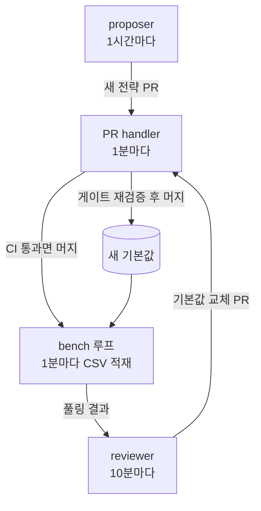

안녕하세요, 고준서입니다. vgc-ai는 IEEE CoG 2026 포켓몬 VGC AI 대회를 목표로 혼자 시작한 게임 AI 프로젝트예요. 5월 19일부터 23일 사이에 GCP 가상 서버 위에 셸 루프 네 개를 올려서, 코딩 에이전트가 전략을 제안하고 구현하면 통계 기준이 판정하고 사람 손 없이 기본 전략이 바뀌는 구조를 만들었습니다. 판정 기준은 [지난 글]({{ "/blog/2026/05/12/wilson-gate-16-verdicts/" | relative_url }})에, 벤치가 빈 메타로 재고 있던 일은 [그 다음 글]({{ "/blog/2026/05/22/empty-meta-bench-harness/" | relative_url }})에 있고, 이번 글은 루프 자체입니다. 왜 셋으로 나눴는지, 각각이 언제 Claude를 부르는지, 그리고 첫 닷새 동안 세 번 멈춘 기록이에요.

## 제안, 판정, 머지를 다른 프로세스에

역할을 셋으로 나눴습니다. proposer는 새 전략을 만들어 PR을 엽니다. reviewer는 벤치 결과를 읽고 기본값을 바꾸자는 PR을 엽니다. PR handler는 열린 PR을 머지하거나 닫습니다. 어느 하나도 자기 PR을 자기가 머지하지 못합니다. 그 밑에서 bench 루프가 매 사이클 모든 전략을 맞붙여 CSV에 행을 쌓고, 이 CSV가 reviewer와 proposer의 유일한 입력입니다.



*그림 1. 네 루프의 순환. 제안, 판정, 집행이 서로 다른 프로세스에 있고, 어느 루프도 자기 PR을 자기가 머지하지 않습니다.*

`TASKS.md` 서두에는 이렇게 적혀 있습니다.

> The loop NEVER invents tasks. If it has an idea, it appends to **Proposed for human review**.

이 문장은 5월 11일 첫 루프 때 것이고, 5월 20일에 proposer가 생기면서 새 전략을 만드는 권한은 넘어갔습니다. 다만 만든 것이 곧바로 기본값이 되지는 못합니다. 새 전략은 머지된 뒤 bench 루프에 측정되고, 기본값을 이겨야 reviewer가 승격 PR을 열고, handler가 그 시점의 CSV로 다시 검증해야 머지됩니다. PR #30 본문에는 이 순환이 "proposer hourly fire → new-compound PR → handler merges if CI green → bench loop measures it → if it beats default → reviewer catches it → bench-gate PR → handler merges if CI + bench re-verify pass → new default → repeat"로 적혀 있습니다.

네 루프는 전부 같은 모양의 셸 스크립트입니다. `git pull`, `uv sync`, 파이썬 모듈 한 번, `sleep`. 다른 것은 주기와, 그 모듈이 Claude를 부르는지 여부입니다.

| 루프 | 주기 | 하는 일 | Claude 호출 |
|---|---|---|---|
| bench | 60초 | 전략 전수 대전, CSV 행 추가 | 없음 |
| reviewer | 600초 | CSV 풀링, 게이트 판정, 승격 PR | 게이트가 발화할 때만 |
| proposer | 3600초 | 가장 접전인 트랙에 새 전략 제안 PR | 조건을 다 통과할 때만 |
| PR handler | 60초 | 열린 루프 PR 머지 또는 닫기 | 없음 |

*표 1. 루프별 주기와 Claude 호출 여부. 넷 중 둘은 LLM을 부르지 않습니다.*

reviewer 모듈의 도크스트링에 순서가 있습니다. 자기가 연 PR이 아직 열려 있으면 멈춘다. 오늘 Claude 호출 횟수가 상한이면 멈춘다. CSV로 기준을 계산한다. 여기까지는 토큰 0이고, 기준을 넘은 후보가 있을 때만 `claude -p`를 한 번 띄웁니다.

```python
# src/vgc_ai/reviewer.py:16-17
- **Step 4**: only when a candidate's pooled ``ci95_low > 0.5`` does a
  one-shot ``claude -p`` fire — no persistent session, ~5K input tokens
```

상한은 처음 12회였고, 5월 20일 PR #32에서 50회로 올렸습니다. 근거는 본문의 "Max 플랜은 잦은 호출은 감당하지만 낭비되는 호출은 싫다"였고, 같은 PR에서 직전 성공 후 30분 안에는 다시 발화하지 않는 `has_new_signal` 조건을 붙였습니다.

```python
# src/vgc_ai/reviewer.py:48
DEFAULT_DAILY_CAP = 50  # bumped 2026-05-20 — user's Max plan tolerates frequent calls
```

proposer는 reviewer와 같은 예산 파일을 쓰고, 발화 한 번이 10K에서 20K 토큰이라 주기를 1시간으로 뒀습니다. 프롬프트에는 현재 기본값, 가장 강한 전략과 약한 전략, 최근 결과, 그리고 `ops/proposer_attempts.csv`에 적힌 이전 시도 목록이 들어갑니다. 직전 시도가 실패면 "뭐가 잘못됐는지 먼저 조사하라", 성공이면 "비슷한 걸 또 만들지 말고 다른 각도로"라는 문장이 붙습니다.

머지 권한을 가진 handler에는 LLM 호출이 없습니다. `pr_auto_handler.py`는 PR 본문에서 `BENCH GATE` 또는 `NEW COMPOUND` 블록을 찾고, 네 관문을 순서대로 통과시킵니다. 30초보다 어리면 기다리고, 바뀐 파일이 허용 경로 밖이면 닫습니다(기본값 교체 PR은 `registry.py`와 `battle.py` 두 파일만, 새 전략 PR은 `policies/`, `eval/`, `strategies/`, `tests/` 아래만). `ruff format --check`, `ruff check`, `mypy --strict`, `pytest`가 하나라도 빨간 채 5분이 지나면 닫습니다. 그리고 기본값 교체 PR은 머지 직전에 그 시점의 CSV로 기준을 다시 계산합니다. reviewer가 PR을 연 뒤에도 bench 루프는 행을 계속 쌓으니, 그 사이에 신호가 죽었으면 머지하지 않는 겁니다. PR #28 본문은 이 재검증을 "reviewer의 스냅샷을 믿는 대신 재검증하는 단 하나의 가장 중요한 이유"라고 적었습니다.

```python
# src/vgc_ai/pr_auto_handler.py:45-46
DEFAULT_MIN_AGE_SEC = 30
DEFAULT_MAX_AGE_SEC = 300  # 5-min SLA
```

이 재검증이 있어도 풀링 표본이 15판에서 30판이라 기본값이 12일 동안 일곱 번 바뀌었습니다. 관문의 개수와 관문이 보는 표본의 크기는 다른 문제였고, 그건 따로 적을 생각입니다.

## 첫 닷새, 세 번 멈췄습니다

5월 11일, 루프가 [이슈 #1](https://github.com/gary5876/vgc-ai/issues/1)을 스스로 열었습니다. vgc2의 `Competitor`가 `Any`로 타입돼 있어 `mypy --strict`가 main에서 실패했고, 루프의 수용 기준이 strict mypy라 "main이 이미 빨간 상태에서는 어떤 자율 PR도 기준을 통과할 수 없다"고 적었습니다. 그날 커밋 60f21be(type-ignore 한 줄)로 고쳐지고 닫혔습니다. 루프가 자기를 멈추게 한 조건을 이슈로 보고한 건 이때 한 번뿐입니다.

5월 20일 [PR #36](https://github.com/gary5876/vgc-ai/pull/36)의 원인 설명은 이렇습니다. 열린 PR을 세는 함수가 `BENCH GATE` 마커만 찾고 `NEW COMPOUND`는 찾지 않았습니다. 그래서 proposer는 자기가 연 PR이 아직 열려 있는데도 매시간 다시 발화했고, 여러 PR이 동시에 `registry.py`를 건드려 충돌이 났습니다. PR #33과 #35는 몇 시간 동안 충돌 상태로 있었고, handler는 1분마다 머지를 시도하다 실패했습니다. 새 전략이 하나도 안 들어온 2시간이 그 결과였습니다. 고친 것은 두 마커를 다 보게 한 것과, 마커가 줄 하나를 통째로 차지할 때만 인식하게 한 것입니다. 후자는 그 직전 [PR #30](https://github.com/gary5876/vgc-ai/pull/30)의 첫 시도가 본문 표 안에 마커 문자열을 언급했다는 이유로 옛 handler에게 닫힌 데서 나왔습니다.

```python
# src/vgc_ai/pr_auto_handler.py:223-226
    Strict by design — prose mentions of ``BENCH GATE`` or ``NEW COMPOUND``
    in markdown formatting must not trigger handler attention. The PR
    that initially added this strict check was itself closed by the old
    looser handler because its description mentioned the markers in
```

5월 22일 [PR #45](https://github.com/gary5876/vgc-ai/pull/45)에 따르면 bench 체크아웃이 `auto/compound-damage_estimate_selection-20260522` 브랜치에 서 있었습니다. proposer가 auto 브랜치를 만들어 푸시한 뒤 main으로 돌아오지 않았고, 이후 매 사이클의 `git pull`은 그 auto 브랜치를 따라갔습니다. 이틀 전 머지된 PR #41, #42, #43이 가상 서버에 반영되지 않은 채 벤치가 돌고 있었고, 앞 글의 `championship_real` 수정이 거기 포함돼 있었으니 고친 하네스가 서버에서는 30시간 더 안 돌았던 셈입니다. 수정은 pull 앞에 체크아웃을 강제하는 세 줄입니다.

```sh
# ops/run_bench.sh:47-49
        git fetch --quiet origin main || true
        git checkout --quiet main || true
        git pull --ff-only --quiet || true
```

셋 다 `|| true`가 붙어 있습니다. 이 스크립트는 `set -e`를 일부러 껐고, 한 판의 vgc2 내부 오류로 루프 전체가 죽으면 안 되며 실패한 단계를 건너뛰고 성공한 단계의 행이라도 남겨야 한다는 이유가 머리에 적혀 있습니다.

## 루프 밖에서 온 변경

5월 19일에는 이 윈도우 PC의 로컬 세션이 발표자료 생성 스크립트 695줄과 작업 폴더 목록을 `auto/` 브랜치에 스테이징해 둔 것이 발견됐습니다. 커밋되지 않은 채였고, 생성된 pptx도 작업 트리에 있었습니다. 받지 않았고, 이유를 `docs/archive/2026-05-19-orphan-presentation-attempt.md`에 남겼습니다. 이 레포의 산출물은 대회 제출본이지 발표 자료가 아니고, 작업 폴더 목록은 한 윈도우 PC의 `D:\` 경로라 서버에도 레포에도 없는 것이며, 스크립트 안의 한글 문자열이 ruff의 RUF001에 걸려 루트에서 `ruff check .`를 막고 있었다는 것입니다. 그 문서에는 조용히 지우는 대신 결정을 기록으로 남기라고 요청한 사람이 저라고 적혀 있습니다. 루프가 만든 변경은 마커와 경로로 자동 판정되지만 루프 밖에서 온 변경은 판정 기준이 없어서, 이 경우는 기록을 남기는 것으로 대신했습니다.

루프 모듈 셋과 셸 스크립트 넷의 구현, PR 본문, 사고 원인 진단은 Claude가 했고, 해당 기간 커밋에 공동 작성자로 남아 있습니다. 제가 한 건 제안과 판정과 머지를 분리한다는 구조, 토큰 상한과 주기, handler에 LLM을 두지 않는다는 결정, 그리고 PR 검토와 머지입니다. 루프는 6월 7일 PR #61 머지를 끝으로 멈췄고, 왜 멈췄는지는 커밋에도 이슈에도 없습니다. 세 사고의 공통점은 루프가 자기 상태를 모른다는 것이었습니다. main이 빨간 것, 자기 PR이 열려 있는 것, 체크아웃이 main이 아닌 것. 셋 다 한 줄짜리 확인으로 막을 수 있었고 실제로 그렇게 막았지만, 이슈 #1을 빼면 둘은 "2시간째 새 전략이 없다", "30시간째 결과가 같다"는 부재를 사람이 로그에서 본 뒤에야 알았습니다. 네 루프가 각자 로그 파일을 남기지만 그 로그를 읽는 다섯 번째는 만들지 않았습니다.
