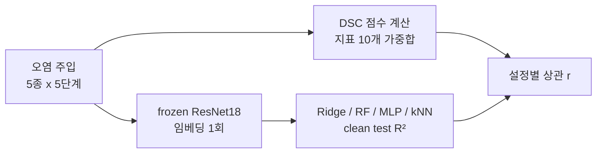

| | 전체 5 polluter | noise_injection 제외 4종 |
|---|---|---|
| UTKFace | r = −0.16 | r = +0.94 |

*표 1. 2026년 6월 3일 새벽, 이미지 회귀 셀의 첫 probe 결과*

네 종만 보면 0.94인데 다섯 종을 다 넣으면 음수가 됩니다. 오염 한 종류가 전체를 끌어내리고 있었어요.

안녕하세요, 고준서입니다. 4학년 캡스톤 팀에서 데이터 품질 점수(DSC) 엔진과 실험 파이프라인을 맡았습니다. 저희 캡스톤의 질문은 하나였습니다. 데이터 품질 점수가 그 데이터로 학습한 모델의 성능을 예측하는가. 정형 분류 셀에서는 3개 데이터셋에 오염 5종을 5단계로 넣고 5개 모델을 학습시켜 435건의 실험으로 r=0.598을 얻었고, 그 다음 셀인 이미지 회귀에서 위 표를 만났습니다. 점수 엔진이 노이즈로 망가진 데이터를 "품질 양호"로 읽고 있었다는 걸 알게 된 날의 이야기를 풀어보려 합니다.

## 첫 번째 단서: 하루 전 기록에 이미 있었습니다

이미지 회귀 셀은 UTKFace(나이)와 SCUT-FBP5500(미모 점수) 두 데이터셋에 오염 5종을 5단계로 넣어 데이터셋당 26개 설정을 만듭니다. 6월 2일에 오염 sweep을 돌려 각 오염이 표적 지표를 떨어뜨리는지 확인했는데요, 네 종은 단조 하락했고 `noise_injection` 하나만 반응이 없었습니다. `sample_quality_image`가 UTKFace에서 0.97에서 0.98로 오히려 올랐어요.

그날 진행 기록에 저는 이렇게 적었습니다.

> noise_injection 무반응(의도된 한계). 가우시안 노이즈가 Laplacian 분산(선명도)을 오히려 높여 sample_quality를 안 떨어뜨림. 5종 중 1종이라 hold-out과 상관에 지장 없음.

원인까지 알고 있었던 거죠. 다섯 중 하나니까 괜찮다고 판단했고, 그 판단은 하루 만에 깨졌습니다.

## 두 번째 단서: 측정을 바꾸자 상관이 무너졌습니다

원래 성능 측정은 설정마다 ResNet18을 full finetune하는 방식이었습니다. 이미지 회귀 한 셀에 GPU 2.5시간이 들었고, Colab 무료 한도에서 중단이 반복됐어요. 그래서 6월 2일 ADR-019로 측정 방식을 바꿨습니다. frozen ResNet18 임베딩을 한 번만 뽑고, 그 위에 Ridge, RandomForest, MLP, kNN 네 개의 경량 모델을 fit해서 clean test로 R²를 잽니다. 정형 셀은 이미 고정 특징 위 sklearn 모델로 재고 있었으니 같은 프로토콜로 통일하는 셈이었고, 셀당 시간은 한 시간 안쪽으로 내려왔습니다.



*그림 1. ADR-019 이후의 이미지 회귀 셀. 왼쪽 DSC 점수와 오른쪽 probe R²가 설정마다 짝을 이뤄 상관을 만든다*

그리고 6월 3일 새벽에 첫 결과가 나왔습니다([bbd88c7](https://github.com/gary5876/capstone-dsc/commit/bbd88c7)). 표 1이 그것이고, SCUT-FBP5500도 마찬가지였어요.

| | 전체 5 polluter | noise_injection 제외 4종 |
|---|---|---|
| UTKFace | r = −0.16 (FAIL) | r = +0.94 |
| SCUT-FBP5500 | r = +0.16 (FAIL) | r = +0.65 |

*표 2. 두 데이터셋 모두 noise_injection 하나가 합격선 0.40 아래로 끌어내렸다*

노이즈 설정들에서 DSC는 85에서 87 사이로 평평했습니다. UTKFace 기준으로 85.9에서 85.1이요. 그런데 Ridge probe의 R²는 0.43에서 0.00으로 무너졌어요. 점수는 "멀쩡하다"고 하고 모델은 아무것도 못 배우고 있었습니다.

정반대였습니다.

## 점수는 무엇을 보고, 노이즈는 무엇을 망가뜨리나

DSC의 이미지 지표 열 개는 전부 신호를 빼거나 흐리거나 중복시키는 열화를 잡도록 설계돼 있었습니다. 누락은 completeness가, blur는 선명도가, 중복은 uniqueness가 잡는 식이죠. 정형 데이터의 품질 차원(DQ4AI)을 물려받은 결과였습니다.

가우시안 노이즈는 반대로 갑니다. 신호를 빼는 게 아니라 가짜 고주파를 더해요. 선명도를 담당하는 `sample_quality_image`는 Laplacian 분산을 쓰는데, 노이즈가 그 분산을 폭증시켜서 "더 선명하다"로 읽습니다. 합성 이미지로 재보니 σ=0일 때 369였던 Laplacian 분산이 σ=60에서 18,324가 됐고, 점수는 셋 다 1.000이었습니다. 노이즈가 심할수록 최대 점수에 박혔어요.

## 왜 finetune 시절엔 안 보였을까요?

finetune은 노이즈에 적응합니다. 노이즈 설정에서도 R²가 0.7에서 0.8 사이를 유지했으니, DSC도 평평하고 성능도 평평했던 거예요. 둘 다 안 움직여서 우연히 일치했고, gap은 그 뒤에 숨어 있었습니다.

frozen 임베딩 위의 probe는 적응하지 못합니다. 노이즈에 그대로 무너졌고, 그제야 점수가 틀렸다는 게 드러났어요. 측정을 싸게 하려고 바꾼 설계가 점수 엔진의 한계를 자가진단해 준 셈입니다. 이런 경우 보신 적 있으신가요? 비용 때문에 바꾼 도구가 원래 도구로는 못 보던 걸 보여주는 경우요.

## 세 번째 단서: 노이즈 자체를 재는 지표가 없었습니다

지표 열 개 중에 "이 이미지에 노이즈가 얼마나 있나"를 직접 묻는 지표는 없었습니다. 그래서 하나를 추가했습니다([c0c429b](https://github.com/gary5876/capstone-dsc/commit/c0c429b)). Immerkær(1996)의 빠른 노이즈 σ 추정을 씁니다. 3×3 마스크가 엣지 같은 구조를 상쇄하고 노이즈만 남기기 때문에, blur나 디테일에는 반응하지 않고 노이즈 강도에만 반응해요.

```python
# dsc_framework/image_cell.py:469-478
def _immerkaer_sigma(gray_uint8):
    """Immerkær(1996) 빠른 Gaussian 노이즈 sigma 추정. 3x3 마스크가 구조(엣지)를
    상쇄해 노이즈만 추정 → blur/디테일엔 오발 안 하고, 노이즈 강도엔 σ를 복원."""
    from scipy import ndimage
    g = gray_uint8.astype(np.float64)
    N = np.array([[1, -2, 1], [-2, 4, -2], [1, -2, 1]], dtype=np.float64)
    conv = ndimage.convolve(g, N, mode='reflect')
    H, W = g.shape
    denom = 6.0 * max(1, W - 2) * max(1, H - 2)
    return float(np.sqrt(np.pi / 2.0) * np.abs(conv).sum() / denom)
```

점수는 `1 − clip(σ̂ / noise_norm, 0, 1)`의 평균이고, `noise_norm=25`는 결과를 보기 전에 사전등록했습니다. 후보 지표 세 개를 합성 이미지로 비교하는 실험과 구현 초안은 Claude가 해줬고, 그중 Immerkær를 고르고 noise_norm을 미리 못 박은 건 제 결정이었어요. 이 커밋들에는 그래서 Claude Opus 4.8이 공동 작성자로 들어가 있습니다.

## 다른 후보는 왜 버렸나

합성 검증 결과가 이랬습니다.

| 입력 | signal_integrity | 추정 σ̂ |
|---|---|---|
| clean | 0.99 | |
| blur | 0.99 | |
| σ=10 | 0.76 | 10.2 |
| σ=30 | 0.31 | 30.3 |
| σ=60 | 0.00 | 53.7 |

*표 3. Immerkær 기반 signal_integrity의 합성 검증. clean과 blur에 오발이 없고 노이즈 강도를 따라 내려간다*

같이 본 MAD-Laplacian은 blur에 오발했고, 디노이징 잔차는 clean에 오발해서 버렸습니다. 가중치는 `sample_quality_image`를 0.15에서 0.10으로 내리고 `signal_integrity`에 0.05를 줘서 합을 1.00으로 유지했어요.

Colab을 다시 돌리기 전에 로컬에서 먼저 확인했습니다. 실제 probe 결과에 노이즈 레벨로 추정한 `signal_integrity` 값을 붙여 가중치 최적화를 돌리니 held-out r이 0.42에서 0.94로 올라왔어요. 추정값이라 예측일 뿐이었고, 실측은 재실행에서 확정하기로 했습니다.

## 다시 잰 결과는 어땠을까요?

같은 날 오후 재실행([888d6ff](https://github.com/gary5876/capstone-dsc/commit/888d6ff))에서 지표가 실데이터의 노이즈를 잡았습니다. UTKFace 노이즈 설정에서 `signal_integrity`가 0.87에서 0.04로 떨어졌고, 전에는 평평하던 DSC가 86.3에서 80.4로 내려갔어요.

| 가중치 | 튜닝(UTKFace) | held-out(SCUT) |
|---|---|---|
| 수정 전 | −0.16 | +0.16 (FAIL) |
| default | +0.49 | +0.67 (PASS) |
| 제약 최적화 | +0.85 | +0.95 (PASS) |

*표 4. 수정 전후의 상관. held-out 데이터셋에서도 합격선 0.40을 넘었다*

로컬 시뮬레이션이 0.94를 예측했고 실측은 0.951이었습니다. 최적화된 가중치에서 `signal_integrity`는 0.152로, 열 개 지표 중 세 번째로 컸어요. 이미지 회귀 셀은 합격선을 통과했습니다.

## 두 달 전에도 비슷한 일이 있었습니다

4월 12일에는 정형 데이터에 75%까지 오염을 넣어도 점수가 2점도 안 움직이는 걸 발견했습니다(ADR-008). 그때는 completeness가 placeholder를 null로 안 세는 식의 구현 문제였어요. 이번은 지표 구현의 버그가 아니라 지표 셋의 커버리지 편향이었습니다. 차감형 열화만 재는 지표 셋은 추가형 열화를 구조적으로 못 봅니다.

지표 하나를 더한 것으로 이 사각지대는 막았습니다. 그런데 막은 건 노이즈 하나예요. 텍스트 셀의 문자 노이즈에 같은 구멍이 있을 가능성은 보고서에 후속으로만 적혀 있고 확인하지 않았습니다. 다음 사각지대가 어디인지는 다음 측정 방식이 바뀔 때 또 드러나겠죠.

## 정리

6월 2일의 "5종 중 1종이라 지장 없음"은 틀린 판단이었습니다. 반응이 없다는 신호를 보고, 원인까지 적어 놓고도 넘어갔어요. 하나가 전체 상관을 깨는 데는 다섯 중 하나면 충분했습니다.

여러분이라면 그 기록을 보고 어떻게 하셨을까요? 저는 이제 "의도된 한계"라고 적을 때마다 그 한계가 결과 전체에 어떤 크기로 들어가는지를 먼저 계산해 보게 됐습니다.

점수를 재는 도구를 의심하게 만든 건 결국 측정 방식의 변경이었습니다. 그 우연에 기대지 않으려면 지표 셋이 어떤 종류의 열화를 못 보는지를 처음부터 목록으로 적어 두는 게 맞았겠다는 생각을 합니다. 데이터 품질 점수를 만들거나 쓰시는 분들께 이 사례가 한 번쯤 참고가 되면 좋겠습니다. 감사합니다.
