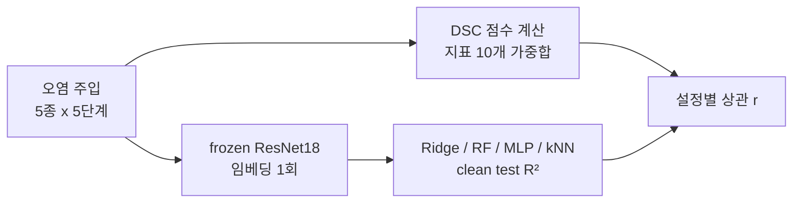

안녕하세요, 고준서입니다. 4학년 캡스톤은 팀으로 했고, 그중 데이터 품질 점수 엔진과 실험 파이프라인을 제가 맡았습니다. 캡스톤의 질문은 하나였어요. 데이터에 점수를 매기는 도구(DSC)가 있을 때, 그 점수가 실제로 그 데이터로 학습한 모델의 성능을 예측하는가. 정형 데이터 쪽에서는 3개 데이터셋에 오염 5종을 5단계로 넣고 5개 모델을 학습시켜 435건을 돌렸고, 점수와 성능의 상관계수 r이 0.598이 나와서 통과했습니다. 그다음이 이미지였습니다.

## 6월 2일, 기록에는 이미 적혀 있었습니다

이미지 회귀 쪽은 UTKFace(나이 추정)와 SCUT-FBP5500(얼굴 매력도 점수) 두 데이터셋에 같은 오염 5종을 5단계로 넣어 데이터셋당 26개 설정을 만듭니다. 6월 2일에 각 오염이 점수를 실제로 떨어뜨리는지 먼저 확인했는데, 넷은 단계가 올라갈수록 점수가 내려갔고 가우시안 노이즈 하나만 반응이 없었어요. 오히려 선명도 지표인 `sample_quality_image`가 UTKFace에서 0.97에서 0.98로 올랐습니다.

그날 진행 기록(Claude Code와 함께 쓴 문서라 커밋에 공동 작성자로 남아 있습니다)에는 이렇게 적혀 있습니다.

> noise_injection 무반응(의도된 한계): 가우시안 노이즈가 Laplacian 분산(선명도)을 오히려 높여 `sample_quality`를 안 떨어뜨림. 노이즈의 실제 영향은 임베딩 계열에 감.

그 뒤에는 다섯 종 중 하나라 hold-out과 상관에 지장이 없다고, 텍스트 셀의 word_shuffle 무반응과 같은 성격이라고 이어집니다. 원인까지 적어 놓고 넘어간 거죠.

같은 날 성능을 재는 방법도 바꿨습니다(ADR-019). 원래는 설정마다 ResNet18 모델을 통째로 다시 학습시켰는데, 이미지 한 셀에 GPU 2.5시간이 들고 Colab 무료 한도에서 자꾸 끊겼어요. 그래서 사전 학습된 ResNet18로 이미지 특징을 한 번만 뽑아 두고, 그 위에 Ridge, RandomForest, MLP, kNN 같은 가벼운 모델(probe)만 올려 성능을 재기로 했습니다. 정형 쪽은 이미 그렇게 재고 있었으니 방식을 맞추는 의미도 있었고, 셀당 한 시간 안쪽으로 내려왔습니다.



*그림 1. 바뀐 측정 방식. 왼쪽 점수와 오른쪽 probe 성능이 설정마다 짝을 이뤄 상관을 만듭니다.*

## 6월 3일 새벽, 상관이 음수로 나왔습니다

바뀐 방식으로 돌린 첫 결과가 이랬습니다([bbd88c7](https://github.com/gary5876/capstone-dsc/commit/bbd88c7)).

| | 전체 5 polluter | noise_injection 제외 4종 |
|---|---|---|
| UTKFace | r = −0.16 (FAIL) | r = +0.94 |
| SCUT-FBP5500 | r = +0.16 (FAIL) | r = +0.65 |

*표 1. 두 데이터셋 모두 noise_injection 하나가 합격선 0.40 아래로 끌어내렸습니다.*

노이즈 설정들에서 DSC 점수는 85에서 87 사이로 거의 움직이지 않았습니다. UTKFace 기준 85.9에서 85.1이요. 그런데 같은 설정에서 Ridge probe의 R²는 0.43에서 0.00까지 떨어졌습니다. 점수는 멀쩡하다고 말하는데 모델은 아무것도 못 배우고 있었던 거죠.

왜 전날의 통째 학습 방식에서는 이게 안 보였을까요. 모델을 통째로 다시 학습시키면 노이즈에 적응합니다. 노이즈 설정에서도 R²가 0.7에서 0.8을 유지했고, 점수도 평평했으니 둘이 우연히 같이 평평해서 차이가 숨어 있었습니다. 고정된 특징 위에 얹은 가벼운 모델은 적응을 못 하니 노이즈에 그대로 무너졌고, 그제야 점수 쪽이 틀렸다는 게 드러났습니다. 비용 때문에 바꾼 측정 방식이 점수 엔진의 구멍을 보여준 셈이에요.

구멍의 정체는 이렇습니다. DSC의 이미지 지표 열 개는 전부 신호를 빼거나 흐리거나 중복시키는 열화를 잡도록 만들어져 있었습니다. 누락은 completeness가, 흐림은 선명도 지표가, 중복은 uniqueness가 잡는 식이죠. 정형 데이터의 품질 차원을 그대로 물려받은 결과였습니다. 가우시안 노이즈는 반대로 가짜 고주파를 더합니다. 선명도 지표가 쓰는 Laplacian 분산은 고주파가 많을수록 커지니까, 노이즈가 심할수록 "더 선명하다"로 읽습니다. 합성 이미지로 재보니 σ=0에서 369였던 분산이 σ=60에서 18,324가 됐고, 점수는 셋 다 1.000이었습니다.

## 노이즈를 직접 재는 지표를 하나 넣었습니다

지표 열 개 중에 "이 이미지에 노이즈가 얼마나 있나"를 묻는 게 없었으니, 하나 추가했습니다([c0c429b](https://github.com/gary5876/capstone-dsc/commit/c0c429b)). Immerkær(1996)의 빠른 노이즈 추정을 씁니다. 3×3 마스크가 엣지 같은 구조를 상쇄하고 노이즈만 남기기 때문에, 흐림이나 디테일에는 반응하지 않고 노이즈 강도에만 반응합니다.

```python
# dsc_framework/image_cell.py:469-478
def _immerkaer_sigma(gray_uint8):
    """Immerkær(1996) 빠른 Gaussian 노이즈 sigma 추정. 3x3 마스크가 구조(엣지)를
    상쇄해 노이즈만 추정 → blur/디테일엔 오발 안 하고, 노이즈 강도엔 σ를 복원."""
    from scipy import ndimage
    g = gray_uint8.astype(np.float64)
    N = np.array([[1, -2, 1], [-2, 4, -2], [1, -2, 1]], dtype=np.float64)
    conv = ndimage.convolve(g, N, mode='reflect')
    H, W = g.shape
    denom = 6.0 * max(1, W - 2) * max(1, H - 2)
    return float(np.sqrt(np.pi / 2.0) * np.abs(conv).sum() / denom)
```

점수는 `1 − clip(σ̂ / noise_norm, 0, 1)`의 평균이고, 기준값 `noise_norm=25`는 결과를 보기 전에 정해 두었습니다. 후보는 셋이었는데 합성 검증에서 MAD-Laplacian은 흐린 이미지에 오발했고, 디노이징 잔차는 깨끗한 이미지에 오발해서 Immerkær만 남았습니다.

| 입력 | signal_integrity | 추정 σ̂ |
|---|---|---|
| clean | 0.99 | |
| blur | 0.99 | |
| σ=10 | 0.76 | 10.2 |
| σ=30 | 0.31 | 30.3 |
| σ=60 | 0.00 | 53.7 |

*표 2. 합성 검증. 깨끗한 이미지와 흐린 이미지에 오발이 없고, 노이즈 강도를 따라 내려갑니다.*

가중치는 `sample_quality_image`를 0.15에서 0.10으로 내리고 `signal_integrity`에 0.05를 줘서 합 1.00을 유지했습니다. Colab을 다시 돌리기 전에 로컬에서 먼저 봤는데, 실제 probe 결과에 노이즈 레벨로 추정한 `signal_integrity` 값을 붙여 가중치 최적화를 돌리니 held-out 상관이 0.42에서 0.94로 올라왔습니다. 추정값이라 예측일 뿐이었고, 확정은 재실행에서 하기로 했습니다.

같은 날 오후 재실행 결과입니다([888d6ff](https://github.com/gary5876/capstone-dsc/commit/888d6ff)). UTKFace 노이즈 설정에서 `signal_integrity`가 0.87에서 0.04로 떨어졌고, 전에는 평평하던 DSC가 86.3에서 80.4로 내려갔습니다.

| 가중치 | 튜닝(UTKFace) | held-out(SCUT) |
|---|---|---|
| 수정 전 | −0.16 | +0.16 (FAIL) |
| default | +0.49 | +0.67 (PASS) |
| 제약 최적화 | +0.85 | +0.95 (PASS) |

*표 3. 수정 전후. 튜닝에 쓰지 않은 데이터셋에서도 합격선 0.40을 넘었습니다.*

로컬 시뮬레이션이 0.94를 예측했고 실측은 0.951이었습니다. 최적화된 가중치에서 `signal_integrity`는 0.152로 열 개 지표 중 세 번째로 컸어요. 이 커밋 세 개는 전부 Claude Opus 4.8과 함께 작업했고, 후보 지표를 합성 이미지로 비교하는 실험과 구현 초안이 그쪽 몫이었습니다.

## 정리

4월 12일에도 비슷한 일이 있었습니다(ADR-008). 정형 데이터에 75%까지 오염을 넣어도 점수가 2점도 안 움직였는데, 그때는 completeness가 placeholder 값을 결측으로 안 세는 구현 문제였습니다. 이번은 구현 버그가 아니라 지표 셋이 처음부터 한 방향만 보고 있었던 문제였습니다. 빼는 열화만 재는 지표 셋은 더하는 열화를 구조적으로 못 봅니다.

막은 건 노이즈 하나입니다. 텍스트 셀의 문자 노이즈에 같은 구멍이 있을 가능성은 보고서에 후속 과제로만 적혀 있고 확인하지 않았습니다. 그리고 6월 2일 기록의 "5종 중 1종이라 지장 없음"은 결과로 보면 틀린 판단이었습니다. 하나가 전체 상관을 깨는 데는 다섯 중 하나면 충분했습니다.
