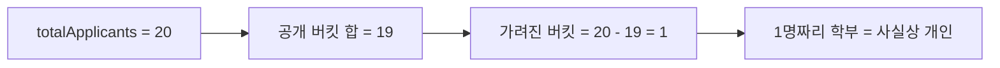
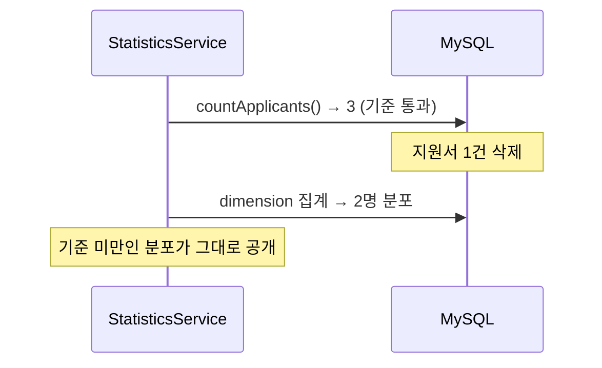

동아리 지원자 통계 한 장으로, 누가 지원했는지 알아낼 수 있을까요? 성별, 학부, 학번 분포만 공개하는데 말이죠.

저도 처음엔 "그게 되겠어?"라고 생각했습니다.

안녕하세요, 고준서입니다. 동아리움이라는 대학 동아리 모집 서비스의 백엔드를 팀에서 맡고 있습니다(백엔드 3인, 프론트엔드 3인). 그중 지원자 통계 도메인은 제가 전담했는데요, 이번 글에서는 설계 이슈([#335](https://github.com/kakao-tech-campus-3rd-step3/Team18_BE/issues/335))에 적어 둔 개인정보 대책이 구현 단계에서 어떻게 뒤집혔는지를 공유하려 합니다.

## 원안은 "위험도 낮음"이었어요

통계는 로그인 없이도 볼 수 있습니다. 지원폼별로 성별, 학부, 학번, 일자별 지원 추이를 집계해서 지원자에게 그대로 보여주는 API예요.

이슈를 쓸 때 개인정보 문제는 이렇게 정리했습니다. "단일 대규모 학교이므로 조합이 개인이 아닌 코호트 수준까지만 좁혀지고, 동아리 지원 사실 자체가 민감 정보에 해당하지 않아 위험도는 낮다." 대신 소수 버킷은 가리기로 했죠. 특정 dimension에서 `0 < count < k`인 버킷을 마스킹하고 나머지는 '기타'로 병합하는, 흔히 보는 per-bucket 방식이었습니다.

여기까지는 무난해 보이지 않나요?

## 빼기 한 번이면 복원된다고요?

구현하다가 알았습니다. 응답에는 `totalApplicants`가 그대로 나갑니다. 한 dimension에서 소수 버킷이 하나만 가려지면, 전체에서 공개된 버킷의 합을 빼면 가려진 값이 그대로 나와요.

학부 분포에서 1명짜리 버킷을 가려봐야, 총원 20명에서 공개된 19명을 빼면 끝입니다.


*그림 1. 버킷 하나만 가리면 총합에서 역산됩니다.*

그럼 버킷을 더 많이 가리면 되지 않을까요? 저도 그 방향을 먼저 생각했는데, 어느 버킷을 몇 개까지 가려야 역산이 막히는지가 dimension 조합마다 달라집니다. 성별 2개, 학부 15개, 학번 여러 개가 서로 교차하니까요. 규칙을 세울수록 규칙이 늘어나는 구조였어요.

## 그래서 기준을 어디에 걸었나

개별 버킷이 아니라 전체 지원자 수 하나에만 걸었습니다. 지원자가 3명 미만이면 분포 자체를 내보내지 않아요([PR #351](https://github.com/kakao-tech-campus-3rd-step3/Team18_BE/pull/351)). 특정 버킷만 가려지는 상황이 아예 없으니 역산할 대상도 없습니다. 기준값은 설정으로 뺐고요.

```java
// domain/statistics/config/StatisticsProperties.java:16-20
@ConfigurationProperties(prefix = "statistics")
public record StatisticsProperties(
        @DefaultValue("3") int minTotalApplicants,
        @DefaultValue("1800") long cacheTtlSeconds
) {
}
```

## 세 가지 '없음'을 어떻게 구분할까

비공개 처리를 넣자마자 다른 문제가 생겼습니다. 지원자가 적어서 가린 것, 실제로 그날 지원이 0건인 것, 학부를 입력하지 않은 것. 셋 다 응답에서는 "값이 없음"으로 보일 수 있었거든요.

처음엔 `count`를 null로 바꾸면 되겠다 싶었는데, 그러면 프론트가 세 경우를 구분할 방법이 없습니다. 그래서 응답 최상위에 `masked` 불리언을 두고, 비공개일 때는 `masked=true`에 `results=[]`를 돌려줍니다. 실제 0명은 버킷의 `count: 0`으로, 미입력은 `UNKNOWN` 버킷으로 남기고요.

```java
// domain/statistics/service/StatisticsServiceImpl.java:63-70
// 재식별 방지: 전체 지원자 수가 최소 공개 기준 미만이면 분포를 비공개(masked)한다.
// 기준은 전체 지원자 수에만 걸리고 개별 버킷에는 걸지 않는다(그래야 버킷 간 뺄셈 역산 문제가 없다).
if (full.totalApplicants() < properties.minTotalApplicants()) {
    return maskedResponse(clubApplyFormId, full.totalApplicants(), full.calculatedAt());
}
```

`totalApplicants`는 분포가 아니라서 비공개 상태에서도 그대로 내보냅니다. "아직 지원자가 적다"는 신호 자체는 지원자에게 쓸모가 있다고 봤어요. 지원자를 직접 관리하는 운영진용 API(`getStatisticsForAdmin`)는 이 기준을 타지 않고 원본을 봅니다.

## 리뷰어가 짚은 한 줄

머지 직전에 CodeRabbit이 트랜잭션 경계를 지적했습니다.

> 공개 기준 판정과 dimension 집계를 같은 스냅샷으로 고정하십시오.
>
> `statsProperties.minTotalApplicants()`는 기본값 `3`입니다. `StatisticsServiceImpl`의 `@Transactional(readOnly = true)`는 격리 수준을 지정하지 않아 기본 `READ_COMMITTED`가 적용될 수 있어, Line 45에서 기준 이상 판정 뒤에 `countApplicants()`와 dimension 집계 쿼리가 지원자 수가 감소한 데이터를 볼 수 있습니다. 이 경우 최소 공개 기준 밑으로 떨어진 분포가 공개됩니다.

지원자 수를 판정에서 한 번 읽고 집계에서 또 읽으면, 그 사이에 지원서가 삭제돼 기준 아래로 떨어진 분포가 그대로 나갈 수 있다는 얘기예요.


*그림 2. 판정과 집계가 다른 스냅샷을 보면 생기는 틈.*

`getStatistics`가 지원자 수를 한 번만 읽어 `calculate`에 넘기도록 바꾸고, 클래스 단위로 격리 수준을 명시했습니다([4be04011](https://github.com/kakao-tech-campus-3rd-step3/Team18_BE/commit/4be04011)).

```java
// domain/statistics/service/StatisticsServiceImpl.java:31-33
// 최소 공개 기준 판정(지원자 수)과 dimension 집계가 같은 스냅샷을 보도록 반복 읽기로 고정한다.
// 운영 MySQL(InnoDB)은 기본이 REPEATABLE_READ지만, DB 기본값에 의존하지 않고 요구사항을 명시한다.
@Transactional(readOnly = true, isolation = Isolation.REPEATABLE_READ)
```

사실 운영 DB가 InnoDB라 기본 격리가 이미 REPEATABLE_READ여서, 이 레이스는 실제로는 나지 않습니다. 그래도 "같은 스냅샷이어야 한다"는 요구사항이 DB 기본값 뒤에 숨어 있는 상태를 두고 싶지 않았어요. 중복 count 쿼리도 이때 같이 사라졌습니다.

## 학과를 왜 enum으로 잠갔나

원안은 학과를 자유 입력으로 두고 공백만 제거하는 쪽이었습니다. 전체 학과 목록을 확보하는 부담이 컸고, 목록에서 빠진 학과 지원자가 지원을 못 하는 상황이 더 나쁘다고 봤거든요. 그 대가로 "컴퓨터공학과, 컴퓨터공학부, 컴공이 각각 집계되므로 학과 통계의 순위와 비율은 실제 분포와 다르다"는 걸 감수하기로 적어 뒀습니다.

그런데 통계 페이지에서 학과 순위가 틀린 채로 나간다면, 그 통계는 뭘 보여주는 걸까요?

단위를 학과에서 학부로 올렸습니다. 학부는 15개라 enum으로 고정할 수 있고, 목록 밖은 `ETC`로 받습니다([PR #339](https://github.com/kakao-tech-campus-3rd-step3/Team18_BE/pull/339)). 프론트가 아직 값을 안 보내던 시점이라 처음부터 `@NotNull`로 조이면 구 프론트의 제출이 전부 400이 되기 때문에, 선택 입력으로 먼저 배포하고 필수화는 별도 PR로 미뤘고요. 집계에서는 null만 '미입력'으로 모으고 `ETC`는 정상 버킷으로 냅니다([PR #345](https://github.com/kakao-tech-campus-3rd-step3/Team18_BE/pull/345)).

```java
// domain/user/entity/Faculty.java:12-13
 * <strong>반드시 {@code @Enumerated(EnumType.STRING)}으로 저장한다.</strong> 순서값으로 저장하면 상수를 추가하거나
 * 순서를 바꾸는 순간 기존 데이터의 의미가 바뀐다.
```

기존 `department` 필드는 지원서 상세와 이메일이 쓰고 있어서 그대로 뒀습니다.

## 하지 않기로 한 것: 마감 직전 blackout

원안에는 마감 5분 전부터 통계를 감추는 항목이 확정으로 들어가 있었습니다. 실시간 경쟁률이 보이면 막판에 눈치 지원이 생긴다는 우려였죠.

구현하면서 뺐습니다.

공개하는 dimension이 성별, 학부, 학번, 일자별 추이인데, 전부 지원자가 바꿀 수 없는 속성이에요. 분포를 보고 지원 여부를 바꿀 수는 있어도, 자기 속성을 바꿔서 통계를 유리하게 만들 수는 없습니다. 감춰서 얻는 게 없었어요. 위험한 극소수 케이스는 이미 총합 기준으로 막히고요. 단계 전환 시점의 스냅샷 저장도 같은 이유로 빠졌고, 이런 원안 대비 변경점은 이슈 코멘트에 항목별로 사유를 남겨 뒀습니다.

이 기간의 커밋 메시지와 테스트 골격 초안은 Claude Code와 같이 만들었는데, 버킷 마스킹을 버릴지 말지와 세 가지 '없음'을 어떻게 나눌지는 코드를 열어 놓고 제가 정했습니다.

## 남은 숙제

총합 기준 3은 작은 숫자입니다. 지원자가 4명이면 분포가 그대로 공개되는데, 4명 중 1명뿐인 학부 버킷은 사실상 개인이죠. 원안의 "위험도 낮음" 판단이 지금도 유효하다고는 보지만, 기준값을 설정으로 뺀 이유가 바로 이 불확실성이었습니다.

더 큰 구멍은 원안 5절에 제가 직접 적어 둔 것입니다. 통계를 반복 조회하면 특정 지원 전후의 차이로 개별 지원자의 속성 조합을 추정할 수 있어요. 이건 총합 기준으로도 막히지 않습니다. 지금은 30분 TTL 캐시가 갱신 단위를 뭉개주는 부수 효과로 완화되고 있을 뿐, 의도한 방어는 아니에요. 차분 공격을 막으려면 갱신 단위를 1이 아니라 k로 두는 식의 설계가 따로 필요합니다.

그 캐시를 원안의 스케줄러 대신 왜 cache-aside로 갔는지는 [다음 글]({{ "/2026/08/18/statistics-cache-aside/" | relative_url }})에 이어서 적었습니다. 작은 서비스의 공개 통계를 만드는 분들께 조금이라도 참고가 되면 좋겠습니다.
