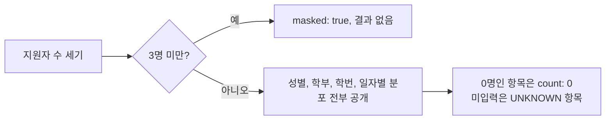

안녕하세요, 고준서입니다. 동아리움이라는 대학 동아리 지원 서비스의 백엔드를 팀(백엔드 3인, 프론트엔드 3인)에서 맡고 있고, 지원자 통계 기능은 제가 전담했어요. 지원폼별 성별, 학부, 학번, 일자별 지원 추이를 지원자에게 공개하는 API인데, 공개 통계는 누가 지원했는지 알아낼 수 있는 자료가 되기도 합니다. 8월 5일부터 10일 사이에 그 부분을 어떻게 잡았는지 적습니다. 코드 초안은 Claude Code가 썼고 저는 읽고 되묻는 쪽이었어요.

## 아직 프론트 수정이 안이루어진 상태라

통계를 내려면 지원자 정보에 성별과 학부가 있어야 합니다. 8월 5일에 성별 컬럼을 추가하는 PR(#337)을 보다가 든 생각은 이거였어요.

> 지원자들은 남성 여성만 받게 프론트에서 강제할거니까 문제없겠지? 만약 유저가 악의적으로 다른 입력을 넣은 통신을 시도하면 어떻게 될까?

그래서 잘못된 값이 오면 400으로 거부하는 회귀 테스트가 붙었습니다. 그런데 필수값으로 조이자마자 다른 문제가 보였어요.

> 아직 프론트 수정이 안이루어진 상태라 null로 올텐데 그건 어떡하지?

> gender도 프론트 수정이 안되어있어서 null을 일단은 허용해놔야해

프론트가 아직 값을 안 보내는 상태에서 처음부터 필수로 조이면 기존 화면의 제출이 전부 막힙니다. 그래서 성별과 학부 둘 다 일단 선택 입력으로 배포하고 필수화는 뒤로 미뤘어요. 학부는 자유 입력 대신 15개 목록의 enum으로 잠갔습니다([PR #339](https://github.com/kakao-tech-campus-3rd-step3/Team18_BE/pull/339)). "컴퓨터공학과, 컴퓨터공학부, 컴공"이 따로 집계되면 통계가 의미를 잃으니까요. 목록 밖은 `ETC`로 받고, 집계에서는 입력 안 한 것만 "미입력"으로 모읍니다([PR #345](https://github.com/kakao-tech-campus-3rd-step3/Team18_BE/pull/345)).

```java
// domain/user/entity/Faculty.java:12-13
 * <strong>반드시 {@code @Enumerated(EnumType.STRING)}으로 저장한다.</strong> 순서값으로 저장하면 상수를 추가하거나
 * 순서를 바꾸는 순간 기존 데이터의 의미가 바뀐다.
```

8월 9일에는 관리자용 통계를 하나 더 두자고 했습니다.

> 그리고 관리자용 통계도 하나 만들고싶어. 지금 지원자들 보라고 있는 비로그인 통계만 있는데 그게 지원자 추청 불가능하게 최소공개기준이라던가 n명 이상 늘어야 갱신된다던가 하는 제약을 걸어놨는데, 만약 이걸 조회하는 인원이 지원자들을 직접 관리하는 동아리 관리자면 제약이 필요 없으니가

지원자를 직접 관리하는 사람에게 지원자 통계를 가릴 이유가 없죠. 그래서 공개용은 가리고, 관리자용(`getStatisticsForAdmin`)은 원본을 그대로 봅니다.

## 버킷별로 합이 다르니?

8월 10일 새벽, 마스킹 PR([#351](https://github.com/kakao-tech-campus-3rd-step3/Team18_BE/pull/351))에 CodeRabbit이 Major로 경고를 하나 달았습니다. 성별처럼 항목이 두세 개뿐인 분포에서 한 항목만 가리면, 전체 지원자 수에서 공개된 항목을 빼서 가린 값이 그대로 나온다는 거였어요. 여성 1명, 남성 4명이면 여성만 가려지는데 5에서 4를 빼면 끝이라는 얘기입니다. Claude가 그 경고를 받아 "공개 총합을 생략할지, 두 번째로 작은 항목까지 같이 가릴지, 위험을 감수할지" 세 가지 선택지를 물었고요.

저는 무슨 말인지 몰라서 이렇게 물었습니다.

> 버킷별로 합이 다르니?

각 분포의 항목 합이 전체 지원자 수와 같으니 역산이 된다는 답이 왔고, 그제야 뭐가 어긋난 건지 보였습니다.

> 도대체 무슨말을 하는거야? 만약 여성이 1명이고 남성이 4명이면 여성만 마스킹하는데, 그 값을 총합에서 추정할 수 있다는 말을 하는거야? 근데 우리 마스킹은 그런 방식이 아니라 총합에만 조건이 걸려있는데

원래 API 계약에는 "최소 공개 기준에 미달하면 결과가 빈 배열"이라고 적어 뒀었어요. 지원자 수 자체가 적으면 분포를 통째로 안 보여주는 방식입니다. 그런데 구현이 그 계약과 다르게 항목 하나하나를 골라 가리는 방식으로 돼 있었고, 역산 문제는 전부 거기서 나온 거였습니다. 항목을 골라 가리지 않으면 빼기로 복원할 것도 없어요. Claude가 잘못 구현했다고 인정했고, 계약대로 되돌렸습니다.

되돌리면서 하나를 더 짚었습니다.

> 기준값 3이라고 했고, 넌 null인지 0인지 미공개인지 구별을 당연히 해야된다고 생각 안하니?

항목별로 가리는 구현은 가린 값을 null로 바꿨는데, 그러면 화면에서 "지원자가 적어서 가린 것", "실제로 그날 0명", "학부를 입력 안 한 것"이 전부 빈 값으로 보입니다. 셋을 구분하게 했어요. 가린 경우는 응답 최상위에 `masked: true`와 빈 결과, 실제 0명은 항목의 `count: 0`, 미입력은 `UNKNOWN` 항목. 기준값 3은 설정으로 뺐습니다.

```java
// domain/statistics/config/StatisticsProperties.java:16-20
@ConfigurationProperties(prefix = "statistics")
public record StatisticsProperties(
        @DefaultValue("3") int minTotalApplicants,
        @DefaultValue("1800") long cacheTtlSeconds
) {
}
```

```java
// domain/statistics/service/StatisticsServiceImpl.java:63-70
// 재식별 방지: 전체 지원자 수가 최소 공개 기준 미만이면 분포를 비공개(masked)한다.
// 기준은 전체 지원자 수에만 걸리고 개별 버킷에는 걸지 않는다(그래야 버킷 간 뺄셈 역산 문제가 없다).
if (full.totalApplicants() < properties.minTotalApplicants()) {
    return maskedResponse(clubApplyFormId, full.totalApplicants(), full.calculatedAt());
}
```



*그림 1. 공개 통계의 판정. 항목을 골라 가리지 않고 전체를 보여주거나 전체를 감춥니다.*

전체 지원자 수는 가린 경우에도 그대로 내보냅니다. "아직 지원자가 적다"는 것 자체는 지원자에게 쓸모 있는 정보라고 봤어요.

## 보통 지원자 삭제는 지원기간 끝나고 하기 때문에

머지 직전 CodeRabbit이 하나를 더 짚었습니다. 지원자 수를 판정에서 한 번 읽고 집계에서 또 읽으면, 그 사이에 지원서가 삭제돼 기준 아래로 떨어진 분포가 그대로 공개될 수 있다는 거였어요. 지원자 수를 한 번만 읽어 넘기고, 두 읽기가 같은 시점의 데이터를 보도록 트랜잭션 격리 수준을 명시했습니다([4be04011](https://github.com/kakao-tech-campus-3rd-step3/Team18_BE/commit/4be04011)).

```java
// domain/statistics/service/StatisticsServiceImpl.java:31-33
// 최소 공개 기준 판정(지원자 수)과 dimension 집계가 같은 스냅샷을 보도록 반복 읽기로 고정한다.
// 운영 MySQL(InnoDB)은 기본이 REPEATABLE_READ지만, DB 기본값에 의존하지 않고 요구사항을 명시한다.
@Transactional(readOnly = true, isolation = Isolation.REPEATABLE_READ)
```

운영 DB는 이미 그 격리 수준이 기본이라 실제로 이 일이 나지는 않습니다. 8월 18일에 이 얘기를 다시 봤을 때 저는 이렇게 판단했어요.

> 보통 지원자 삭제는 지원기간 끝나고 하기 때문에 신경쓸 필요 없을 듯. 우리 이슈 확인해보고, 남은거 있는지 확인

그래도 "같은 시점이어야 한다"는 요구를 DB 기본값에 숨겨 두는 것보다는 코드에 적어 두는 게 낫다고 봐서 명시는 남겼습니다.

이슈에 있던 "마감 5분 전 통계 감추기"는 하지 않았습니다. 공개하는 게 성별, 학부, 학번, 일자별 추이인데 전부 지원자가 바꿀 수 없는 속성이라, 분포를 본다고 자기 속성을 바꿔 통계를 유리하게 만들 수는 없으니까요.

지금 남은 약점은 기준값 3이 작다는 겁니다. 지원자가 4명이면 분포가 그대로 공개되는데, 4명 중 1명뿐인 학부 항목은 사실상 그 사람이에요. 그리고 통계를 반복해서 조회하면 지원 전후의 차이로 한 사람의 속성 조합을 추정할 수 있는데, 이건 총합 기준으로도 막히지 않습니다. 지금은 30분짜리 캐시가 갱신 단위를 뭉개 주는 걸로 완화될 뿐이에요. 그 캐시를 왜 스케줄러 대신 요청 시점 계산으로 갔는지는 [다음 글]({{ "/2026/08/18/statistics-cache-aside/" | relative_url }})에 적었습니다.
