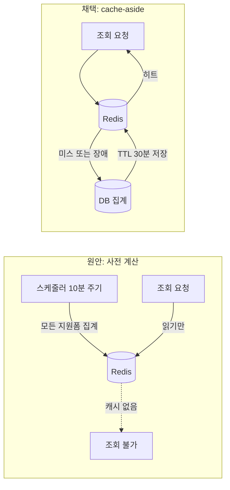

스케줄러를 버리고 요청 시점 캐시로 갔습니다. 설계 문서에 "선택이 아니라 필수"라고 제 손으로 써놓은 스케줄러를요.

안녕하세요, 고준서입니다. 동아리움이라는 대학 동아리 지원 서비스의 백엔드를 팀(백엔드 3인, 프론트엔드 3인)에서 맡고 있고, 지원자 통계 도메인은 제가 전담했습니다. 지원폼 단위로 성별, 학부, 학번, 일자별 지원 추이를 집계해서 로그인하지 않은 사용자에게도 보여주는 API인데요. 이 API의 부하 대책을 구현 단계에서 스스로 뒤집은 과정이 이슈 코멘트에 그대로 남아 있어서, 무엇을 왜 바꿨는지 공유해 보려고 합니다.

## 원안은 왜 스케줄러였나

2026년 7월 23일에 올린 [이슈 #335](https://github.com/kakao-tech-campus-3rd-step3/Team18_BE/issues/335)에서 저는 조회 부하를 이렇게 봤습니다. 통계가 지원자에게 공개되니 마감 직전에 조회가 몰릴 테고, 지원 마감 1분에 200명 이상이 들어올 수 있다. 요청이 올 때마다 집계하면 가장 중요한 지원서 제출 트래픽과 같은 시각에 DB를 두고 경합하게 된다. TTL 캐시는 만료 순간 대기 중이던 요청들이 동시에 미스를 내면서 집계 쿼리를 한꺼번에 날리는데, 하필 가장 몰리는 시점에 그렇게 된다.

그래서 스케줄러가 10분 주기로 집계해서 Redis에 써두고, 조회는 캐시만 읽는 방식을 골랐어요. 문서에는 이렇게 적었습니다.

> 비로그인 조회를 허용하고 별도 조회 빈도 제한을 두지 않으므로, 사전 계산 캐시가 유일한 부하 방어 수단이다. 7번 단계는 선택이 아니라 필수다.

말만 한 게 아니었습니다.

통계 전체를 한 덩어리로 담은 [PR #336](https://github.com/kakao-tech-campus-3rd-step3/Team18_BE/pull/336)에 "통계 사전 계산 스케줄러와 캐시 조회" 커밋이 들어 있었거든요. 50개 파일, 4,121줄짜리 PR이었죠.

## 우리는 정말 사전 계산이 필요했을까요?

8월 9일에 PR #336을 닫았습니다. 그리고 이슈에 진행 현황 코멘트를 달면서 7번 항목을 "cache-aside TTL 캐시로 대체"로 바꿨어요.

왜 마음이 바뀌었을까요? 코멘트에 적은 근거는 네 가지였습니다.

### 이유 1: 스케줄러가 이미 한 번 사고를 냈다

3월에 고아 이미지를 정리하는 스케줄러가 정상 이미지를 지운 적이 있습니다. [핫픽스로 스케줄러를 주석 처리](https://github.com/kakao-tech-campus-3rd-step3/Team18_BE/commit/38c7f875)하는 걸로 급히 막았죠. 백그라운드에서 혼자 도는 코드는 잘못됐을 때 아무도 보고 있지 않다는 걸 팀이 몸으로 겪은 뒤였어요.

### 이유 2: 분산 락이 필요하다

인스턴스가 여럿이면 스케줄러는 한 인스턴스만 돌아야 합니다. 원안에도 "Redis 선점 잠금을 획득한 인스턴스만 진행"이라고 써두긴 했는데요. ShedLock 같은 걸 얹어서 관리할 만큼의 가치가 이 워크로드에 있는지 의문이었습니다.

### 이유 3: 작업량이 조회 수요와 무관하다

스케줄러는 아무도 안 보는 지원폼까지 10분마다 계산합니다. 지원폼 수는 많고 조회는 들쭉날쭉한데, 요청 시점에 채우면 안 보는 폼의 계산 비용은 0이에요.

### 이유 4: Redis가 죽었을 때

스케줄러 방식은 캐시가 없으면 조회할 것 자체가 없습니다. 요청 시점에 계산하는 구조면 캐시 장애가 곧 실시간 계산 폴백이 되죠. [PR #353](https://github.com/kakao-tech-campus-3rd-step3/Team18_BE/pull/353) 본문에는 한 가지를 더 적었습니다. 사전 계산 방식도 미스가 나면 결국 cache-aside가 필요하니, cache-aside는 사실상 사전 계산의 상위집합이라는 것이었어요.



*그림 1. 원안의 스케줄러 사전 계산과 채택한 cache-aside의 흐름. 오른쪽은 캐시가 죽어도 DB 집계로 폴백된다.*

## 그럼 cache-stampede는요?

원안이 TTL 캐시를 거부한 이유가 바로 만료 시점의 동시 미스였으니, 이걸 어떻게 처리했는지 궁금하실 텐데요.

처리하지 않았습니다.

이 서비스는 단일 대학의 동아리 지원 서비스이고, 통계 조회는 핫패스가 아닙니다. 집계 쿼리 몇 개가 같은 순간에 두세 번 돌아도 DB가 감당 못 할 규모가 아니라고 봤고, 코멘트에도 "원안이 우려한 cache-stampede는 이 규모에서 실질 위험이 아니라고 판단"이라고 남겼어요. 마감 1분에 200명이라는 원안의 가정 자체가 꽤 보수적이기도 했고요.

## 구현하며 정한 것들

구현은 [RedisStatisticsCache.java](https://github.com/kakao-tech-campus-3rd-step3/Team18_BE/blob/develop/src/main/java/com/kakaotech/team18/backend_server/domain/statistics/cache/RedisStatisticsCache.java)와 `StatisticsServiceImpl`에 있습니다. 조회 흐름은 이게 전부예요.

```java
// StatisticsServiceImpl.java:57-61
StatisticsResponseDto full = cache.find(clubApplyFormId).orElseGet(() -> {
    StatisticsResponseDto computed = calculate(form, StatisticsDimension.defaults());
    cache.put(clubApplyFormId, computed);
    return computed;
});
```

캐시에는 마스킹하지 않은 전체 dimension 결과를 담고, 재식별 방지 마스킹과 dimension 선택은 응답을 만드는 시점에 적용합니다. 그래야 캐시 키가 지원폼 하나로 끝나거든요. dimension 조합마다 키를 만들면 2의 4제곱으로 쪼개지고, 마스킹 임계값을 바꿀 때마다 캐시를 비워야 합니다. 판정과 응답이 같은 캐시 스냅샷의 `totalApplicants`를 쓰니 서로 어긋날 일도 없고요.

## 캐시가 죽으면 조회도 죽나요?

아니요. 캐시 구현체가 예외를 밖으로 내보내지 않게 했습니다.

```java
// RedisStatisticsCache.java:47-51
} catch (Exception e) {
    // 캐시 장애/역직렬화 실패는 조회를 막지 않는다. 미스로 간주해 실시간 계산으로 폴백한다.
    log.warn("통계 캐시 조회 실패 clubApplyFormId={} : {}", clubApplyFormId, e.toString());
    return Optional.empty();
}
```

저장 실패도 같은 방식으로 삼킵니다. 다음 요청이 다시 계산하고 저장을 시도하면 되니까요. 이 동작은 `RedisStatisticsCacheTest`의 `find_onError_returnsEmpty`, `put_onError_doesNotThrow` 두 테스트로 고정해 뒀습니다.

작은 결정이 두 개 더 있었어요. 키에 `statistics:v1:` 접두사를 두어서 응답 스키마가 바뀌면 v2로 올려 이전 캐시와 충돌하지 않게 했습니다. 그리고 Jackson이 역직렬화하면서 `calculatedAt`의 `+09:00`을 UTC로 정규화하는 바람에 캐시 히트와 미스의 시각 표기가 달라지는 문제가 있어서, 캐시 전용 ObjectMapper에서 `ADJUST_DATES_TO_CONTEXT_TIME_ZONE`을 껐습니다.

## TTL 1분에서 30분으로

PR을 올린 8월 11일 당일에 TTL 기본값을 60초에서 1,800초로 올렸습니다. 그러면서 응답의 `calculatedAt`이 조회 시각이 아니라 캐시된 스냅샷의 산출 시각이라는 걸 계약에 명시했어요. 클라이언트가 "몇 시 기준"이라고 표시할 수 있게 하는 대신, 서버는 데이터가 최대 30분 낡을 수 있음을 인정한 거죠.

같은 날 바로 버그가 하나 나왔습니다.

캐시 히트 뒤 최소 공개 기준 미만이라 마스킹 응답을 줄 때 `calculatedAt`에 `now()`를 넣고 있었거든요. 방금 정한 계약과 정면으로 어긋나는 코드였습니다. 마스킹 응답도 캐시 스냅샷의 시각을 쓰도록 고쳤습니다.

## 4,121줄 PR을 14개로

설계를 뒤집은 것과 별개로, 4,121줄짜리 PR #336은 리뷰가 불가능했습니다. 닫고 성별 수집(#337)부터 캐시(#353)까지 관심사별로 14개의 작은 PR로 다시 올렸어요. 이 기간의 커밋 대부분은 Claude Opus 4.8과 함께 작성했고, 코드 초안과 테스트 골격, 커밋 메시지 정리를 같이 했습니다. 다만 스케줄러를 버릴지, stampede를 무시할지, TTL을 얼마로 둘지 같은 판단은 제가 내리고 이슈와 PR 본문에 근거를 직접 적었어요.

쪼개는 과정에서 원안의 다른 항목들도 같이 재검토됐습니다. 자유입력 학과는 `Faculty` enum으로, 버킷별 마스킹은 총합 기준 비공개로 바뀌었고, 단계전환 스냅샷과 마감 직전 블랙아웃은 스킵했죠. 큰 PR 하나였다면 이 결정들이 리뷰어에게 보이지 않은 채 한꺼번에 들어갔을 겁니다.

## 우리가 포기한 것과 얻은 것

동시 미스는 여전히 처리하지 않습니다. 같은 지원폼에 같은 순간 요청이 들어오면 각자 계산하고 각자 저장해요. 규모상 문제가 없다는 판단은 유지하지만, 락이든 single-flight든 넣지 않은 건 판단이지 증명은 아닙니다.

캐시 적중률이나 미스 시 계산 시간을 재는 지표도 없습니다. 지금 코드에는 실패 시 `warn` 로그만 있어서, 이 판단이 맞았는지 운영 데이터로 확인할 방법이 없어요. 스케줄러를 버린 근거 중 하나가 "안 보는 폼은 계산 0"이었는데, 실제로 얼마나 안 보는지도 모릅니다.

그래도 얻은 게 있습니다. 백그라운드에서 혼자 도는 코드가 없어졌고, Redis가 죽어도 통계는 나오고, 14개 PR 각각에 "왜"가 남았습니다. "필수"라고 써놓은 걸 뒤집는 게 처음엔 좀 민망했는데요. 설계 문서는 구현 전의 가설이고, 구현하면서 가설이 깨지면 문서를 고치는 게 맞다는 걸 이번에 배웠습니다.

혹시 지금 "이건 필수다"라고 적어둔 설계가 있으시다면, 한 번쯤 다시 열어보셔도 좋을 것 같아요. 제 사례가 그 고민에 조금이라도 도움이 되면 좋겠습니다. 감사합니다.
