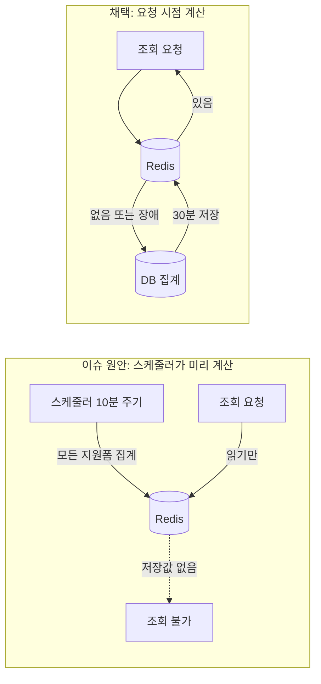

안녕하세요, 고준서입니다. 동아리움이라는 대학 동아리 지원 서비스의 백엔드를 팀(백엔드 3인, 프론트엔드 3인)에서 맡고 있고, 지원자 통계 기능은 제가 전담했어요. 지원폼마다 성별, 학부, 학번, 일자별 지원 추이를 집계해서 로그인 안 한 사람도 볼 수 있게 하는 API입니다. 8월 한 달 동안 이걸 만들면서 Claude Code와 같이 일했는데, 코드 초안과 테스트 골격은 Claude가 쓰고 저는 PR을 읽고 되묻고 머지하는 쪽이었습니다. 이 글은 그중 캐시를 어떻게 할지 정한 사흘의 기록이에요.

## 무식하게 800줄이 한 커밋에

시작은 설계 이슈([#335](https://github.com/kakao-tech-campus-3rd-step3/Team18_BE/issues/335))였습니다. 거기에는 조회 부하 대책으로 이렇게 적혀 있었어요.

> 비로그인 조회를 허용하고 별도 조회 빈도 제한을 두지 않으므로, 사전 계산 캐시가 유일한 부하 방어 수단이다. 7번 단계는 선택이 아니라 필수다.

스케줄러가 10분마다 미리 집계해서 저장해 두고, 조회는 그 저장값만 읽게 하자는 뜻입니다. 이 설계대로 통계 전체를 한 덩어리로 담은 [PR #336](https://github.com/kakao-tech-campus-3rd-step3/Team18_BE/pull/336)이 올라왔어요. 50개 파일, 4,121줄. 그 안에 "통계 사전 계산 스케줄러와 캐시 조회" 커밋도 들어 있었습니다.

8월 5일에 그 PR을 읽다가 이렇게 말했습니다.

> #337은 머지완료했어. 이렇게 한 이유는 벌크pr을 안하려고 그런거야. 이제 #336에 있는 나머지 내용에 대한 작업을 시작하자

> 아니 머지는 니가 하지말고 내가 할거야

그러니까 큰 PR 하나를 닫고, 성별 컬럼 추가(#337)부터 관심사별로 쪼개서 하나씩 올리고 제가 직접 머지하기로 한 거예요. 나흘 뒤 8월 9일 새벽에도 같은 문제가 또 보였습니다.

> 근데 지원자 통계 api정의와 성별집계는 다른 내용인데 왜 한 커밋에 있는거야?

> 아니 다른내용 한 커밋에 넣지 말라고 좀 지금보니까 2개로 나눠서 될게 아니네 어쩐지 무식하게 800줄이 한 커밋에 있더라

> 지금 자꾸 force push 해서 coderabbit이 리뷰가 안맞는데, 그냥 이전 pr 닫고 다른 pr로 다시 ㄱ

그렇게 성별 수집(#337)부터 캐시(#353)까지 14개의 작은 PR이 됐습니다. 쪼개는 김에 이슈에 적혀 있던 다른 항목들도 하나씩 다시 봤고, 스케줄러 항목은 맨 뒤로 밀렸어요.

## 사고이력이든 뭐든 잊고

8월 10일 밤에 나머지 PR을 다 머지하고 나니 남은 게 그 스케줄러였습니다. Claude가 두 가지 안을 내놓았어요. A는 스케줄러 없이, 조회 요청이 올 때 저장값이 있으면 쓰고 없으면 그 자리에서 계산해서 30분쯤 저장해 두는 방식(cache-aside라고 부릅니다). B는 이슈에 적힌 대로 스케줄러가 주기적으로 미리 계산하는 방식. 그러면서 3월에 팀에서 스케줄러가 정상 이미지를 지운 사고([핫픽스 커밋](https://github.com/kakao-tech-campus-3rd-step3/Team18_BE/commit/38c7f875))가 있었으니 A를 권한다고 했습니다.

8월 11일 0시 1분에 제가 답했어요.

> 근데 구조적으로도 a가 더 적합해보이는데

그리고 Claude가 바로 A로 진행하려는 걸 끊었습니다.

> 아니아니 그냥 진짜 둘을 비교해봐. 그렇지않아? 아닌가? 사고이력이든 뭐든 잊고 진짜 시스템설계 입장에서 봐봐

사고가 났으니까 피하자는 건 이유가 아니라고 생각했거든요. 그래서 나온 비교가 이랬습니다. 스케줄러는 아무도 안 보는 지원폼까지 10분마다 계산하는데, 요청 시점에 계산하면 안 보는 폼의 비용은 0이다. 서버가 두 대면 스케줄러는 인스턴스마다 돌아서 분산 락을 또 얹어야 한다. 스케줄러 방식도 결국 저장값이 없는 순간엔 요청 시점 계산이 필요하니 B는 A에 스케줄러를 더한 것이다. 그리고 Redis가 죽었을 때 A는 실시간 계산으로 넘어가면 그만이지만 B는 저장값이 낡은 채로 남는다. 이슈가 걱정했던 "만료 순간에 요청이 몰려 집계 쿼리가 한꺼번에 나가는 문제"는 단일 대학 동아리 서비스 규모에서는 실질 위험이 아니라고 봤고요.



*그림 1. 두 안의 흐름. 위쪽(채택안)은 Redis가 죽어도 DB 집계로 넘어갑니다.*

그래서 A로 갔고, "필수"라고 적혀 있던 항목은 이슈 코멘트에 "cache-aside TTL 캐시로 대체"로 바뀌었습니다. 조회 코드는 이게 전부예요.

```java
// StatisticsServiceImpl.java:57-61
StatisticsResponseDto full = cache.find(clubApplyFormId).orElseGet(() -> {
    StatisticsResponseDto computed = calculate(form, StatisticsDimension.defaults());
    cache.put(clubApplyFormId, computed);
    return computed;
});
```

저장할 때는 마스킹하지 않은 전체 결과를 담고, 재식별 방지 마스킹과 항목 선택은 응답을 만들 때 합니다. 그래야 저장 키가 지원폼 하나로 끝나거든요. 키에는 `statistics:v1:` 접두사를 두어서 응답 모양이 바뀌면 v2로 올리게 했고, Jackson이 `calculatedAt`의 `+09:00`을 UTC로 바꿔 버리는 문제가 있어서 캐시 전용 ObjectMapper에서 `ADJUST_DATES_TO_CONTEXT_TIME_ZONE`을 껐습니다.

## ttl 30분으로 하고

같은 날 오전에 PR([#353](https://github.com/kakao-tech-campus-3rd-step3/Team18_BE/pull/353))을 보다가 이렇게 물었습니다.

> ttl 30분으로 하고, 언제 산출된건지 프론트에 표시될 수 있게 넘겨주는건?

TTL은 저장값을 얼마나 오래 쓰느냐예요. 처음 기본값은 60초였는데, 30분으로 늘리는 대신 응답의 `calculatedAt`이 조회 시각이 아니라 그 저장값이 계산된 시각이라는 걸 계약에 명시했습니다. 화면에서 "몇 시 기준"이라고 보여줄 수 있게요. 그러자 CodeRabbit이 바로 하나를 잡았습니다. 저장값을 쓰는 경우에도 지원자가 적어서 가려진 응답에는 `calculatedAt`에 지금 시각을 넣고 있었어요. 방금 정한 계약과 정면으로 어긋나는 코드라 그것도 고쳤습니다.

Redis가 죽으면 어떻게 되는지는 8월 18일에 머지 전에 다시 물었습니다.

> redis 연결 실패의 경우에는 어떻게 나타나?

> redis 캐시는 각 동아리별로 다른거 맞지?

캐시 구현체가 예외를 밖으로 내보내지 않게 돼 있었어요.

```java
// RedisStatisticsCache.java:47-51
} catch (Exception e) {
    // 캐시 장애/역직렬화 실패는 조회를 막지 않는다. 미스로 간주해 실시간 계산으로 폴백한다.
    log.warn("통계 캐시 조회 실패 clubApplyFormId={} : {}", clubApplyFormId, e.toString());
    return Optional.empty();
}
```

저장 실패도 같은 식으로 삼키고 다음 요청이 다시 계산합니다. `RedisStatisticsCacheTest`의 `find_onError_returnsEmpty`, `put_onError_doesNotThrow` 두 테스트가 이 동작을 고정하고 있어요. 그걸 확인하고 머지했습니다.

남은 건 두 가지예요. 같은 지원폼에 같은 순간 요청이 들어오면 각자 계산하고 각자 저장하는데, 규모상 괜찮다는 판단만 있지 잰 적은 없습니다. 그리고 캐시가 얼마나 맞고 있는지 세는 지표가 없어서, 스케줄러를 안 쓴 이유 중 하나였던 "안 보는 폼은 계산 0"이 실제로 얼마나 0인지도 모릅니다. 이슈에 "필수"라고 적어 둔 걸 뒤집은 건 결국 사고 이력 때문이 아니라 비교표 때문이었고, 그 비교를 하게 만든 건 "잊고 봐봐" 한마디였습니다.
