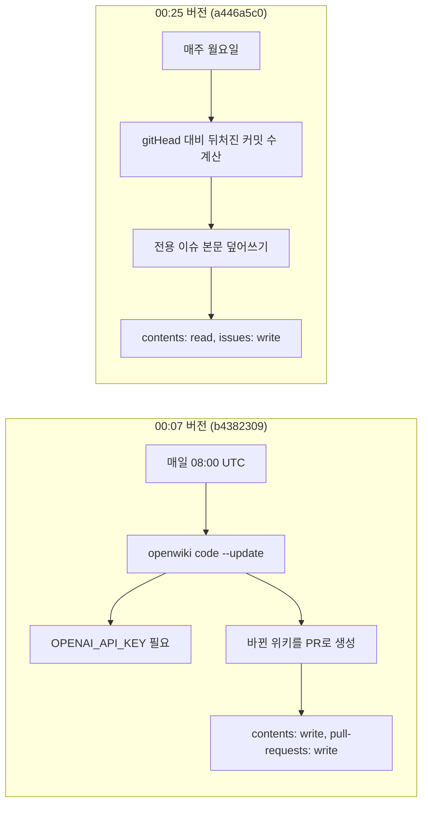

2026년 9월 1일 00시 07분, 팀 레포에 "매일 LLM이 위키를 다시 쓰고 PR을 여는" GitHub Actions 워크플로를 올렸습니다. 00시 25분, 같은 PR 안에서 그 워크플로에서 LLM 호출을 통째로 뺐습니다. 00시 29분, PR이 머지됐습니다.

18분이었습니다.

안녕하세요, 고준서입니다. 동아리움이라는 대학 동아리 지원 서비스의 백엔드를 팀에서 맡고 있는데(백엔드 3인, 프론트엔드 3인), 이번엔 코드가 아니라 문서 자동화 얘기예요. LLM에게 문서를 맡기려다 18분 만에 마음을 바꾼 이유와, 그 뒤로 실제로 어떻게 돌고 있는지를 공유해 보려 합니다.

## OpenWiki라는 도구

OpenWiki는 저장소 코드를 읽어서 위키 페이지를 만들어 주는 도구입니다. 그냥 요약을 뱉는 게 아니라, 각 페이지의 문장을 실제 소스 파일과 라인에 근거(Claim)로 묶어서 `openwiki/.claims/*.json`에 남기고, 마지막으로 문서화한 커밋 해시(`gitHead`)를 `openwiki/.last-update.json`에 기록해요.

8월 31일 밤에 이걸 팀 레포에 돌려서 위키 12페이지가 나왔습니다. 아키텍처, 도메인 모델, 인증 세션, 지원과 전형 워크플로, 이메일 알림, 실시간 인기도 집계, 통계, 파일 저장, 배포와 모니터링, 테스트 전략까지요([PR #371](https://github.com/kakao-tech-campus-3rd-step3/Team18_BE/pull/371), [이슈 #370](https://github.com/kakao-tech-campus-3rd-step3/Team18_BE/issues/370)). 12페이지 생성과 워크플로 초안은 Claude Code와 같이 만들었고, PR의 커밋 4건에는 전부 `Co-Authored-By: Claude Sonnet 5`가 찍혀 있습니다.

여기까지는 좋았어요. 문제는 "그 다음에 누가 이걸 최신으로 유지하느냐"였죠.

## 처음 붙인 것

초기화 커밋 5초 뒤에 올린 워크플로([b4382309](https://github.com/kakao-tech-campus-3rd-step3/Team18_BE/commit/b4382309))는 OpenWiki 공식 템플릿에 가까웠습니다. 매일 08:00 UTC에 전체 히스토리를 받아 `openwiki code --update`를 돌리고, 바뀐 위키를 `peter-evans/create-pull-request`로 PR에 올리는 구조예요. 그러려면 레포 시크릿에 `OPENAI_API_KEY`와 LangSmith 키 두 종이 있어야 하고, 워크플로 권한도 이만큼 필요했습니다.

```yaml
# .github/workflows/openwiki-update.yml (b4382309)
permissions:
  contents: write
  pull-requests: write
      - name: Run OpenWiki
        run: openwiki code --update --print
        env:
          OPENWIKI_PROVIDER: openai
          OPENAI_API_KEY: ${{ secrets.OPENAI_API_KEY }}
          OPENWIKI_MODEL_ID: "gpt-5.6-terra"
```

여러분이라면 팀 레포에 외부 LLM 키를 넣고, 쓰기 권한까지 준 워크플로가 매일 PR을 올리게 두시겠어요?

## 18분 뒤

저는 못 두겠더라고요. 00시 25분에 워크플로를 통째로 바꿨습니다([a446a5c0](https://github.com/kakao-tech-campus-3rd-step3/Team18_BE/commit/a446a5c0)). 커밋 메시지에 적은 이유는 이거예요.

> OpenAI/LangSmith 키 없이도 동작하도록, 코드를 재생성하는 대신 openwiki/.last-update.json의 gitHead 대비 뒤처진 커밋 수만 계산해 전용 이슈에 기록한다. 문서 갱신은 수동으로 계속 진행한다.

LLM을 빼기로 한 건 제 결정이었습니다. 초안을 같이 만든 Claude가 그러자고 한 게 아니라, 팀 레포에 키를 넣는 순간부터 그 키와 그 PR을 누가 책임지느냐가 저한테 넘어온다는 게 무거웠거든요.

## 바뀐 것 셋

LLM 호출과 PR 생성 단계가 사라졌습니다. 권한은 `contents: write, pull-requests: write`에서 `contents: read, issues: write`로 내려갔고요. 주기는 매일에서 매주 월요일로 바뀌었습니다.



*그림 1. 18분 사이에 워크플로가 바뀐 모양. 왼쪽은 LLM이 문서를 다시 쓰고, 오른쪽은 문서가 얼마나 뒤처졌는지만 셉니다.*

PR은 00시 29분에 머지됐고, GitHub에 등록된 워크플로는 처음부터 "OpenWiki Freshness Tracker" 하나뿐이에요. LLM 자동 갱신 버전은 이 레포에서 한 번도 돈 적이 없습니다.

## 남은 워크플로가 하는 일

셸 두 줄로 요약됩니다.

```sh
# .github/workflows/openwiki-update.yml (a446a5c0)
last_head=$(jq -r '.gitHead' openwiki/.last-update.json)
commits_behind=$(git rev-list --count "${last_head}..HEAD")
```

그 숫자를 "OpenWiki 최신화 상태"라는 제목의 이슈 하나에 계속 덮어씁니다. 이슈가 없으면 만들고, 있으면 본문만 고쳐요. 본문에는 마지막 문서화 커밋, 뒤처진 커밋 수, compare 링크, 그리고 "쌓였다면 수동 갱신을 고려하라"는 한 줄이 들어갑니다.

문서를 고치는 건 사람이고, 자동화는 고칠 때가 됐다고 알려주는 데서 멈춥니다.

## 팀 레포에서는

이 글을 쓰는 시점 기준으로 트래커는 9월 7일과 14일 두 번 돌았고 둘 다 성공했습니다. [이슈 #374](https://github.com/kakao-tech-campus-3rd-step3/Team18_BE/issues/374)에는 마지막 문서화 커밋 `f8fc0e9`(8월 31일) 대비 뒤처진 커밋 7개가 적혀 있어요.

그러니까 위키는 2주째 갱신되지 않았습니다. 다만 그 사실이 이슈에 정직하게 남아 있죠.

## 내 레포에서는 18번

여러분 레포의 스케줄 워크플로, 마지막으로 초록색이었던 게 언제인가요?

대조군이 하나 있습니다. 개인 레포 agent-research에는 처음 붙였던 LLM 자동 갱신 워크플로가 그대로 남아 있거든요. 8월 31일 첫 스케줄 실행부터 9월 17일까지 18번 돌았고, 전부 실패입니다. 실패 지점은 매번 `Run OpenWiki` 단계, 소요 시간은 30초 안팎이에요.

그 레포의 소스 문서에는 9월 3일자로 이렇게 정정을 적어 뒀습니다.

> `gh run list --workflow=openwiki-update.yml`로 확인한 결과 최근 스케줄 실행 3건이 전부 30~37초 만에 failure로 끝났다. 이 레포에 `OPENAI_API_KEY`/`OPENWIKI_LANGSMITH_API_KEY` 시크릿이 설정돼 있지 않기 때문이다. 즉 이 레포의 OpenWiki는 "한 번 생성된 뒤 정지된 스냅샷"이지 "매일 자동 갱신되는 살아있는 시스템"이 아니다.

정정 문서까지 써 놓고 워크플로는 안 고쳤어요. 팀 레포에서는 18분 만에 뺀 의존성이 개인 레포에서는 2주 넘게 매일 빨간 실행 기록을 만들고 있었던 거죠.

## 첫 관문부터 비어 있던 리뷰

트래커로 바꾼 판단은 지금도 맞다고 봅니다. 팀 레포에 외부 LLM 키를 넣고 쓰기 권한을 준 워크플로가 매일 생성물을 PR로 올리는 구조는, 그 PR을 누가 어떤 기준으로 리뷰할지 정하지 않은 상태에서는 위험하니까요.

그런데 그 걱정을 12페이지를 올린 PR #371 자체가 먼저 보여줬습니다. CodeRabbit은 경로 필터 때문에 33개 파일을 전부 건너뛰었고, 사람 리뷰 코멘트 없이 30분 만에 머지됐거든요. 생성된 문서가 팀 레포에 들어가는 첫 관문부터 검토가 비어 있었던 셈입니다.

자동 갱신을 끄면서 "누가 리뷰하나"를 걱정했는데, 정작 수동으로 올린 첫 PR도 아무도 안 봤습니다. 좀 머쓱하죠?

## 남은 숙제

`AGENTS.md`의 OpenWiki 블록에는 지금도 "The scheduled OpenWiki GitHub Actions workflow refreshes the repository wiki"라고 적혀 있습니다. README 기술 스택 표에는 "저장소 위키 자동 생성/갱신"이라고 적혀 있고요. 둘 다 18분 뒤에 사라진 동작을 설명하고 있어요. 트래커가 "7개 뒤처짐"을 정확히 세고 있어도, 그 옆의 문서가 "자동으로 갱신된다"고 말하면 읽는 사람은 후자를 믿습니다.

그리고 트래커 자체가 실패하면 그걸 누가 알아채는지도 정해져 있지 않습니다. 개인 레포의 18번 실패를 2주 동안 아무도 안 본 것이 그 답이겠죠.

문서 자동화를 붙이려는 분들께 제 사례가 조금이라도 참고가 되면 좋겠습니다. LLM을 붙일지 말지보다, 그 산출물을 누가 언제 보는지를 먼저 정하는 게 순서였던 것 같아요. 감사합니다.
