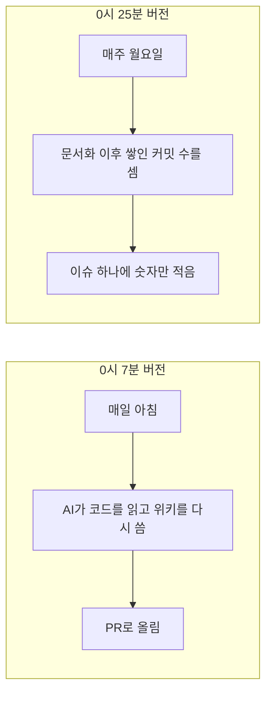

안녕하세요, 고준서입니다. 동아리움이라는 대학 동아리 지원 서비스의 백엔드를 팀(백엔드 3인, 프론트엔드 3인)에서 맡고 있어요. 8월 31일 밤에 OpenWiki라는 도구로 팀 레포의 코드를 읽어 위키 12페이지를 만들었고, 9월 1일 0시 7분에는 그 위키를 매일 AI가 다시 써서 PR로 올리는 GitHub Actions 워크플로가 초안으로 올라왔습니다. 18분 뒤에 그걸 껐어요. AI 호출과 API 키, 코드 쓰기 권한을 다 빼고, 마지막 문서화 이후 커밋이 몇 개 쌓였는지만 매주 세어 이슈 하나에 적는 추적기로 바꿨습니다. 그날 제가 남긴 말에는 "내가 가끔 업데이트할 테니 LLM 없이 최신화 정도만 추적하자"는 결정만 있고 이유가 없어서, 이 글에서는 그때 발언과 지금 말하는 이유를 구분해 적습니다.

워크플로가 18분 사이에 어떻게 바뀌었는지(커밋 두 개)와 결정 당시 대화 원문, 그리고 2주 뒤 그 결정이 어떻게 됐는지를 순서대로 적어요. 위키 12페이지가 팀에서 얼마나 읽혔는지는 잴 수 없습니다. 조회 수 같은 게 없거든요. 페이지 생성과 워크플로 초안은 Claude Code가 만들었고 그 PR의 커밋 4건에는 전부 `Co-Authored-By: Claude Sonnet 5`가 찍혀 있어요.

## 0시 7분 버전과 0시 25분 버전

위키는 8월 30일에 README를 다시 쓰다가 예전에 별표를 눌러 둔 도구가 생각나서 시작했습니다. 팀 레포에 도구 자체가 올라가지 않는지부터 확인했고요.

> 아니 오픈위키로 작성된 위키를 커밋하는건 좋은데, 저 오픈소스가 그대로 올라가는건 문제지

위키만 올리기로 하고 8월 31일 밤에 12페이지가 나왔습니다. 아키텍처, 도메인 모델, 인증, 지원과 전형 흐름, 이메일 알림, 통계, 배포와 모니터링, 테스트 전략까지요([PR #371](https://github.com/kakao-tech-campus-3rd-step3/Team18_BE/pull/371), [이슈 #370](https://github.com/kakao-tech-campus-3rd-step3/Team18_BE/issues/370)).

위키가 생기면 다음 질문은 "누가 이걸 최신으로 유지하나"입니다. 9월 1일 0시 7분에 그 답으로 올라온 게 워크플로 초안이었어요. 매일 아침 AI가 코드를 다시 읽어 위키를 고쳐 쓴 뒤 PR로 올리는 구조였습니다([b4382309](https://github.com/kakao-tech-campus-3rd-step3/Team18_BE/commit/b4382309)).

```yaml
# .github/workflows/openwiki-update.yml (b4382309)
permissions:
  contents: write
  pull-requests: write
      - name: Run OpenWiki
        run: openwiki code --update --print
        env:
          OPENWIKI_PROVIDER: openai
          OPENAI_API_KEY: ${{ secrets.OPENAI_API_KEY }}
          OPENWIKI_MODEL_ID: "gpt-5.6-terra"
```

그러려면 팀 레포에 OpenAI 키를 비밀값으로 넣어 두어야 했고, 이 자동화에 코드를 쓰고 PR을 여는 권한을 줘야 했습니다. 0시 20분에 제가 물었어요.

> ci가 문서를 자동으로 갱신해주는거 맞지? 갱신했는지 검사만 하는게 아니라

맞다는 걸 확인하고 나서, 3분 뒤에 이렇게 정했습니다.

> 걍 내가 가끔가다가 업데이트 할테니까 최신화가 어느정도인지 커밋과 pr을 기록해두는 정도로만 해두자. llm없이 최신화 정도만 track 하게

0시 25분 커밋([a446a5c0](https://github.com/kakao-tech-campus-3rd-step3/Team18_BE/commit/a446a5c0))으로 워크플로가 통째로 바뀌었습니다. 커밋 메시지는 이렇습니다.

> OpenAI/LangSmith 키 없이도 동작하도록, 코드를 재생성하는 대신 openwiki/.last-update.json의 gitHead 대비 뒤처진 커밋 수만 계산해 전용 이슈에 기록한다. 문서 갱신은 수동으로 계속 진행한다.

AI 호출이 빠졌고, 키도 필요 없어졌고, 권한은 코드 쓰기에서 읽기와 이슈 쓰기로 내려갔고, 주기는 매일에서 매주 월요일로 바뀌었어요. 남은 일은 셸 두 줄입니다. 마지막으로 문서화한 시점 이후로 커밋이 몇 개 쌓였는지 세는 것.

```sh
# .github/workflows/openwiki-update.yml (a446a5c0)
last_head=$(jq -r '.gitHead' openwiki/.last-update.json)
commits_behind=$(git rev-list --count "${last_head}..HEAD")
```

그 숫자를 "OpenWiki 최신화 상태"라는 이슈 하나에 계속 덮어씁니다. 0시 29분에 PR이 머지됐고, GitHub에 등록된 워크플로는 처음부터 이 추적기 하나뿐이에요. 매일 AI가 위키를 고쳐 쓰는 버전은 팀 레포에서 한 번도 돌지 않았습니다.



*그림 1. 18분 사이에 바뀐 것. 왼쪽은 AI가 문서를 쓰고, 오른쪽은 문서가 얼마나 낡았는지만 셉니다.*

## 왜 껐나

그때 말로 남긴 건 위의 한 줄이 전부이고, 거기엔 "가끔 내가 하겠다"는 결정만 있습니다. 0시 20분 질문이 "검사만 하는 게 아니라 갱신까지 하느냐"였던 걸 보면, 갱신까지 한다는 답을 듣고 바로 접은 거예요. 지금 말하면 이유는 이렇습니다. 첫째, 팀 레포에 유료 API 키를 비밀값으로 넣어 두면 그 비용과 키 관리가 팀 것이 되는데, 이 위키는 제가 시작한 일이라 그걸 팀에 얹을 근거가 없었습니다. 둘째, 코드 쓰기와 PR 열기 권한을 자동화에 주면 매일 AI가 쓴 문서 PR이 올라오고, 그걸 누군가 읽고 머지해야 합니다. 12페이지짜리 첫 PR도 사람 리뷰 없이 30분 만에 머지된 마당에 매일 오는 PR을 읽을 사람은 없었어요. 안 읽고 머지되는 문서를 매일 만드는 자동화보다, 문서가 얼마나 낡았는지 숫자 하나 보여 주는 쪽이 팀에 덜 해롭다고 봤습니다. 셋째는 그날은 생각 못 했고 나중에 개인 레포에서 확인한 건데, 키가 없는 워크플로는 조용히 실패만 쌓입니다. 이 셋 중 둘은 그날 머릿속에 있었을 텐데 문장으로 남기지 않았고, 그래서 지금 "그때 이유"라고 확언할 수는 없습니다.

## 그 뒤로

추적기는 9월 7일과 14일에 돌았고 둘 다 성공했습니다. [이슈 #374](https://github.com/kakao-tech-campus-3rd-step3/Team18_BE/issues/374)에는 마지막 문서화 커밋 `f8fc0e9`(8월 31일) 이후로 커밋 7개가 쌓였다고 적혀 있어요. "가끔가다가 업데이트"하겠다던 저는 2주째 안 했고, 그 사실은 이슈에 그대로 남아 있습니다. 9월 14일에는 이슈 목록을 보다가 이걸 제가 다시 발견했어요.

> 그리고 우리 이슈 보니까 openwiki관련 이슈가 2개 있던데, 이거 pr로 이미 올라와서 완료된 작업들 아니야?

하나는 초기화 이슈였고, 하나는 추적기가 계속 덮어쓰는 그 이슈였습니다.

개인 레포 쪽은 더 솔직한 대조군이에요. 같은 시기에 만든 agent-research 레포에는 0시 7분 버전, 그러니까 AI가 매일 위키를 다시 쓰는 워크플로가 그대로 남아 있습니다. 8월 31일부터 9월 17일까지 18번 돌았고 전부 실패했어요. 이유는 9월 2일에 제가 이미 말한 그대로입니다.

> openwiki ci는 현재 아무것도 못해. 거기에 넣어놓을 api key가 없거든

알고 있었고, 그대로 뒀습니다. 팀 레포에서는 키를 넣지 않는 쪽으로 워크플로를 바꿨는데, 개인 레포에서는 키도 안 넣고 워크플로도 안 바꿔서 2주 넘게 빨간 실행 기록만 쌓인 거예요.

팀 레포에도 안 맞는 문장이 남아 있습니다. `AGENTS.md`에는 지금도 "The scheduled OpenWiki GitHub Actions workflow refreshes the repository wiki"라고 적혀 있고, README 기술 스택 표에는 "저장소 위키 자동 생성/갱신"이라고 적혀 있어요. 둘 다 0시 25분에 사라진 동작입니다. 그리고 12페이지를 올린 PR #371은 CodeRabbit이 경로 규칙 때문에 33개 파일을 전부 건너뛰었고, 사람 리뷰 코멘트 없이 30분 만에 머지됐습니다. AI가 쓴 문서 12페이지가 아무도 읽지 않은 채 팀 레포에 들어간 거죠. 자동 갱신을 끈 이유로 위에 적은 "안 읽고 머지되는 문서"가, 끄기도 전에 이미 한 번 일어난 셈입니다.

위키를 낡게 두는 건 고칠 수 있는 일이라 곧 갱신할 생각이에요. 문서에 남은 "자동으로 갱신된다"는 문장 두 개는 그보다 먼저 지워야 하고요. 그리고 결정을 내릴 때 결정만 말하고 이유를 안 남기면 2주 뒤에 자기 결정을 자기가 추측하게 된다는 것도, 이 글을 쓰면서 알았습니다.
