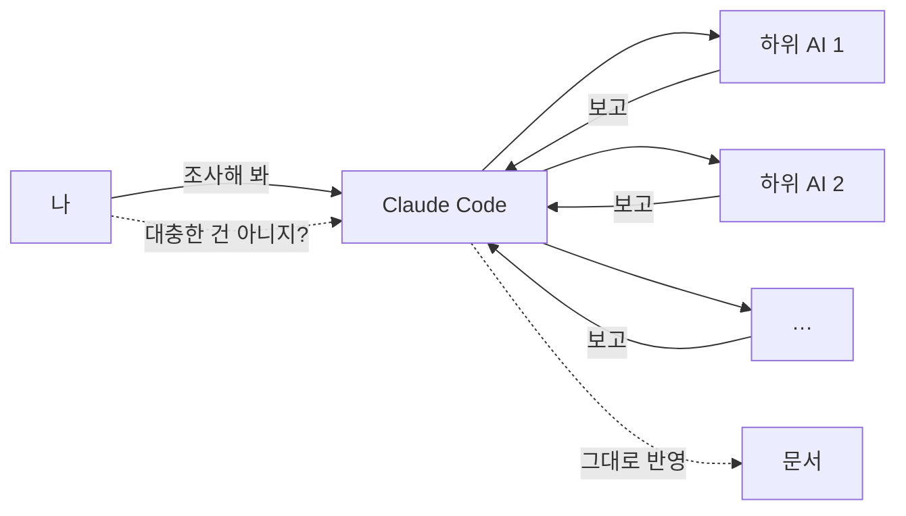

안녕하세요, 고준서입니다. 9월 초에 "내 분야에 전문성이 있는 AI 에이전트"를 만들어 보겠다고 개인 레포(agent-research)를 하나 파고 있었어요. 설계부터 시작하려는 Claude Code에게 제가 처음 시킨 건 이거였습니다. 만들기 전에 같은 목적의 오픈소스나 스킬이 이미 있는지, 있으면 남들 후기와 스타 수를 보고 정말 괜찮은 건지 추려내라. 그래서 Claude는 조사를 여러 개의 하위 AI에게 나눠 맡겼고, 저는 돌아온 보고를 문서에 그대로 받아 적게 뒀습니다.

그날 하루 동안 그 보고 여섯 건 중 세 건이 틀렸다는 걸 알게 됐고, 세 건 다 제가 따져 묻고 나서야 드러났어요. 그 하루를 시간순으로 적어 둡니다.

## "각 부분별 레퍼런스는 5개 이상 찾아봤어?"

9월 2일 오전 6시쯤, 첫 조사 결과가 올라왔습니다. 제가 필요하다고 정한 요소 네 가지 중 "좁고 명시적인 조회 인터페이스" 항목에 대해 보고는 이랬어요. 일반화된 오픈소스는 없고, GitHub 전용인 github-mcp-server 하나가 가장 가까운 참고 패턴이다.

저는 그때 그 말을 그대로 뒀습니다. 대신 전체 진행 상황을 물었어요.

> 전문성 높은 에이전트 만들기는 어떻게 설계가 진행되고있어? 이에 필요한 요소들중 빠진게 뭐야? 각 부분별 레퍼런스는 5개이상 찾아봤어? 그 레퍼런스들을 테스트 해볼 환경은? 평가 기준마련 방법은?

돌아온 표에는 data lake 요소가 0개, 인터페이스 요소가 2개였습니다. 조사를 안 한 항목이 있다는 걸 그제야 봤어요.

오후에 data lake 쪽 재조사 결과가 왔습니다. Nessie라는 프로젝트(1.5천 스타)를 1순위로 추천하는 내용이었어요. 스타 수도 있고 활동도 있어서 그럴듯했는데, 뭔가 미덥지 않아서 이렇게 물었습니다.

> 혹시 레퍼런스조사 대충한건 아니지? 높은 수준과 지속된 유지보수 유명함 이정도는 만족하는 것들중에서 골라야한다

이 한 줄 뒤에 Claude가 GitHub API로 직접 다시 뒤졌고, 결과가 두 군데서 뒤집혔습니다. "없다"던 인터페이스 라이브러리는 여섯 개가 나왔어요. 그중 하나는 Anthropic 공식 레퍼런스인 modelcontextprotocol/servers로 스타가 9만 개였습니다. 그리고 1순위였던 Nessie는 2026년 10월까지 Apache Polaris라는 다른 프로젝트로 합병될 예정이었어요. 합병되는 중인 프로젝트를 유지보수 기준 1순위로 올려놓은 거죠. Polaris로 바꿨습니다.

| 나눠 맡긴 조사 | 처음 보고 | 다시 확인해 보니 |
|---|---|---|
| 오픈소스 1차 서베이 | 인터페이스 라이브러리는 없고 github-mcp-server 하나뿐 | 6개 있음. modelcontextprotocol/servers 90,019★, github-mcp-server 32,665★, mcp-server-cloudflare 4,137★, mcp-grafana 3,407★, postgres-mcp 3,246★, mongodb-mcp-server 1,118★ |
| data lake 재조사 | Nessie(1.5k★) 1순위 | 2026년 10월 Apache Polaris로 합병 예정. Polaris(2,045★)로 교체 |
| 응답 필터 재조사 | PurpleLlama, portkey-ai/gateway 등 | 이상 없음. GitHub API로 수치 일치 확인 |
| 사업 방향 리서치 | 보고서 | 이상 없음. 다만 커뮤니티 쪽이 빠져 있어 제가 추가 요청 |
| 커뮤니티 리서치 | Reddit은 검색 도구 한계로 못 가져왔다고 보고 | 이상 없음. 한계를 숨기지 않은 보고 |
| 엣지케이스, 로그 추적, 재시도 리서치 | "LangGraph는 이미 채택됐다"는 전제로 작성 | 채택한 적 없음. 앞선 조사의 호의적 언급을 결정으로 받아들인 것 |

*표 1. 그날 나눠 맡긴 조사 여섯 건. 세 건이 재확인에서 뒤집혔습니다.*

인터페이스 쪽 필터 레퍼런스 다섯 개도 같은 방식으로 다시 확인해 달라고 했고, 그건 수치가 맞았습니다.

## "레딧은 없나?"

저녁에는 다른 쪽이 문제였습니다. 만들려는 에이전트로 뭘 할지 방향 조사를 시켰는데, 결과가 너무 깔끔하게 정리돼 있어서 오히려 의심이 갔어요.

> 아니 조사좀 해보라고 니 혼자 생각하지말고

> 레딧은 없나? 개발자 커뮤나 바이브코딩 커뮤냐 깃허브 오픈소스나

커뮤니티 조사가 추가로 나왔고, 거기서 보고된 문제들을 다 모아 보라고 했더니 문제 하나만 골라서 써 오길래 다시 다 모으게 했습니다. 그렇게 모은 문제 목록으로 후속 조사를 돌렸는데, 그 조사가 "이미 채택한 LangGraph"를 전제로 쓰여 있었어요. LangGraph를 채택한 적이 없었습니다. 그날 오후 방향 조사에서 "활발하고 실재하는 프레임워크"라고 좋게 언급된 게 전부였는데, 다음 조사가 그걸 결정으로 받아서 그 위에 쌓은 거였죠. 문서에는 "오해였다"로 바로잡아 적었습니다.

*그림 1. 그날의 구조. 보고와 문서 사이에 확인 단계가 없었고, 그 자리를 제 질문이 대신했습니다.*

## 그 뒤에 만든 것

이틀 뒤 제가 다시 물은 건 이거였습니다.

> 참고할 자료도 없고, 테스트해본 데이터도 없고 이말이이지?

이 질문을 계기로 조사와 확인을 분리했습니다. 조사를 맡는 역할에는 "없다"고 결론 내리기 전에 반증을 두세 번 찾아볼 것, 스타 수는 GitHub API로 직접 셀 것, 1순위를 매기기 전에 합병이나 지원 종료 여부를 따로 검색할 것을 규칙으로 넣었고, 확인만 맡는 역할을 따로 두어 원래 조사와 같은 경로를 다시 타지 말고 독립된 도구로 재확인한 뒤 "확인됨, 반박됨, 확인 불가" 셋 중 하나로만 답하게 했습니다. 9월 5일 커밋([a15f7b9](https://github.com/gary5876/agent-research/commit/a15f7b9))에 그 정의가 있어요. 전부 그날 실제로 틀렸던 일에서 거꾸로 뽑은 규칙입니다.

솔직히 말하면 이 조사도, 정리도, 규칙을 문서로 옮긴 것도 Claude가 했습니다. 제가 한 건 미덥지 않을 때 따져 묻고, 보고와 원본을 대조한 것뿐이에요. 그리고 그 확인 전담 역할은 만들어 둔 뒤로 그 세션에서 한 번도 그 이름으로 불리지 않았습니다. 세 건을 잡은 건 규칙이 아니라 제 질문이었고, 그 구조는 아직 그대로입니다.

이 글도 같은 방식으로 썼습니다. 그날의 채팅 기록과 문서를 여는 건 AI가 했고, 인용한 제 말이 실제로 제가 친 문장인지 대조하는 건 제 몫입니다.
