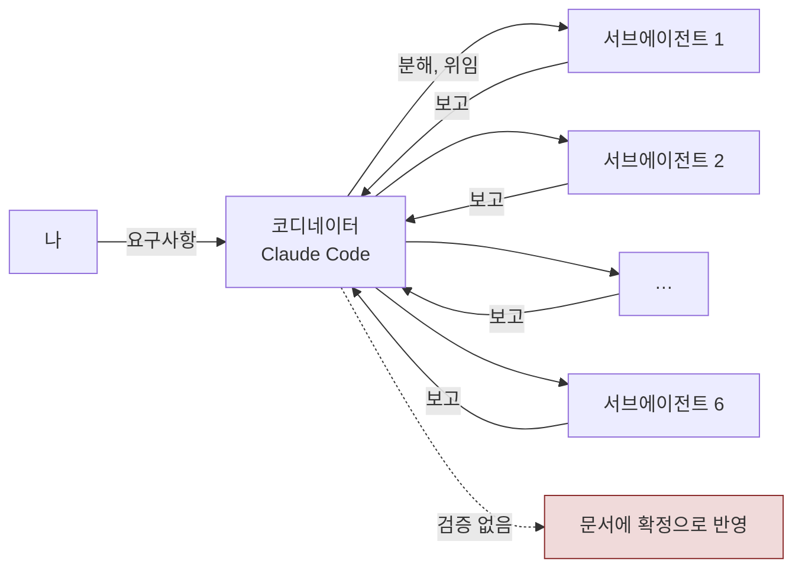

> 이 요소는 레퍼런스를 조사한 게 맞냐

제가 채팅창에 친 한 줄입니다. 이 한마디에서 보고 세 건이 뒤집혔어요.

안녕하세요, 고준서입니다. agent-research는 "자기 분야에 전문성이 있는 에이전트는 어디서 오는가"를 정리하는 제 개인 연구 레포인데요. 2026년 9월 2일부터 5일 사이의 한 세션에서 Claude Code를 코디네이터로 두고 오픈소스 레퍼런스 조사를 시켰고, 코디네이터는 그 조사를 서브에이전트 여섯 개에 나눠 맡겼습니다. 돌아온 보고 여섯 건 중 세 건이 틀렸습니다. 무엇이 어떻게 틀렸고 어떻게 잡혔는지, 그리고 그 뒤에 무엇을 바꿨는지를 레포에 남은 문서와 커밋 기준으로 풀어보려 합니다.

## 나눠 맡기고, 돌아온 것을 그대로 쓰던 구조

코디네이터는 요구사항을 서브 작업으로 쪼개 fork로 던지고, 완료 알림이 오면 결과를 문서에 반영했습니다. 나중에 `06-orchestrator-pattern.md`에 역추출한 5단계가 분해, 위임, 감시, 검증, 반영인데요. 이 중 네 번째인 검증이 이 세션에서는 실제로 없었습니다.

서브에이전트가 "없다"고 하면 없다고 적었고, "1순위"라고 하면 1순위로 적었어요.

*그림 1. 이 세션의 실제 흐름. 보고에서 반영 사이에 검증 단계가 비어 있었습니다.*

에이전트가 "그런 라이브러리는 없습니다"라고 하면, 믿으시나요?

저는 믿었습니다. 세 번이나요.

## 여섯 건의 보고

| 위임한 조사 | 보고 | 재검증에서 드러난 것 | 잡은 방법 |
|---|---|---|---|
| OSS 레퍼런스 1차 서베이 | "좁은 인터페이스 카테고리에는 일반화된 라이브러리가 없고 github-mcp-server 하나뿐" | 6개가 있었다. modelcontextprotocol/servers 90,019★, github/github-mcp-server 32,665★, cloudflare/mcp-server-cloudflare 4,137★, grafana/mcp-grafana 3,407★, crystaldba/postgres-mcp 3,246★, mongodb-js/mongodb-mcp-server 1,118★ | 내가 "이 요소는 레퍼런스를 조사한 게 맞냐"고 감사를 요구, 코디네이터가 `gh api`로 직접 재조사 |
| data lake 레퍼런스 재조사 | Nessie(1.5k★)를 1순위로 추천 | Nessie는 2026년 10월까지 Apache Polaris로 합병 예정이었다. 합병 중인 프로젝트를 단독 1순위로 올린 유지보수 지속성 판단 오류 | 내가 "높은 수준, 지속된 유지보수, 유명함" 기준으로 재검증을 요구, 독립 웹 검색으로 확인 후 Polaris(2,045★)로 교체 |
| filter 레퍼런스 재조사 | PurpleLlama, portkey-ai/gateway 등 | 오류 없음. `gh api` 재검증에서 수치 일치 | 재검증 |
| Direction 리서치(수익형 vs 서비스형) | 보고서 | 오류 없음. 다만 내가 "레딧은 없냐"고 지적해 2차 조사 추가 | 지적 |
| Grassroots 리서치(Reddit, HN) | Reddit은 검색 도구 한계로 못 가져왔다고 보고 | 오류 없음. 한계를 숨기지 않고 보고한 사례 | 없음 |
| Edge-case, tracing, retry 리서치 | "LangGraph는 이미 채택됐다"는 전제 위에서 작성 | 정식 ADR로 채택된 적이 없었다. 이전 방향 리서치의 맥락 설명을 결정으로 승격한 것 | ADR 목록과 대조하면서 드러남, ADR-8에 "오해였다"로 기록 |

*표 1. 위임 여섯 건과 재검증 결과. 문서 `06` §1 표와 `04` §9 표를 합친 것입니다.*

세 오류는 모양이 다 달랐습니다. 하나씩 보겠습니다.

## 케이스 A: "없다"는 결론

첫 서베이의 보고는 이랬습니다. 좁은 인터페이스 카테고리에는 일반화된 라이브러리가 없고, github-mcp-server 하나만 참고할 패턴이라고요.

그럴듯하죠? 저도 그렇게 적힌 문서를 한동안 그대로 두고 있었습니다.

그런데 이 요소만 유독 후보가 0개인 게 이상했어요. 그래서 "이 요소는 레퍼런스를 조사한 게 맞냐"고 물었고, 코디네이터가 `gh api`로 직접 다시 뒤졌더니 여섯 개가 나왔습니다. 9만 스타짜리 modelcontextprotocol/servers부터 천 스타짜리 mongodb-mcp-server까지요. 조사가 얕았던 겁니다.

"없다"는 말은 조사가 얕아도 나올 수 있습니다. 그런데 없다는 결론은 반증할 근거를 따로 찾지 않으면 그대로 통과해 버려요. 있다는 결론은 링크 하나로 확인되지만, 없다는 결론은 확인할 게 없으니까요.

## 케이스 B: 1순위라는 결론

두 번째는 data lake 레퍼런스 재조사였습니다. 보고는 Nessie(1.5k★)를 1순위로 올렸어요. 별 수와 활동만 보면 틀린 말이 아니었습니다.

높은 수준, 지속된 유지보수, 유명함. 이 세 기준으로 다시 봐 달라고 했습니다.

독립 웹 검색으로 확인해 보니 Nessie는 2026년 10월까지 Apache Polaris로 합병될 예정이었습니다. 합병 중인 프로젝트를 단독 1순위로 올린 건 유지보수 지속성 판단 오류였고, Polaris(2,045★)로 교체했습니다.

순위 결론의 함정은 여기예요. 별 수와 커밋 활동은 검색 한 번에 나오는데, 그 프로젝트가 다른 프로젝트로 합쳐지는 중이라는 사실은 별도로 검색해야 나옵니다. 1순위를 매기기 전에 deprecated나 merged를 따로 찾아봤다면 처음부터 안 나왔을 오류였습니다.

## 케이스 C: 이미 결정됐다는 전제

세 번째는 조금 다릅니다. 틀린 결론이 아니라 틀린 전제였어요.

Edge-case, tracing, retry 리서치가 "LangGraph는 이미 채택됐다"는 전제 위에서 작성돼 돌아왔습니다. 그런데 LangGraph는 정식 ADR로 채택된 적이 없었습니다. 이전 방향 리서치에서 "활발하고 실재한다"고 호의적으로 언급한 게 전부였고, 다음 조사가 그 맥락 설명을 결정으로 승격해서 그 위에 쌓은 거였죠.

이건 ADR 목록과 대조하다가 드러났고, ADR-8에 "오해였다"로 기록했습니다.

앞선 조사가 좋게 말한 것을 다음 조사가 "이미 결정됐다"로 받는 것. 부정 결론과 함께 이 세션에서 가장 잦았던 실패 모드였습니다.

## 코디네이터도 같은 실수를

서브에이전트만 틀린 게 아니었습니다.

방향 리서치에서 나온 문제 일곱 가지(A부터 G)를 코디네이터가 채팅에서 "대부분 기존 요소로 막힌다"고 정리했는데요. 그 말을 문서와 대조하라고 하자 `04` §9 표에서 절반 가까이가 뒤집혔습니다. A는 요소1의 그라운딩이 막는다고 했지만 회사의 자기 매출 과장과 에이전트 응답의 소스 일치는 다른 문제였고, B는 루프가 다룬다고 했지만 반복 실행 간 분산을 재는 코드가 없었고, C는 요소4가 다룬다고 했지만 해당 규칙이 하나도 없었어요.

위임 결과를 안 믿는 것과 별개로, 코디네이터의 요약도 같은 방식으로 새고 있었던 겁니다.

## 바꾼 것: verifier

세션이 끝나기 전에 이 오류들을 `04` §5의 Constraints로 역추출했습니다. 그중 하나는 이렇습니다.

> 서브에이전트/1차 조사 결과("이런 라이브러리는 없다", "이게 1순위다")를 재검증 없이 문서에 확정으로 적지 않는다

그리고 9월 5일 커밋 [a15f7b9](https://github.com/gary5876/agent-research/commit/a15f7b9)에서 검증만 전담하는 `verifier` 에이전트를 정의했습니다. 규칙은 두 가지예요. 원 조사와 같은 추론 경로를 다시 타지 말고 `gh api`나 별도 검색 같은 독립 도구로 재확인할 것, 그리고 CONFIRMED, REFUTED, COULDN'T VERIFY 셋 중 하나로만 답할 것. 부정 결론에는 반증 검색을 두세 번 시도하고, 순위 결론에는 deprecated나 merged 같은 위험 신호를 따로 검색하라는 절차도 넣었습니다.

이 정의와 문서 정리는 코디네이터였던 Claude가 썼습니다. 커밋에도 Co-Authored-By로 남아 있고요. 제가 한 건 세 번의 감사 요구와, 오류를 규칙으로 남기자는 방향을 정한 것입니다.

검증이 "웬만하면 하자"는 다짐이 아니라 문서에 반영하기 전에 반드시 거치는 단계가 되려면 규칙을 프롬프트가 아니라 훅으로 강제해야 한다는 시도는, 같은 커밋의 `07` 문서에 따로 적어 두었습니다.

## 마치며

솔직하게 적어야 할 게 두 가지 있습니다.

세 건 중 두 건은 제가 감사를 요구해서 잡혔습니다. 코디네이터가 스스로 검증 단계를 돌린 게 아니에요. 그리고 `verifier`는 정의된 뒤로 이 세션에서 한 번도 그 이름으로 호출되지 않았습니다. `06` §6에 그대로 적혀 있듯이, 네 워커 에이전트는 파일로는 존재하지만 실측 데이터는 전부 코디네이터가 겸임해서 만든 것이거든요.

검증을 사람이 요구해야 일어나는 구조는 병목이 사람이라는 뜻이고, 검증 에이전트를 만들어 두고 안 부르는 구조는 병목이 그대로라는 뜻입니다.

표본도 여섯 건뿐입니다. 절반이 틀렸다는 숫자는 이 세션 하나의 것이고, 조사 주제가 전부 오픈소스 레퍼런스라는 편향도 있어요. 같은 주에 다른 세션에서는 자료조사 없이 단정하는 실패로 별도의 포스트모템을 썼는데, 위임 여부와 무관하게 같은 계열의 실패였습니다.

이 글도 마찬가지예요. 원본 문서를 여는 건 에이전트가 했고, 표의 숫자와 인용문이 원본과 맞는지 대조하는 건 제 몫입니다.

여러분은 에이전트가 가져온 "없습니다"를 어디까지 믿으시나요? 제 사례가 그 선을 정하는 데 조금이라도 도움이 되면 좋겠습니다. 감사합니다.
