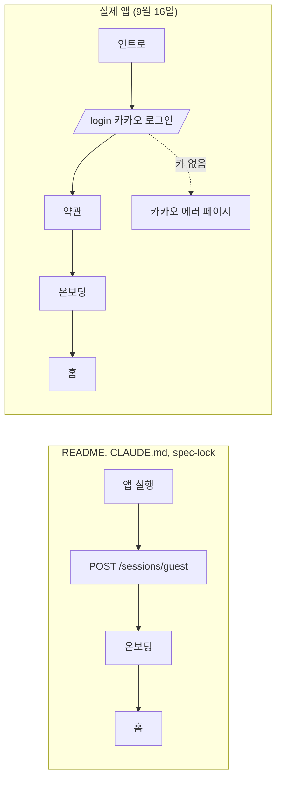

안녕하세요, 고준서입니다. diet-setlog는 6월 말에 GDG on Campus 전남대에서 디자이너 두 분, 개발자 두 명이 열하루 만에 만든 식단 기록 앱이에요. 저는 개발 둘 중 한 명으로 설계 문서를 쓰고 Claude Code로 구현을 돌리고 PR을 머지했습니다. 마지막 커밋은 7월 4일이었고, 그 뒤로 두 달 넘게 레포를 열지 않았어요.

9월 16일 오후에 다시 열었습니다. 처음 한 일은 Claude Code에게 `CLAUDE.md`가 최신인지 물은 거였어요. 아니라고 했습니다. "아직 스캐폴딩 전"이라는 문구가 남아 있었고, 상태 관리 라이브러리는 "택1"이라고 적혀 있는데 이미 Riverpod로 정해진 뒤였죠. 갱신시켰습니다. 그리고 origin에서 받아온 게 있는지 확인시켰더니 로컬이 이미 최신이라고 했어요.

그다음에 제가 친 말이 이겁니다.

> 근데 이게 제대로 작동하는지 어케 보장함?

## 첫 답은 "서버가 뜬다"였다

Claude는 `docker compose up --build`로 Postgres, Redis, 스토리지 에뮬레이터, 서버 컨테이너 네 개를 띄우고 `GET /health`가 200을 돌려준다고 보고했습니다. 마이그레이션 두 개가 자동으로 적용됐고, Gemini 키가 없어서 `geminiApiKeyConfigured: false`라는 것까지요. Docker 데몬이 꺼져 있어서 자기가 켰다는 말도 있었습니다.

서버가 뜨는 건 맞는데, 그건 제가 물은 게 아니었어요.

> 아니, 내부에 구현된 기능들이 의도에 맞고 사용자 흐름에 맞게 구현된건지 알고싶은데

이 말 뒤에 검증이 세 갈래로 갈라졌습니다. curl로 API를 스펙 순서대로 실제 호출하기, 코드와 `spec-lock.md`를 정적으로 대조하기, 그리고 Flutter를 설치해서 웹으로 띄운 앱을 브라우저에서 직접 클릭하기. 마지막 게 제일 오래 걸렸고 제일 큰 걸 찾았습니다.

## 문서는 익명 우선, 앱은 카카오 필수

`README.md` 6번째 줄의 핵심 플로우는 "익명 세션"에서 시작해 온보딩, 홈, 촬영, 분석, 기록, 캘린더, 피드로 이어지고, `CLAUDE.md` 4번째 줄에는 이렇게 적혀 있어요.

> 로그인 없이 익명 세션으로 전 기능 사용(추후 OAuth 연결).

브라우저에서 앱을 열면 인트로 화면이 나오고, "시작하기"를 누르면 카카오톡 로그인 화면으로 갑니다. 게스트로 건너뛰는 버튼이 없어요. 원인은 코드 주석에 그대로 있었습니다.

```dart
// app/lib/features/session/session_providers.dart:55-56
/// 앱 부트스트랩: 저장된 토큰 복구 → 홀더 주입 → 프로필 조회.
/// 토큰이 없으면 게스트를 만들지 않고 로그인 화면으로 보낸다(2차 시안: 카카오 우선).
```



*그림 1. 문서가 말하는 흐름과 앱이 실제로 타는 흐름. 오른쪽에는 게스트 경로가 없습니다.*

언제 바뀌었는지는 git log가 알려 줬습니다. 6월 26일 친구 추천 결정 기록 §7에는 "게스트 폴백 유지, 카카오는 선택"이라고 적어 놨어요. 그런데 6월 27일에 디자이너가 2차 시안을 올렸고, 거기에 카카오 로그인 화면(온보딩2)이 새로 들어 있었습니다. 6월 28일 새벽 5시 43분에 그걸 구현하는 이슈([#39](https://github.com/GDG-jnu-DietSetlog/diet-setlog/issues/39))를 만들었고, 6시 17분에 PR([#40](https://github.com/GDG-jnu-DietSetlog/diet-setlog/pull/40), [f4a140b](https://github.com/GDG-jnu-DietSetlog/diet-setlog/commit/f4a140b))을 머지했습니다. 34분이에요.

그 PR 본문의 "머지 후 필요 작업"에는 이렇게 쓰여 있었습니다.

> 게스트 자동생성 제거(로그인 우선). "둘러보기/게스트" 진입 필요 시 별도 추가

그러니까 방향이 바뀐다는 건 PR에 적혀 있었고, 저는 그걸 읽고 머지했어요. 다만 그때도, 그 뒤 팀원이 2차 시안 나머지를 반영한 7월 4일까지도, README와 CLAUDE.md와 spec-lock은 아무도 고치지 않았습니다. 문서 세 개가 두 달 동안 6월 26일에 멈춰 있었던 거죠.

한 가지 더 있었습니다. 게스트 세션은 죽은 코드가 아니라 완성된 채로 방치된 코드였어요. 서버의 `POST /v1/sessions/guest`는 curl 검증에서 정상으로 토큰을 발급했고, 앱 쪽 클라이언트에도 메서드가 있습니다.

```dart
// app/lib/data/api/session_api.dart:8-9
/// POST /v1/sessions/guest (무인증). 게스트 토큰 발급.
Future<GuestSession> createGuest({String? deviceHint}) async {
```

이걸 부르는 화면이 하나도 없습니다. 그리고 카카오 앱 키는 레포에 넣지 않기로 한 값이라 로컬에는 비어 있었고, 로그인 버튼을 누르면 `client_id`가 빈 채로 카카오 인증 서버에 요청이 가서 에러 페이지가 떴어요. 키가 없는 건 당연한 거라 버그는 아닌데, 결과적으로 키 없이는 온보딩 뒤 화면(홈, 캘린더, 피드)에 아예 못 들어갑니다.

## 레이트리밋은 주석으로만 있었다

API 쪽 검증에서 나온 건 하나였습니다. 레이트리밋, 그러니까 같은 사람이 짧은 시간에 요청을 너무 많이 보내면 막는 장치가 없었어요. `spec-lock.md` 273번째 줄에는 게스트 세션 발급이 IP당 분당 5회, 초과하면 429라고 잠겨 있는데, 같은 IP로 7번 연속 호출해도 전부 201이었습니다. 코드에는 이렇게 남아 있었고요.

```ts
// server/src/index.ts:54
// v1 라우트. 미들웨어 순서: (rateLimit →) authGuard → handler. rateLimit/Redis 는 후속 wave.
```

`express-rate-limit`과 `rate-limit-redis`는 spec-lock §10.2의 패키지 표에 버전까지 적혀 있지만 `package.json`에는 없습니다. "후속 wave"는 오지 않았어요. CLAUDE.md 상단에 적어 둔 "트래픽 스파이크 대응" 원칙과 정면으로 어긋나는 상태입니다.

나머지 이탈은 작은 것들이었습니다. spec-lock §9에 "그대로 쓰라"고 잠근 Gemini 프롬프트 원문과 실제 코드가 달랐고(구현이 더 정교해졌는데 문서가 안 따라옴), 온보딩 STEP2는 스펙의 "출생연도"가 아니라 생년월일 전체를 받고 있었고, `POST /v1/food-records`는 스펙에 없는 `imageUrl` 필드를 추가로 받았습니다. 피드, 좋아요, 댓글, 캘린더, 추천 알고리즘 상수는 전부 스펙과 일치했어요.

## 아직 안 고쳤다

Claude의 마지막 보고는 선택지를 둘로 정리했습니다. 문서를 지금 구현(카카오 필수)에 맞춰 고치거나, 로그인 화면에 게스트 진입 버튼을 넣어 원래 의도로 돌리거나. 이 글을 쓰는 시점에 어느 쪽도 커밋되지 않았고, 레포의 마지막 커밋은 여전히 7월 4일입니다.

돌아보면 "제대로 작동하는지"라는 제 첫 질문에 대한 첫 답은 헬스체크였고, 두 번째 질문을 던지고 나서야 브라우저를 열었습니다. 검증을 시킨 것도, 세 갈래로 나눈 것도, 코드 주석과 PR 본문을 찾아 시점을 맞춘 것도 Claude가 했어요. 제가 한 건 첫 답이 제 질문과 다르다는 걸 알아채고 다시 물은 것뿐입니다. 그리고 6월 28일 새벽에 PR 본문의 "머지 후 필요 작업"을 읽고도 문서 갱신을 그 목록에 넣지 않은 것도 저였습니다.
